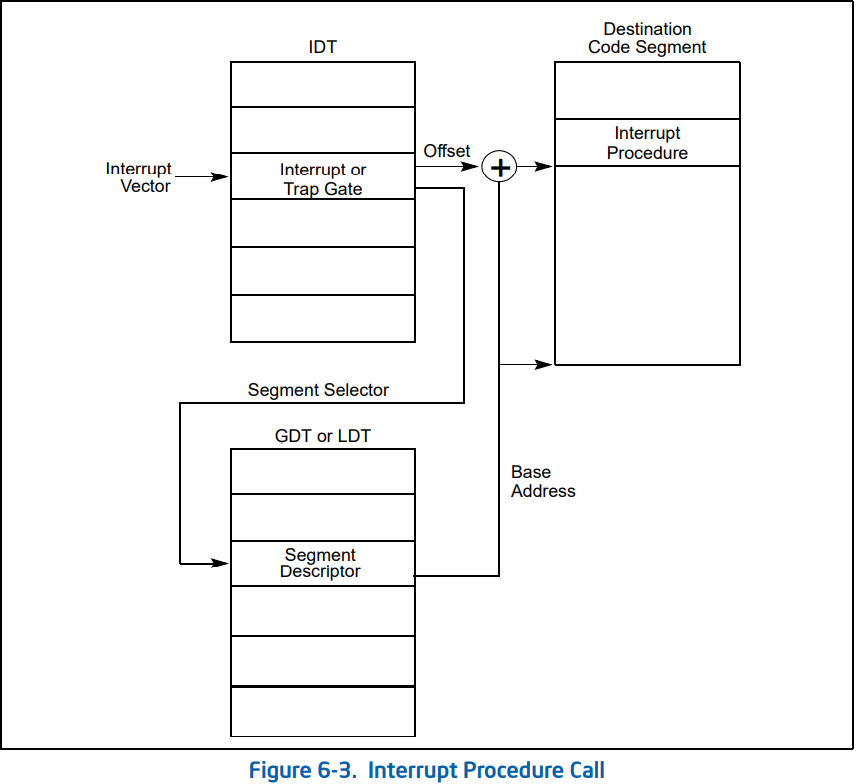

# 要点目录

+   [段存取](#前置知识---段存取)
+   [段属性](#2前置知识---段属性)
+   [特权级](#2前置知识---特权级)
+   [中断与异常](#2前置知识---中断与异常)
+   [调用门](#2前置知识---调用门(call gate))
+   [中断特权级切换](#1Challenge 1)


# 练习1

## 操作系统镜像文件ucore.img是如何一步一步生成的？

链接器命令详情：https://cloud.tencent.com/developer/article/1415004

根据Makefile结果，kernel镜像产生流程：

+ 中间文件:
	+ obj/kern/init/init.o
	+ obj/kern/libs/stdio.o
	+ obj/kern/libs/readline.o
	+ obj/kern/debug/panic.o
	+ obj/kern/debug/kdebug.o
	+ obj/kern/debug/kmonitor.o
	+ obj/kern/driver/clock.o
	+ obj/kern/driver/console.o
	+ obj/kern/driver/picirq.o
	+ obj/kern/driver/intr.o
	+ obj/kern/trap/trap.o
	+ obj/kern/trap/vectors.o
	+ obj/kern/trap/trapentry.o
	+ obj/kern/mm/pmm.o
	+ obj/libs/string.o
	+ obj/libs/printfmt.o
+ 链接:
	+ ```bash
	  ld -m    elf_i386 -nostdlib -T tools/kernel.ld -o bin/kernel  obj/kern/init/init.o obj/kern/libs/stdio.o obj/kern/libs/readline.o obj/kern/debug/panic.o obj/kern/debug/kdebug.o obj/kern/debug/kmonitor.o obj/kern/driver/clock.o obj/kern/driver/console.o obj/kern/driver/picirq.o obj/kern/driver/intr.o obj/kern/trap/trap.o obj/kern/trap/vectors.o obj/kern/trap/trapentry.o obj/kern/mm/pmm.o  obj/libs/string.o obj/libs/printfmt.o
	  #-m <emulation>:	模拟指定的链接器
	  #-nostdlib: 禁止链接标准库
	  #-T: 指定链接脚本
	  ```
	+   ```ld
	    /* Simple linker script for the JOS kernel.
	       See the GNU ld 'info' manual ("info ld") to learn the syntax. */
	    
	    OUTPUT_FORMAT("elf32-i386", "elf32-i386", "elf32-i386") /*输出格式*/
	    OUTPUT_ARCH(i386)	/*架构*/
	    ENTRY(kern_init)	/*入口*/
	    
	    SECTIONS {
	    	/* Load the kernel at this address: "." means the current address */
	    	. = 0x100000;
	    
	    	.text : {
	    		*(.text .stub .text.* .gnu.linkonce.t.*)
	    	}
	    
	    	PROVIDE(etext = .);	/* Define the 'etext' symbol to this value */
	    
	    	.rodata : {
	    		*(.rodata .rodata.* .gnu.linkonce.r.*)
	    	}
	    
	    	/* Include debugging information in kernel memory */
	    	.stab : {
	    		PROVIDE(__STAB_BEGIN__ = .);
	    		*(.stab);
	    		PROVIDE(__STAB_END__ = .);
	    		BYTE(0)		/* Force the linker to allocate space
	    				   for this section */
	    	}
	    
	    	.stabstr : {
	    		PROVIDE(__STABSTR_BEGIN__ = .);
	    		*(.stabstr);
	    		PROVIDE(__STABSTR_END__ = .);
	    		BYTE(0)		/* Force the linker to allocate space
	    				   for this section */
	    	}
	    
	    	/* Adjust the address for the data segment to the next page */
	    	. = ALIGN(0x1000);
	    
	    	/* The data segment */
	    	.data : {
	    		*(.data)
	    	}
	    
	    	PROVIDE(edata = .);
	    
	    	.bss : {
	    		*(.bss)
	    	}
	    
	    	PROVIDE(end = .);
	    
	    	/DISCARD/ : {
	    		*(.eh_frame .note.GNU-stack)
	    	}
	    }
	    
	    ```

最后生成**bin/kernel**

然后是boot相关的：

+   obj/boot/bootasm.o，obj/boot/bootmain.o

+   链接:

    +   ````bash
        ld -m    elf_i386 -nostdlib -N -e start -Ttext 0x7C00 obj/boot/bootasm.o obj/boot/bootmain.o -o obj/bootblock.o
        #-N,--omagic:	指定读取/写入文本和数据段
        #-e <entry>:使用指定的符号作为程序的初始执行点
        #-Ttext=<org>:使用指定的地址作为文本段的起始点
        ````

+   
    
    +   从IDA看到该目标文件基址就是0x7c00，入口start


然后使用sign程序制作bin/bootblock引导

最后进行拼接：

```bash
dd if=/dev/zero of=bin/ucore.img count=10000
dd if=bin/bootblock of=bin/ucore.img conv=notrunc
dd if=bin/kernel of=bin/ucore.img seek=1 conv=notrunc
```

默认情况下一个块512字节，所以根据上面的命令第一个块就是BootLoader紧接着是kernel


## 一个被系统认为是符合规范的硬盘主引导扇区的特征是什么？

由上面的分析可以知道sign程序将bootblock.o制作成了BootLoader

```c
#include <stdio.h>
#include <errno.h>
#include <string.h>
#include <sys/stat.h>

int
main(int argc, char *argv[]) {
    struct stat st;
    if (argc != 3) {
        fprintf(stderr, "Usage: <input filename> <output filename>\n");
        return -1;
    }
    if (stat(argv[1], &st) != 0) {
        fprintf(stderr, "Error opening file '%s': %s\n", argv[1], strerror(errno));
        return -1;
    }
    printf("'%s' size: %lld bytes\n", argv[1], (long long)st.st_size);
    if (st.st_size > 510) {
        fprintf(stderr, "%lld >> 510!!\n", (long long)st.st_size);
        return -1;
    }
    char buf[512];
    memset(buf, 0, sizeof(buf));
    FILE *ifp = fopen(argv[1], "rb");
    int size = fread(buf, 1, st.st_size, ifp);
    if (size != st.st_size) {
        fprintf(stderr, "read '%s' error, size is %d.\n", argv[1], size);
        return -1;
    }
    fclose(ifp);
    buf[510] = 0x55;
    buf[511] = 0xAA;
    FILE *ofp = fopen(argv[2], "wb+");
    size = fwrite(buf, 1, 512, ofp);
    if (size != 512) {
        fprintf(stderr, "write '%s' error, size is %d.\n", argv[2], size);
        return -1;
    }
    fclose(ofp);
    printf("build 512 bytes boot sector: '%s' success!\n", argv[2]);
    return 0;
}

```

根据后面两个赋值命令可知，引导扇区的特点是最后两个字节分别为：`0x55`，`0xAA`


# 练习2

参见：

+   https://www.intel.com/content/dam/www/public/us/en/documents/manuals/64-ia-32-architectures-software-developer-vol-3a-part-1-manual.pdf
+   https://www.zhihu.com/question/29375534
+   https://blog.51cto.com/u_12810168/2331038
+   https://wenku.baidu.com/view/d6efe68fcc22bcd126ff0c00.html


## 前置知识---段存取

### Segment

段寄存器：每个段寄存器都有一个可见部分(段选择子)和一个隐藏部分

 

段选择子：16位


当段寄存器载入一个段选择子时，将同时通过段选择子指向的段描述符把**基地址，段大小，访问信息**重新载入隐藏部分


段描述符位于**全局描述符表**(GDT)或局部描述符表(LDT)，每一个描述符占8字节

具体：

+   计算index的值除8
+   通过GDTR or LDTR获取描述符表的基址
+   两者相加获得地址，载入baseAddr，Limit，权限(DPL)
    +   这里DPL的值由系统初始化定好的，不可变，而段选择子中的RPL是可变的，因为寻址只用了段选择子的前面14位。这将涉及权限访问问题

### Register

#### 控制寄存器

GDT或者LDT存放着其他段的基址长度等信息，该表本身使用类似的方式管理


+   cr0：控制处理器的运行模式和状态
    +   
    +   PE：是否启用保护模式(分段)
    +   PG：是否使用分页


## Power up---Bios

加电后寄存器初始化状态如下：(处于实模式16位)


关注：

+   EIP：0xfff0
+   cs_base：0xffff0000

那么第一条指令地址就是cs<<4+ip:也就是0xfffffff0是BIOS的EPROM(Erasable Programmable Read Only Memory)

```bash
gdb-peda$ x/8i 0xfffffff0
   0xfffffff0:	jmp    0xf000:0xe05b
   0xfffffff5:	xor    BYTE PTR ds:0x322f,dh
   0xfffffff9:	xor    bp,WORD PTR [bx]
   0xfffffffb:	cmp    WORD PTR [bx+di],di
   0xfffffffd:	add    ah,bh
   0xffffffff:	add    BYTE PTR [bx+si],al
   
gdb-peda$ x/8i 0xfe05b
   0xfe05b:	cmp    DWORD PTR cs:0x6c48,0x0
gdb-peda$ x/8bx 0xf6c48
0xf6c48:	0x00	0x00	0x00	0x00	0x66	0x90	0x66	0x90
   0xfe062:	jne    0xfd2e1
   0xfe066:	xor    dx,dx
   0xfe068:	mov    ss,dx
   0xfe06a:	mov    esp,0x7000
   0xfe070:	mov    edx,0xf3691
   0xfe076:	jmp    0xfd165
   0xfe079:	push   ebp
```

>   继续跟bios的代码发现会开启A20，并且进入保护模式
>
>   ````assembly
>   gdb-peda$ x/8i 0xfd165
>      0xfd165:	mov    ecx,eax
>      0xfd168:	cli    
>      0xfd169:	cld    
>      0xfd16a:	mov    eax,0x8f
>      0xfd170:	out    0x70,al
>      0xfd172:	in     al,0x71
>      0xfd174:	in     al,0x92
>      0xfd176:	or     al,0x2
>   gdb-peda$ 
>      0xfd178:	out    0x92,al
>      0xfd17a:	lidtw  cs:0x6c38		#0x6c3e0000
>      0xfd180:	lgdtw  cs:0x6bf4		#0x6c000037
>      0xfd186:	mov    eax,cr0
>      0xfd189:	or     eax,0x1
>      0xfd18d:	mov    cr0,eax
>      0xfd190:	jmp    0x8:0xfd198
>      0xfd198:	mov    ax,0x10
>   ````
>
>   我的理解：在8086模式下地址线有20位也就是1MB的寻址空间，采用**段<<4+偏移**的方式寻址最大范围：0xffff0 + 0xffff = 0x10ffef， 也就是说最高位是第20位，超出了地址线(溢出)那么结果只会包含后面的20位(这就是所谓的回卷)，**所以当时很多程序会利用回卷这一特点**。
>
>   
>
>   但到了80286模式，地址线扩展到了24位也就不存在20位回卷的情况了，也就无法向下兼容，好在8086实模式利用的回卷只涉及第20位的问题，所以IBM采用键盘控制器或端口0x92等方法使得第20位失效(始终为0)，所以老一代的BIOS就会进行把A20禁用的操作。
>
>   但是在新的BIOS会直接开启A20。所以，不打开A20的话，相当于A20那一位永远都是0，相当于物理内存里有一半的空间你无法使用。由于还有很多细节涉及历史原因就不继续深究了
>
>    
>
>   对于进入了保护模式，这里插个眼


进行一些硬件自检，然后读取BootLoader：

```bash
ecx            0x100	0x100
es             0x7c0	0x7c0
0xfb2c9:	rep ins WORD PTR es:[edi],dx
gdb-peda$ p $dx
$4 = 0x1f0
```

读取512字节到0x7c00，然后跳转到此处


# 练习3

将引用上部分内容


## 前置知识---段属性

对于GDT表项的段属性描述部分：


+   P(Present): 表示这个,段是否在内存中。P=1，段在内存中；P=0不在内存中，可能存在硬盘上。

+   DPL (Descriptor Privilege Level ):值0-3。表示段的保护等级。

+   S(System):表示是系统段还是用户段。s=0是表示是系统段描述符，指向的是中断描述符表、异常

    描述符表等。s=1表示的是用户段描述符，代码段、数据段都是用户段

+   后面4个字节对应Type字段

针对上图的0~3字节：


>   当段描述符中的S标志（描述符类型）为1时，该描述符为代码段描述符或者数据段描述符。
>   类型域的最高位（段描述符的第二个双字的第11位）将决定该描述符为数据段描述符（为0）
>   或者代码段描述符（为1）。
>
>   对于数据段而言，描述符的类型域的低3位（位8，9，10）被解释为访问控制（A），是否
>   可写（W），扩展方向（E）
>
>   访问位A（access 位）表示访问位自最后一次被操作系统清零后，该段是否被访问过。每当
>   处理器将该段的段选择符置入某个段寄存器时，就将访问位置为1。该位一直保持为1直到
>   被显式清零。
>
>   对于代码段而言，类型域的低3位被解释为访问位（A），可读位（R），一致位（C）。


当S=1时：

+   第3位为1表示代码段：
    +   **C=0，非一致代码段，当前特权级CPL=DPL才能去访问**；
    +   **C=1，一致代码段，CPL>=DPL也可以访问，访问特权级仍然是CPL**
    +   R=0，代码段不可读，可执行；R=1，代码段可读可执行
+   第三位为0时表示数据段：
    +   ED=0，地址增大方向扩展；
    +   ED=1，地址减小方向扩展
    +   W=0，数据段不能写，W=1，数据段可写


当段描述符的S标志（描述符类型）为0，该描述符为系统描述符。处理器可以识别以下类
型的系统描述符：

+   局部描述符表（LDT）段描述符
+   **任务状态段（TSS）描述符**
+   调用门描述符
+   **中断门描述符**
+   **陷阱门描述**
+   任务门描述符

由Type字段：


对于段属描述部分：


G：段属性中的粒度位（Granularity），用符号G标记。G=0表示段界限以字节位位单位，20位的界限可表示的范围是1字节至1M字节，增量为1字节；G=1表示段界限以4K字节为单位，于是20位的界限可表示的范围是4K字节至4G字节，增量为4K字节。

D/B：根据这个段描述符所指的是一个可执行代码段，一个向下扩展的数据段还是一个堆栈
段，这个标志完成不同的功能。（对32位的代码和数据段，这个标志总是被置为1，而
16位的代码和数据段，这个标志总是被置为0:

+   代码段：此时被称为D flag它表明了当前代码段的有效地址或指令集的操作数默认长度，如果该flag被置为1那就是32位有效地址以及32或8位操作数，置0就是16位有效地址以及16位或8位操作数
+   堆栈段(data segment pointed to by the SS register)：此时被称为B(big) flag他将指出进行隐含栈操作(pushes, pops, and calls)的栈指针大小。当该flag被置1：32位栈指针也就是ESP被使用，当置为0：16位栈指针也是SP被使用
+   向下增长的数据段：B flag，当置1时段顶为FFFFFFFFH (4 GBytes)，当置0时段顶为 FFFFH (64 KBytes)

L (64-bit code segment) flag：在IA-32e模式下如果该flag被置1表示该代码段以64位模式运行，否则以兼容模式运行。如果L被置1那么D必须置0.当不是IA-32e模式或非代码段L为保留字段并始终为0

>    具有64位扩展技术的处理器能运行在传统IA-32模式或IA-32e模式.IA-32E模式是处理器在运行64位操作系统的时候使用的一种模式
>
>    
>
>   IA-32e模式
>      IA-32e模式有两个子模式：64位模式和兼容模式。IA-32e模式只能在装载64位操作系统的情况下进入。
>
>   兼容模式
>       兼容模式允许传统的16位和32位应用程序无需重新编译就可以运行在64位操作系统下
>
>   参见：http://www.njyangqs.com/hardware/ia-32etech.htm


## 为何开启A20，以及如何开启A20

如果不开启A20那么32位的地址寻址范围只有一半了，并且不连续：0~1MB, 2~3MB, 4~5MB

开启方法：键盘控制器或端口0x92等


## 如何初始化GDT表

从bootasm.s:

```assembly
#include <asm.h>

gdt:
    SEG_NULLASM                                     # null seg 8bytes
    SEG_ASM(STA_X|STA_R, 0x0, 0xffffffff)           # code seg for bootloader and kernel
    SEG_ASM(STA_W, 0x0, 0xffffffff)                 # data seg for bootloader and kernel
```

几个定义域asm.h中的宏：

```c
/* Normal segment */
#define SEG_NULLASM                                             \
    .word 0, 0;                                                 \
    .byte 0, 0, 0, 0

#define SEG_ASM(type,base,lim)                                  \
    .word (((lim) >> 12) & 0xffff), ((base) & 0xffff);          \
    .byte (((base) >> 16) & 0xff), (0x90 | (type)),             \
        (0xC0 | (((lim) >> 28) & 0xf)), (((base) >> 24) & 0xff)

/* Application segment type bits */
#define STA_X       0x8     // Executable segment
#define STA_E       0x4     // Expand down (non-executable segments)
#define STA_C       0x4     // Conforming code segment (executable only)
#define STA_W       0x2     // Writeable (non-executable segments)
#define STA_R       0x2     // Readable (executable segments)
#define STA_A       0x1     // Accessed
```

可以看到第一个gdt表项是初始化为空的然后是bootloader代码段和数据段表项

代码段描述符：


数据段：


## 如何使能和进入保护模式

载入gdt表：

```assembly
lgdt gdtdesc		#<======

gdt:
    SEG_NULLASM                                     # null seg 8bytes
    SEG_ASM(STA_X|STA_R, 0x0, 0xffffffff)           # code seg for bootloader and kernel
    SEG_ASM(STA_W, 0x0, 0xffffffff)                 # data seg for bootloader and kernel

gdtdesc:
    .word 0x17                                      # sizeof(gdt) - 1
    .long gdt                                       # address gdt
```

在gdb中可以看到：

````bash
[-------------------------------------code-------------------------------------]
   0x7c18:	jne    0x7c14
   0x7c1a:	mov    al,0xdf
   0x7c1c:	out    0x60,al
=> 0x7c1e:	lgdtw  ds:0x7c6c
   0x7c23:	mov    eax,cr0
   0x7c26:	or     eax,0x1
   0x7c2a:	mov    cr0,eax
   0x7c2d:	jmp    0x8:0x7c32
[------------------------------------stack-------------------------------------]
0000| 0x6f2c --> 0xf000d242 --> 0x0 --> 0xf000ff53 (0x00000000)
0004| 0x6f30 --> 0x0 --> 0xf000ff53 (0x00000000)
0008| 0x6f34 --> 0x6f6a --> 0x0 --> 0xf000ff53 (0x00000000)
0012| 0x6f38 --> 0x0 --> 0xf000ff53 (0x00000000)
0016| 0x6f3c --> 0x916e --> 0x0 --> 0xf000ff53 (0x00000000)
0020| 0x6f40 --> 0x9135 --> 0x0 --> 0xf000ff53 (0x00000000)
0024| 0x6f44 --> 0x0 --> 0xf000ff53 (0x00000000)
0028| 0x6f48 --> 0x0 --> 0xf000ff53 (0x00000000)
[------------------------------------------------------------------------------]
Legend: code, data, rodata, value
0x00007c1e in ?? ()
gdb-peda$ x/8wx 0x7c6c
0x7c6c:	0x7c540017	
````

结合gdtr寄存器：0x17是limit字段，gdt表基址为0x7c54

```bash
gdb-peda$ x/8wx 0x7c54
0x7c54:	0x00000000	0x00000000	0x0000ffff	0x00cf9a00
0x7c64:	0x0000ffff	0x00cf9300	0x7c540017(gdtdesc)	
```

符合gdt表的定义：前8字节为空，后面两个是BootLoader代码段和数据段描述符base都为0，limit字段20位都为0xfffff


启用保护模式(分段机制)：

需要注意的是进入BootLoader时cs的base为0，然后前面载入gdt表后base字段也是0。ip计算没有变化，继续往下走

```assembly
movl %cr0, %eax
orl $CR0_PE_ON, %eax
movl %eax, %cr0
#转换为分段机制，但不是32位模式
```

到下条指令`jmp    0x8:0x7c32`cs选择符为0x8， esp为0x7c32(下一条指令)。此时gdt表偏移为8的是代码段描述符，base为0所以继续往下。该指令完成了16位到32位指令模式的转换：

```assembly
    ljmp $PROT_MODE_CSEG, $protcseg

.code32                                             # Assemble for 32-bit mode
protcseg:
    # Set up the protected-mode data segment registers
    movw $PROT_MODE_DSEG, %ax                       # Our data segment selector
    movw %ax, %ds                                   # -> DS: Data Segment
    movw %ax, %es                                   # -> ES: Extra Segment
    movw %ax, %fs                                   # -> FS
    movw %ax, %gs                                   # -> GS
    movw %ax, %ss                                   # -> SS: Stack Segment

    # Set up the stack pointer and call into C. The stack region is from 0--start(0x7c00)
    movl $0x0, %ebp
    movl $start, %esp
    call bootmain
```

接下来就是初始化数据段寄存器(全设置为第二个gdt表项)

然后设置栈空间，调用bootmain函数(bootmain.c):

注意现在所有段的base值都为0，只是部分权限不一样:

```bash
gdb-peda$ i r
eax            0x10	0x10
ecx            0x0	0x0
edx            0x80	0x80
ebx            0x0	0x0
esp            0x7c00	0x7c00
ebp            0x0	0x0
esi            0x0	0x0
edi            0x0	0x0
eip            0x7c4a	0x7c4a
eflags         0x6	[ PF ]
cs             0x8	0x8
ss             0x10	0x10
ds             0x10	0x10
es             0x10	0x10
fs             0x10	0x10
gs             0x10	0x10
```


# 练习4


## bootloader如何读取硬盘扇区的？

考虑到实现的简单性，bootloader的访问硬盘都是LBA模式的PIO（Program IO）方式，即所有的IO操作是通过CPU访问硬盘的IO地址寄存器完成。

一般主板有2个IDE通道，每个通道可以接2个IDE硬盘。访问第一个硬盘的扇区可设置IO地址寄存器0x1f0-0x1f7实现的，具体参数见下表。一般第一个IDE通道通过访问IO地址0x1f0-0x1f7来实现，第二个IDE通道通过访问0x170-0x17f实现。每个通道的主从盘的选择通过第6个IO偏移地址寄存器来设置。

当前 硬盘数据是储存到硬盘扇区中，一个扇区大小为512字节。读一个扇区的流程（可参看boot/bootmain.c中的readsect函数实现）大致如下：

>   等待磁盘准备好
>   发出读取扇区的命令
>   等待磁盘准备好
>   把磁盘扇区数据读到指定内存

```c
/*从硬盘读取一页的数据到指定虚拟内存(0x10000)*/
readseg(uintptr_t va, uint32_t count, uint32_t offset)
readseg((uintptr_t)ELFHDR, SECTSIZE * 8, 0);
/*读取指定的一个扇区到虚拟地址*/
readsect(void *dst, uint32_t secno)
readsect((void *)va, secno);
```


## bootloader是如何加载ELF格式的OS？

在读取一个页的kernel后利用如下elf的结构体：

```c
struct elfhdr {
  uint magic;  // must equal ELF_MAGIC
  uchar elf[12];
  ushort type;
  ushort machine;
  uint version;
  uint entry;  // 程序入口的虚拟地址
  uint phoff;  // program header 表的位置偏移
  uint shoff;
  uint flags;
  ushort ehsize;
  ushort phentsize;
  ushort phnum; //program header表中的入口数目
  ushort shentsize;
  ushort shnum;
  ushort shstrndx;
};
struct proghdr {
  uint type;   // 段类型
  uint offset;  // 段相对文件头的偏移值
  uint va;     // 段的第一个字节将被放到内存中的虚拟地址
  uint pa;
  uint filesz;
  uint memsz;  // 段在内存映像中占用的字节数
  uint flags;
  uint align;
};
```

由程序头偏移找到proghdr，进而读取对应段到虚拟内存(base=0)，然后将控制权交给内核：

```c
struct proghdr *ph, *eph;

    // load each program segment (ignores ph flags)
    ph = (struct proghdr *)((uintptr_t)ELFHDR + ELFHDR->e_phoff);
    eph = ph + ELFHDR->e_phnum;
    for (; ph < eph; ph ++) {
        readseg(ph->p_va & 0xFFFFFF, ph->p_memsz, ph->p_offset);
    }

    // call the entry point from the ELF header
    // note: does not return
    ((void (*)(void))(ELFHDR->e_entry & 0xFFFFFF))();
```

注意：**因为base一直都是0所以此时虚拟地址就是物理地址**

+   bootmain.c中的0x10000是读取内核前0x1000字节存放的地址
+   编译内核时定义的0x100000是载入各个段时的虚拟首地址

```bash
gdb-peda$ x/8s 0x10000
0x10000:	"\177ELF\001\001\001"
gdb-peda$ x/8i 0x100000
   0x100000 <kern_init>:	push   bp
   0x100001 <kern_init+1>:	mov    bp,sp
   0x100003 <kern_init+3>:	sub    sp,0x18
   0x100006 <kern_init+6>:	mov    dx,0xfd20
   0x100009 <kern_init+9>:	adc    BYTE PTR [bx+si],al
   0x10000b <kern_init+11>:	mov    ax,0xea16
   0x10000e <kern_init+14>:	adc    BYTE PTR [bx+si],al
   0x100010 <kern_init+16>:	sub    dx,ax
gdb-peda$ x/8wx 0x0010e000
0x10e000 <commands>:	0x00103728	0x00103730	0x00100ce9	0x0010374f
0x10e010 <commands+16>:	0x00103758	0x00100d43	0x0010377e	0x00103788   
```


# 练习5

````c
static inline uint32_t
read_ebp(void) {
    uint32_t ebp;
    asm volatile ("movl %%ebp, %0" : "=r" (ebp));
    return ebp;
}//读取最后阶段ebp

static __noinline uint32_t
read_eip(void) {
    uint32_t eip;
    asm volatile("movl 4(%%ebp), %0" : "=r" (eip));
    return eip;
}//读取caller的返回地址，获取近似调用点
/*获取前4个call参数*/
asm volatile("movl 8(%%ebp), %0":"=r"(args[0]));
asm volatile("movl 12(%%ebp), %0":"=r"(args[1]));
asm volatile("movl 16(%%ebp), %0":"=r"(args[2]));
asm volatile("movl 20(%%ebp), %0":"=r"(args[3]));
/*更新ebp和eip*/
asm volatile(
            "movl (%1), %0;"
            :"=a"(ebp)
            :"b"(ebp)
        );
asm volatile(
            "movl 4(%1), %0;"
            :"=a"(eip)
            :"b"(ebp)
        );
````


# 练习6


## 前置知识---特权级

CPL：存在于**cs和ss寄存器**的**第0，1位**代表当前执行或任务的特权级。通常CPL是等于要取指令所在的段的特权级。当程序跳转到一个不同特权级的代码段时，处理器将改变CPL。当访问**依从代码段**时CPL要大于等于该段的DPL此时CPL不会发生改变

DPL：描述段或门的特权级。当代码段某指令试图跳到某个段上或门上的指令，那么将把目标段或门的DPL和当前段或门的CPL和RPL进行比较。DPL的解释会随着目标段或门的类型发生改变

+   数据段：此时DPL表示可访问该段的最低特权级，如当DPL=1，只有CPL为0或1的程序可以访问
    非依从代码段(不通过调用门进行访问)：此时DPL表示可访问该段的限定特权级。如当非依从代码段的DPL=0那么只有CPL为0的程序可以访问
+   调用门：此时DPL表示可访问该段的最低特权级，如当DPL=1，只有CPL为0或1的程序可以访问
+   依从或非依从代码段(通过调用 门访问)：此时DPL表示可访问该段的最高特权级。如一个依从代码段DPL=2那么，CPL为1或0都不可以访问
+   TSS：此时DPL表示可访问该段的最低特权级，如当DPL=1，只有CPL为0或1的程序可以访问

RPL： override privilege leve，就是说再访问某个段的时候他们俩谁大谁作主进行比较

>   这几个东西光看定义比较难懂，记住几个重要的特权级变化过程即可


## 前置知识---中断与异常

此处把引用CSAPP，将其通称为异常(或中断)，包括：中断(interrupt)，陷阱(trap)，故障(fault)，终止(abort)

对于这些异常由IDT(Interrupt Descriptor Table)负责将每个异常的编号和对应服务例程的描述符联系起来。

操作系统在IDT中设置好各种中断向量对应的中断描述符，留待CPU在产生中断后查询对应中断服务例程的起始地址。而IDT本身的起始地址保存在idtr寄存器中

同GDT一样，IDT是一个8字节的描述符数组，但IDT的第一项可以包含一个描述符。CPU把中断（异常）号乘以8做为IDT的索引

IDT可以位于内存的任意位置，CPU通过IDT寄存器（IDTR）的内容来寻址IDT的起始地址。指令LIDT和SIDT用来操作IDTR。两条指令都有一个显示的操作数：一个6字节表示的内存地址。指令的含义如下：

+   LIDT（Load IDT Register）指令：使用一个包含线性地址基址和界限的内存操作数来加载IDT。操作系统创建IDT时需要执行它来设定IDT的起始地址。这条指令只能在特权级0执行。（可参见libs/x86.h中的lidt函数实现，其实就是一条汇编指令）
+   SIDT（Store IDT Register）指令：拷贝IDTR的基址和界限部分到一个内存地址。这条指令可以在任意特权级执行。


在保护模式下，最多会存在256个Interrupt/Exception Vectors

在IDT中，可以包含如下3种类型的Descriptor：


我们主要关注Trap Gate和Interrupt Gate也就是陷阱和中断

Interrupts/Exceptions应该使用Interrupt Gate和Trap Gate，它们之间的唯一区别就是：当调用Interrupt Gate时，Interrupt会被CPU自动禁止；而调用Trap Gate时，CPU则不会去禁止或打开中断，而是保留它原来的样子。

>   【补充】所谓“自动禁止”，指的是CPU跳转到interrupt gate里的地址时，在将EFLAGS保存到栈上之后，清除EFLAGS里的IF位，以避免重复触发中断。在中断处理例程里，操作系统可以将EFLAGS里的IF设上,从而允许嵌套中断。但是必须在此之前做好处理嵌套中断的必要准备，如保存必要的寄存器等。二在ucore中访问Trap Gate的目的是为了实现系统调用。用户进程在正常执行中是不能禁止中断的，而当它发出系统调用后，将通过Trap Gate完成了从用户态（ring 3）的用户进程进了核心态（ring 0）的OS kernel。如果在到达OS kernel后禁止EFLAGS里的IF位，第一没意义（因为不会出现嵌套系统调用的情况），第二还会导致某些中断得不到及时响应，所以调用Trap Gate时，CPU则不会去禁止中断。总之，interrupt gate和trap gate之间没有优先级之分，仅仅是CPU在处理中断时有不同的方法，供操作系统在实现时根据需要进行选择。


中断服务例程包括具体负责处理中断（异常）的代码是操作系统的重要组成部分。需要注意区别的是，有两个过程由硬件完成：

>   硬件中断处理过程1（起始）：从CPU收到中断事件后，打断当前程序或任务的执行，根据某种机制跳转到中断服务例程去执行的过程。其具体流程如下：
>
>   +   CPU在执行完当前程序的每一条指令后，***都会去确认在执行刚才的指令过程中中断控制器（如：8259A）是否发送中断请求过来***，如果有那么CPU就会在相应的时钟脉冲到来时从总线上***读取中断请求对应的中断向量***；
>
>   +   CPU根据得到的中断向量（以此为索引）到IDT中找到该向量对应的中断描述符，中断描述符里保存着***中断服务例程的段选择子***；
>       CPU使用IDT查到的中断服务例程的段选择子从***GDT中取得相应的段描述符***，段描述符里保存了中断***服务例程的段基址和属性信息***，此时CPU就得到了中断服务例程的起始地址，并跳转到该地址；
>
>   +   
>
>   +   CPU会根据CPL和中断服务例程的段描述符的DPL信息确认是否发生了特权级的转换。比如当前程序正运行在用户态，而中断程序是运行在内核态的，则意味着发生了特权级的转换，这时**CPU会从当前程序的TSS信息（该信息在内存中的起始地址存在TR寄存器中）里取得该程序的内核栈地址，即包括内核态的ss和esp的值，并立即将系统当前使用的栈切换成新的内核栈**。这个栈就是即将运行的中断服务程序要使用的栈。紧接着就将当前程序使用的用户态的ss和esp压到新的内核栈中保存起来；
>
>   +   
>
>   +   CPU需要开始保存当前被打断的程序的现场（即一些寄存器的值），以便于将来恢复被打断的程序继续执行。这需要利用内核栈来保存相关现场信息，即依次压入当前被打断程序使用的**eflags，cs，eip，errorCode（如果是有错误码的异常）**信息；
>
>   +   CPU利用中断服务例程的段描述符将其**第一条指令的地址加载到cs和eip寄存器中**，开始执行中断服务例程。这意味着先前的程序被暂停执行，中断服务程序正式开始工作。
>
>       
>
>   硬件中断处理过程2（结束）：每个中断服务例程在有中断处理工作完成后需要通过iret（或iretd）指令恢复被打断的程序的执行。CPU执行IRET指令的具体过程如下：
>
>   +   程序执行这条iret指令时，首先会从内核栈里弹出先前保存的被打断的程序的现场信息，即eflags，cs，eip重新开始执行；
>   +   如果存在特权级转换（从内核态转换到用户态），则还需要从内核栈中弹出用户态栈的ss和esp，这样也意味着栈也被切换回原先使用的用户态的栈了；
>   +   如果此次处理的是带有错误码（errorCode）的异常，CPU在恢复先前程序的现场时，并不会弹出errorCode。这一步需要通过软件完成，即要求相关的中断服务例程在调用iret返回之前添加出栈代码主动弹出errorCode。


## 前置知识---调用门(call gate)

call gate的调用陷阱门中断门的调用很相似，这里介绍call gate的细节即可：


+   param count:如果有栈切换，要确定在栈之间拷贝的可选参数的个数


调用call gate使用`call 或JMP指令`操作提供段选择子和偏移(任意)，段选择子找到GDT中的call gate描述符(**没错不是所有门的描述符都在IDT**)，获取服务例程的段选择子和其例程偏移：


由此确定入口地址。这个过程中涉及到：

+   call gate selector：门选择子(CGS)
    +   call gate descriptor：门描述符(CGD)
        +   Destination code descriptor：服务例程(代码)段描述符(DCD)
+   CS寄存器


然后就是对他们的特权级检查，根据caller到门的特权级检查和caller到代码段的特权级检查：

+   **caller->call gate(CGD)**：当MAX(CS_CPL, CGS_RPL) <= CGD_DPL则门权限通过，然后检查caller与DCD的特权级
+   **caller->DCD**：根据DCD的依从字段：
    +   nonconforming：此时只有call指令可以让**CS_CPL >=  DCD_DPL**的程序跳转到最终服务例程结合门权限检查可以发现这样就进行了**越权跳转**(但是这样的话和前面段性质对conforming的解释刚好相反了？)。而JMP指令此时会需要CS_CPL =  DCD_DPL
    +   conforming：此时不管是call还是JMP都可以调到更高特权级的段执行。**CS_CPL >=  DCD_DPL**


那么总结调用门：就是门提供了**对外可见且低特权级**的接口，进而找到**高特权级且允许越权跳转**的服务例程


## 中断描述符表（也可简称为保护模式下的中断向量表）中一个表项占多少字节？其中哪几位代表中断处理代码的入口？

根据上图中断描述符占8个字节，其前16位+末尾16位构成处理代码的偏移


## 请编程完善kern/trap/trap.c中对中断向量表进行初始化的函数idt_init。

>   在idt_init函数中，依次对所有中断入口进行初始化。使用mmu.h中的SETGATE宏，填充idt数组内容。每个中断的入口由tools/vectors.c生成，使用trap.c中声明的vectors数组即可。


```c
void
idt_init(void) {
     
    extern uintptr_t __vectors[]; //256  ISR's entry addrs
     
    uintptr_t ISR_addr = __vectors[0];
    for (int i = 0; i < sizeof(idt)/sizeof(struct gatedesc); i++, ISR_addr = __vectors[i]){
        SETGATE(idt[i], 0, GD_KTEXT, ISR_addr, DPL_USER);                   
    }
    /*提供给用户的接口*/
    SETGATE(idt[T_SWITCH_TOK], 0, GD_KTEXT, __vectors[T_SWITCH_TOK], DPL_USER);

    lidt(&idt_pd);
     
}
```


## 请编程完善trap.c中的中断处理函数trap，在对时钟中断进行处理的部分填写trap函数中处理时钟中断的部分，使操作系统每遇到100次时钟中断后，调用print_ticks子程序，向屏幕上打印一行文字”100 ticks”。

```c
int
kern_init(void) {
    extern char edata[], end[];
    memset(edata, 0, end - edata);

    cons_init();                // init the console

    const char *message = "(THU.CST) os is loading ...";
    cprintf("%s\n\n", message);

    print_kerninfo();

    grade_backtrace();

    pmm_init();                 // init physical memory management

    pic_init();                 // init interrupt controller
    idt_init();                 // init interrupt descriptor table

    clock_init();               // init clock interrupt
    intr_enable();              // enable irq interrupt

    //LAB1: CAHLLENGE 1 If you try to do it, uncomment lab1_switch_test()
    // user/kernel mode switch test
    lab1_switch_test();

    /* do nothing */
    while (1);
}
```


简单分析一下中断历程：

+   pic_init()：初始化中断设备8259A

+   idt_init()：建立IDT表并且基地址载入IDTR寄存器

+   clock_init()：初始化时钟中断(每秒发出100次中断信号)

+   cup获得中断向量*8+LDTR找到服务例程(地址保存在vector.S)：

    +   在进行服务例程之前可能发送低特权级转为高特权级的情况：向内核栈压入`ss, ESP, eflags，cs，eip，errorCode`（详见[前置知识---中断与异常](#前置知识---中断与异常)）

    +   ````assembly
        .globl vector7
        vector7:
          pushl $0
          pushl $7
          jmp __alltraps
        .globl vector8
        vector8:
          pushl $8
          jmp __alltraps
        .globl vector9
        vector9:
          pushl $9
          jmp __alltraps
        ````

    +   这些服务例程有些是压入$0作为错误码，有些直接压入中断号

+   然后调到__alltraps：这将会压入`ds, es, fs, gs段寄存器`然后是`EAX, ECX, EDX, EBX, ESP, EBP, ESI, EDI`通用寄存器。再将内核数据段赋值给`ds es`.调用trap(esp)

    +   ```assembly
        # vectors.S sends all traps here.
        .text
        .globl __alltraps
        __alltraps:
            # push registers to build a trap frame
            # therefore make the stack look like a struct trapframe
            pushl %ds
            pushl %es
            pushl %fs
            pushl %gs
            pushal
        
            # load GD_KDATA into %ds and %es to set up data segments for kernel
            movl $GD_KDATA, %eax
            movw %ax, %ds
            movw %ax, %es
        
            # push %esp to pass a pointer to the trapframe as an argument to trap()
            pushl %esp
        
            # call trap(tf), where tf=%esp
            call trap
        ```

    +   esp指向的栈结构由如下结构体管理**trapframe**：

        +   ```c
            #define T_SWITCH_TOU                120    // user/kernel switch
            #define T_SWITCH_TOK                121    // user/kernel switch
            
            /* registers as pushed by pushal */
            struct pushregs {
                uint32_t reg_edi;
                uint32_t reg_esi;
                uint32_t reg_ebp;
                uint32_t reg_oesp;            /* Useless */
                uint32_t reg_ebx;
                uint32_t reg_edx;
                uint32_t reg_ecx;
                uint32_t reg_eax;
            };
            
            struct trapframe {
                struct pushregs tf_regs;
                uint16_t tf_gs;			//注意压段寄存只能压入可见的2字节，但是一个esp占4字节
                uint16_t tf_padding0;
                uint16_t tf_fs;
                uint16_t tf_padding1;
                uint16_t tf_es;
                uint16_t tf_padding2;
                uint16_t tf_ds;
                uint16_t tf_padding3;
                uint32_t tf_trapno;tf_ss
                /* below here defined by x86 hardware */
                uint32_t tf_err;
                uintptr_t tf_eip;
                uint16_t tf_cs;
                uint16_t tf_padding4;
                uint32_t tf_eflags;
                /* below here only when crossing rings, such as from user to kernel */
                uintptr_t tf_esp;
                uint16_t tf_ss;
                uint16_t tf_padding5;
            } __attribute__((packed));
            
            void
            trap(struct trapframe *tf) {
                // dispatch based on what type of trap occurred
                trap_dispatch(tf);
            }
            ```

+   最后通过获取中断编号switch响应操作

    +   ```c
        /* trap_dispatch - dispatch based on what type of trap occurred */
        static void
        trap_dispatch(struct trapframe *tf) {
            char c;
        
            switch (tf->tf_trapno) {
            case IRQ_OFFSET + IRQ_TIMER:
                
                if(++ticks == TICK_NUM){
                    print_ticks();
                    ticks = 0;
                }
        
                break;
            case IRQ_OFFSET + IRQ_COM1:
                c = cons_getc();
                cprintf("serial [%03d] %c\n", c, c);
                break;
            case IRQ_OFFSET + IRQ_KBD:
                c = cons_getc();
                cprintf("kbd [%03d] %c\n", c, c);
                break;
            //LAB1 CHALLENGE 1 : YOUR CODE you should modify below codes.
            case T_SWITCH_TOU:
            case T_SWITCH_TOK:
                panic("T_SWITCH_** ??\n");
                break;
            case IRQ_OFFSET + IRQ_IDE1:
            case IRQ_OFFSET + IRQ_IDE2:
                /* do nothing */
                break;
            default:
                // in kernel, it must be a mistake
                if ((tf->tf_cs & 3) == 0) {
                    print_trapframe(tf);
                    panic("unexpected trap in kernel.\n");
                }
            }
        }
        ```


# Challenge 1

通过门来完成内核态转用户态以及用户态转内核态(小问题由于并没有用户态代码，所以其实一直在运行内核代码？)

主要问题是对TSS结构体中对应内核栈的调用问题

在pmm.c中初始化(内核栈)：(**那我在这之前一直使用的栈也是内核栈**)

```c
/* temporary kernel stack */
uint8_t stack0[1024];

/* gdt_init - initialize the default GDT and TSS */
static void
gdt_init(void) {
    // Setup a TSS so that we can get the right stack when we trap from
    // user to the kernel. But not safe here, it's only a temporary value,
    // it will be set to KSTACKTOP in lab2.
    ts.ts_esp0 = (uint32_t)&stack0 + sizeof(stack0);
    ts.ts_ss0 = KERNEL_DS;

    // initialize the TSS filed of the gdt
    gdt[SEG_TSS] = SEG16(STS_T32A, (uint32_t)&ts, sizeof(ts), DPL_KERNEL);
    gdt[SEG_TSS].sd_s = 0;

    // reload all segment registers
    lgdt(&gdt_pd);

    // load the TSS
    ltr(GD_TSS);
}
```


## 内核态转用户态

思路：使用中断门int (T_SWITCH_TOU)将压栈由于当前CPL为0内核态，不会进行栈切换详见[前置知识---中断与异常](#2前置知识---中断与异常)。那么不会将**ss和esp**压栈！但是我们在**服务例程**中将**改变trapframe中的cs，ds，ss，es为用户段来完成转换**

>   这里只改变以上4个段寄存器的原因个人认为：从用户态通过中断entry进入内核态的汇编来看，int指令将会有硬件**改变ss和cs为内核态**，但是ds(数据段寄存器)和es(附加段寄存器)由软件进行转换
>
>   ```assembly
>    # load GD_KDATA into %ds and %es to set up data segments for kernel
>       movl $GD_KDATA, %eax
>       movw %ax, %ds
>       movw %ax, %es
>   ```
>
>   和历史有很大关系：
>
>   x86架构中，存储器分段（英语：Memory Segmentation）是在不改变16位段选择符时，使用单个索引寄存器（保存了段内地址偏移值）所能够寻址的的存储器范围部分。也指在英特尔x86指令集体系结构下存储器分段的实现方式。
>
>   从8086开始到随后的各款x86架构CPU，无论是实模式还是保护模式，内存寻址时都使用16位段寄存器（segment register）。段寄存器默认使用情况为：
>
>   +   代码段寄存器**CS与寄存器IP**相配合获得当前线程代码执行到的内存位置；
>   +   数据段寄存器**DS与各通用寄存器**配合访问内存中的数据；
>   +   栈段寄存器**SS**与寄存器(E)SP、(E)BP配合访问线程的调用栈（call stack）；
>   +   扩展段寄存器**ES用于特定字符串指令**（如MOVS或CMPS）。
>   +   80386引入了2个额外的段寄存器FS与GS，并无特定的硬件用途。

那么服务例程降级trapframe：

```c
case T_SWITCH_TOU:
        tf->tf_eflags |= FL_IOPL_MASK;//在trap_dispatch中转User态时，将调用io所需权限降低。
        tf->tf_es = USER_DS;
        tf->tf_ds = USER_DS;
        tf->tf_ss = USER_DS;
        tf->tf_cs = USER_CS;
        break;
```

然后就是iret指令来退出服务例程，此时CPL已经变为3所以认为发生特权级改变将会强行把ss和esp 弹出来，所以这样损坏原来的栈空间。因此在执行int指令前压入ss和esp：

```c
static void
lab1_switch_to_user(void) {
    asm volatile(
        "pushl $0x23;"		//对应USER_SS
        "pushl %%esp;"		//这样esp不会变化
        "int %0;"
        "popl %%ebp;"
        :
        :"i"(T_SWITCH_TOU)
    );
}
```

需要注意的是此处iret在弹SS段寄存器的时候应该是没用pop这样的指令的，因为SS只占16位，经过调试发现确实如此，iret会根据SS所在栈位置对其SS寄存器进行赋值，也就是这个0x23还是在栈中所以后面用一个pop来弹出来(这里留个心眼)


##  用户态转内核态

有一个疑惑：明明在上一步cs的CPL就处于用户态了但ip还是指向内核代码(这个因为此处所有段描述符的base都为0)

```c
//pmm.c
static struct segdesc gdt[] = {
    SEG_NULL,
    [SEG_KTEXT] = SEG(STA_X | STA_R, 0x0, 0xFFFFFFFF, DPL_KERNEL),
    [SEG_KDATA] = SEG(STA_W, 0x0, 0xFFFFFFFF, DPL_KERNEL),
    [SEG_UTEXT] = SEG(STA_X | STA_R, 0x0, 0xFFFFFFFF, DPL_USER),
    [SEG_UDATA] = SEG(STA_W, 0x0, 0xFFFFFFFF, DPL_USER),
    [SEG_TSS]    = SEG_NULL,
};
```

寻址没问题，但特权级不一样啊(待解决！！)


思路：利用陷阱门进入内核态，这需要在trap.c开启

```c
/*开启陷阱门*/
    SETGATE(idt[T_SWITCH_TOK], 1, KERNEL_CS, __vectors[T_SWITCH_TOK], DPL_USER);
```

然后利用int指令转内核态，这里特权级发生了变化所以会使用到前面提到的内核栈TSS并且压入ss和esp。然后在服务例程我们提升trapframe中cs，ds，es，ss的特权级稳定内核态(否则将trapframe寄存器弹回还是用户态)，这时候iret出问题：检查到此时特权级就是内核态所以不会弹出ss和esp，ss不弹出来没问题因为已经改过了但是esp不弹出来将无法正常返回，方法：

```c
static void
lab1_switch_to_kernel(void) {
    asm volatile(
        "int %0;"
        "movl %%ebp, %%esp;"
        :
        :"i"(T_SWITCH_TOK)
    );
}
/*对应汇编
   0x1001b3 <lab1_switch_to_kernel>:	push   ebp
   0x1001b4 <lab1_switch_to_kernel+1>:	mov    ebp,esp
=> 0x1001b6 <lab1_switch_to_kernel+3>:	int    0x79
   0x1001b8 <lab1_switch_to_kernel+5>:	mov    esp,ebp
   0x1001ba <lab1_switch_to_kernel+7>:	nop
   0x1001bb <lab1_switch_to_kernel+8>:	pop    ebp
   0x1001bc <lab1_switch_to_kernel+9>:	ret
*/
```

因为该函数没有开辟栈空间所以esp一直等于ebp，在TSS栈中的esp弹不回来用ebp替代就行


# ld链接脚本学习

参见：https://www.jianshu.com/p/42823b3b7c8e

链接配置（可有可无）
如一些符号变量的定义、入口地址、输出格式等

```bash
STACK_SIZE = 0X200;
OUTPUT_FORMAT(elf32-littlearm)
OUTPUT_ARCH(arm)
ENTRY(_start)
```

内存布局定义
脚本中以MEMORY命令定义了存储空间，其中以ORIGIN定义地址空间的起始地址，LENGTH定义地址空间的长度。

```bash
MEMORY {
NAME1 [(ATTR)] : ORIGIN = ORIGIN1, LENGTH = LEN2
NAME2 [(ATTR)] : ORIGIN = ORIGIN2, LENGTH = LEN2
…
}
```

>   NAME ：存储区域的名字。（自己可以随意命名）
>
>   ATTR ：定义该存储区域的属性。ATTR属性内可以出现以下7 个字符：
>
>   R 只读section
>   W 读/写section
>   X 可执行section
>   A 可分配的section
>   I 初始化了的section
>   L 同I
>   ! 不满足该字符之后的任何一个属性的section
>   ORIGIN ：关键字，区域的开始地址，可简写成org 或o
>
>   LENGTH ：关键字，区域的大小，可简写成len 或l
>

定位符号‘.’的使用
‘.’表示当前地址，它可以被赋值也可以赋值给某个变量。
如下为将当前地址赋值给某个变量（链接器链接是按照SECTIONS里的段顺序排列的，前面的排列完之后就能计算出当前地址）

如下为将段存放在特定的地址中：

````bash
SECTIONS
{
    . = 0×10000;
    .text : 
    { 
        *(.text)
    }
    
    . = 0×8000000;
    .data : 
    { 
        *(.data) 
    }
}	
````

“. = 0×10000;”该语句表示将当前地址设置为0x10000。如上代码中，意思是将所有目标文件的text段从0x10000地址开始存放。

SECTIONS 命令

SECTIONS基本的命令语法如下：

```bash
SECTIONS
{
       ...
      secname start BLOCK(align) (NOLOAD) : AT ( ldadr )
      { 
        contents 
      } >region :phdr =fill
      ...
}
```

这么多参数中，只有secname 和 contents 是必须的，即可简写成：

```bash
SECTIONS
{
       ...
      secname :
      { 
        contents 
      } 
      ...
}
```

链接脚本本质就是描述输入和输出。secname表示输出文件的段，即输出文件中有哪些段。而contents就是描述输出文件的这个段从哪些文件里抽取而来，即输入文件，一般就是目标文件之类的。
如下，将目标文件的数据段存放在输出文件的数据段（段名自己定义,段名前后必须要有空格）

其中 *(.data) 表示将所有的目标的.data段链接到输出文件.datad段中， 特别注意的是，之前链接的就不会再链接，这样做的目的是可以将某些特殊的目标文件链接到地址前面。

我们继续来讲一下其他参数。

+   start ：表示将某个段强制链接到的地址。
+   AT（addr）：实现存放地址和加载地址不一致的功能，AT表示在文件中存放的位置，而在内存里呢，按照普通方式存储。
+   region：这个region就是前面说的MEMORY命令定义的位置信息。


PROVIDE关键字：
该关键字定义一个（目标文件内被引用但没定义）符号。相当于定义一个全局变量，其他C文件可以引用它。

该关键字定义一个（目标文件内被引用但没定义）符号。相当于定义一个全局变量，其他C文件可以引用它。

```bash
SECTIONS
{
    .text :
    {
        *(.text)
        PROVIDE(_etext = .);
    }
}
```

如上，目标文件可以引用etext符号，其地址为定义为.text section之后的第一个字节的地址。C文件中引用。

KEEP 关键字
在连接命令行内使用了选项–gc-sections后，连接器可能将某些它认为没用的section过滤掉，此时就有必要强制连接器保留一些特定的 section，可用KEEP()关键字达此目的。如KEEP(* (.text))或KEEP(SORT(*)(.text))

