# 知识清单_物理内存管理

---

+   [连续连续内存分配](#连续内存分配)
    +   [伙伴系统(Buddy System)](#Buddy_System)
+   [非连续内存分配](#非连续内存分配)
    +   [段式存储管理](#段式存储管理)
    +   [页式存储管理](#页式存储管理)
    +   [段页式存储管理](#段页式存储管理)
+   [ucore内存内存管理体系解析](#ucore内存内存管理体系解析)


## 连续内存分配

定义：给进程分配一块不小于指定大小的**连续的物理内存**区域。可能产生内存碎片，外部碎片(分配单元之间的未被使用内存)内部碎片(分配单元内部未被使用的内存)

---

+   动态分区分配：当程序被加载执行时，分配一个**进程指定**大小可变的分区(地址连续)
    +   操作系统需要维护的数据结构：所有进程的已分配分区，空闲分区
    +   分配策略：最先匹配，最佳匹配，最差匹配(选最大的)
+   碎片整理：通过调整进程占用的分区位置来减少或避免分区碎片
    +   碎片紧凑：通过移动分配给进程的内存分区以合并外部碎片，这需要所有程序可动态重定位
    +   分区对换：通过抢占并回收处于等待状态进程的分区以增大可用内存空间


缺点：

+   分配给程序的物理内存必须连续
+   存在外碎片和内碎片
+   内存分配的动态修改困难
+   **内存利用效率低**


### Buddy_System

定义：整个可分配的分区大小为**2^n**（一直是2的幂），需要的分区大小为2^(n-1) < S <= 2^n把整个块分配给进程：

+   如S <= 2^(i-1)，将大小为2^i的当前空闲分区切半
+   重复切半，直到2^(i-1) < s <= 2^i并把一个空闲分区分配给进程

---

数据结构：

+   空闲块按大小和起始地址组织成的二维数组
+   初始状态：只有一个大小为2^u的空闲块


释放过程：

+   把释放的块放入空闲数组
+   满足合并条件的空闲块合并

合并过程：

+   大小相同：2^i
+   地址相邻
+   起始地址较小的块的起始地址必须是2^(i+1)的倍数


## 非连续内存分配

设计目标：提高内存利用效率和**管理的灵活性**

+   **允许一个程序使用非连续物理地址**
+   **允许共享代码和数据**
+   **支持动态加载和动态链接**

需要解决的问题：

+   如何实现虚拟地址和物理地址的转换：软件实现，硬件实现(实现简单重复的地址转换很适合而且开销很小)
+   如何选择非连续分配中内存块的大小(硬件辅助机制)：**段式，页式**


### 段式存储管理

段地址空间：进程由多个段组成主代码段，共享库段，堆栈段，堆数据段，初始化数据段等相对独立的段。达到**更细粒度和灵活的分离和共享**目的


段间相对独立(不连续)段内连续

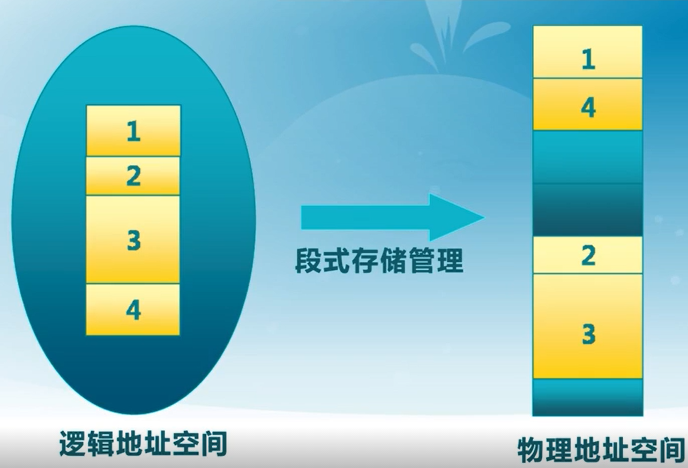

联系Lab1的段知识点：一个段由**base**字段指出基地址并有**limit**字段限制在该地址的偏移范围(也就是指针范围)，加上权限字段。使用这样的可以将连续的逻辑地址映射到分散的物理地址空间中并提供了访问保护


段访问：逻辑地址由二元组(s, addr)表示

+   s：段号(段选择子)
+   addr：段内偏移

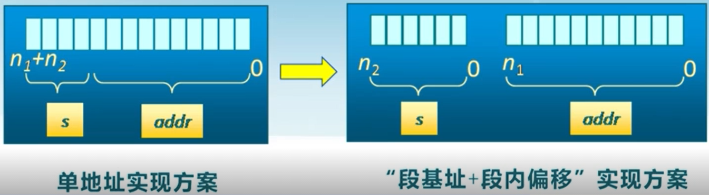

硬件实现：

+   程序提供逻辑地址给CPU
+   取段选择子，获取段描述符进而获得base和limit等字段
+   （MMU）检查addr(偏移)是否合法
+   （MMU）base + off获得物理地址


### 页式存储管理

页：2^n 常见为4K，帧和页的大小必须相同

+   页帧：针对物理地址空间**划分为大小相同**的基本分配单位
+   页面：针对逻辑地址划**分为大小相同**的基本分配单位


地址计算：


这里假定页大小为2^9==512也就是后面9位为页内偏移是6，前7位是页号为3：

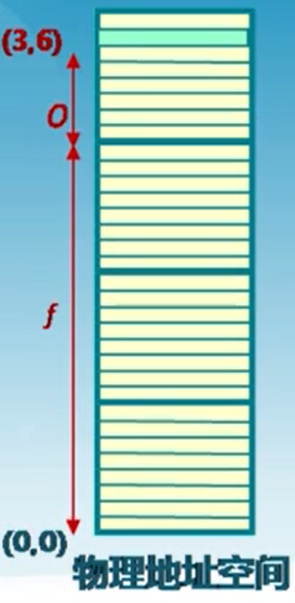

需要注意的是逻辑页划分和物理页划分是一样的但是一般页号大小！= 帧号大小，也是为了达到**灵活使用物理内存**的目的(逻辑页号连续，物理帧号不连续)，不像段存储中的段自带定位功能，这里将需要引入**页表来实现逻辑页到物理页的对应**


#### X86页目录和页表项

引入这两个结构来管理页到帧的对应关系，很像段描述符

页目录：

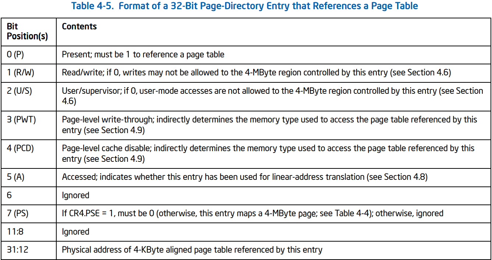

+   12：31的20位是页表的基地址，也就是页表基地址是4KB对齐的
+   当前页目录的物理地址存放在CR3寄存器中（也称为页目录基址寄存器PDBR）


页表：

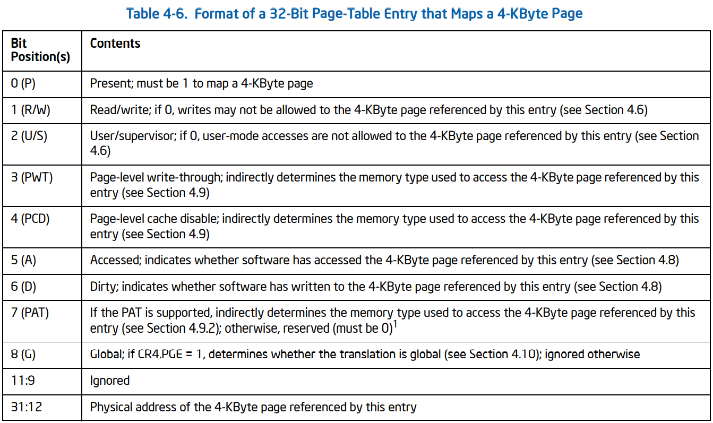

+   12：31的20为是页基地址说明页是4KB对齐的


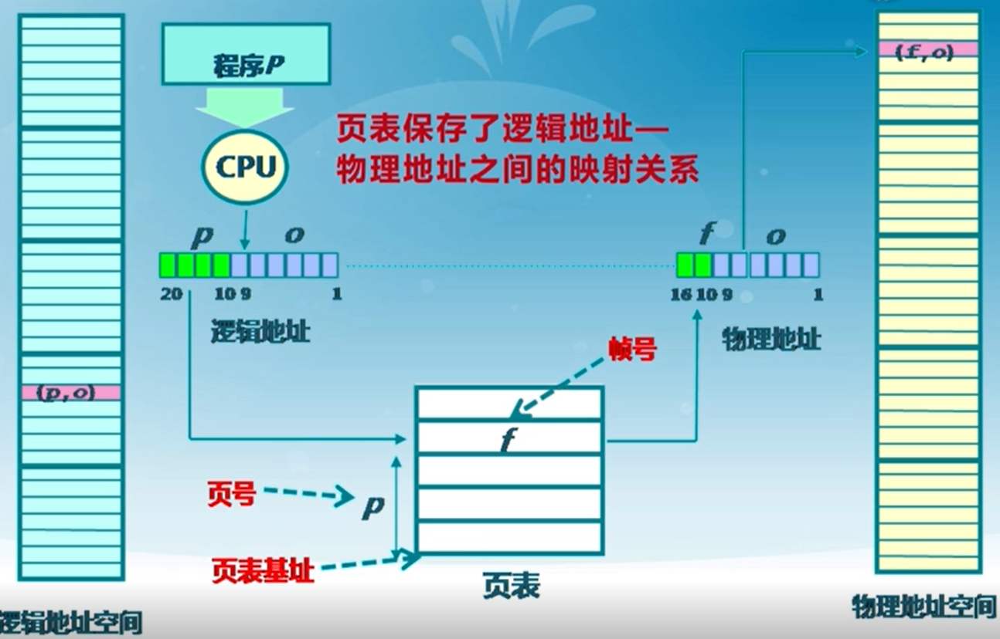

内存访问性能问题：访问一个内存单元需要2次内存访问(页表项，访问数据)

页表大小问题：页表占内存可能非常大

处理：引入缓冲机制(TLB快表)，间接访问(多级页表)

+   TLB利用代码/数据相邻性应用，缓存其附近的页表项，再次引用时更加快速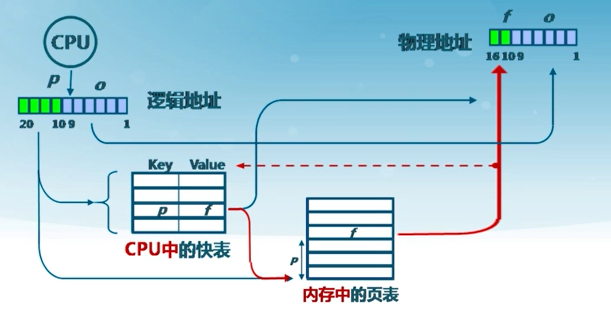
+   多级页表，就是把原来的打页表切割成几份，这样在TSS切换任务时就可以减少页表的载入。如运行一个程序其一级页表(页目录)的某些**存在位**是0那么其对应下面的页表就不需要载入内存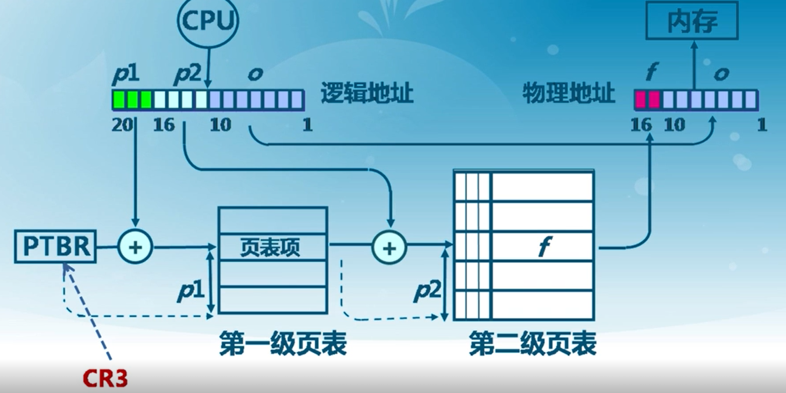


### 段页式存储管理

通过前面的介绍可知这两种存储方式各有春秋：

+   段式管理利用硬件对其使用权限的检查可以起到很好的保护作用
+   页式管理利用其粒化物理内存可以起到内存灵活利用和动态转移的作用

那么两者如何合并？由于每个段所对应的内存较大，那么为**每个段添加页表**来对其进行分块

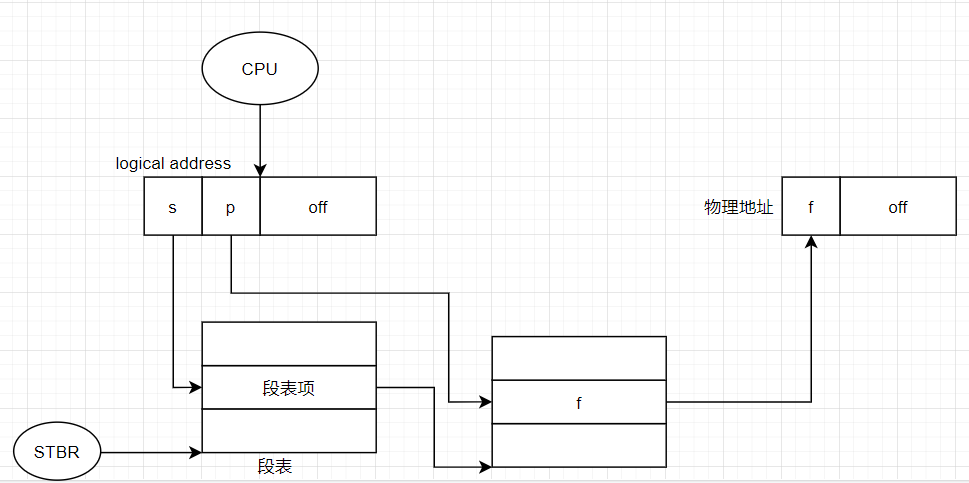

这样可以很方便的共享某个段(物理内存只有一份)


## ucore内存内存管理体系解析

从内核被载入到内核执行，逐步跟踪看看物理内存如何被段页式支配


在载入内存前内核链接脚本**kernel.ld**指出起始地址为`. = 0xC0100000`.由bios加载BootLoader然后再有BootLoader加载内核并转移控制权。BootLoader被加载与PA：0x7c00


### BootLoader

GDT:VA到PA直接映射

```assembly
gdt:
    SEG_NULLASM                                     # null seg
    SEG_ASM(STA_X|STA_R, 0x0, 0xffffffff)           # code seg for bootloader and kernel
    SEG_ASM(STA_W, 0x0, 0xffffffff)                 # data seg for bootloader and kernel
```

---


和实验一不同的是，这里加入了bios中断`int 0x15`进行对物理内存的信息读取：

```assembly
probe_memory:
    movl $0, 0x8000
    xorl %ebx, %ebx
    movw $0x8004, %di
start_probe:
    movl $0xE820, %eax
    movl $20, %ecx
    movl $SMAP, %edx
    int $0x15
    jnc cont
    movw $12345, 0x8000
    jmp finish_probe
cont:
    addw $20, %di
    incl 0x8000
    cmpl $0, %ebx
    jnz start_probe
```

返回一个结构体信息：

```c
struct e820map {
    int nr_map;			//获取的内存块map个数
    struct {			//每个内存块对应的描述结构体map
        uint64_t addr;
        uint64_t size;	
        uint32_t type;	//对应一个map块的内存属性，reserved：2或available：1
    } __attribute__((packed)) map[E820MAX];
};
```

参数：这里我们所关注的输出就是DI指向的map信息

+   eax:e820h，Function Code
+   ebx：0，初始值必须为0，从PA 0地址开始，完成一次信息读取更新为下一块PA地址
+   ES:DI，信息存放指针，此处为0x8004即map数组，
+   ecx：最大map数，对应E820MAX
+   edx：指向签名`SMAP`

在pmm.c的page_init中：

```bash
e820map:
  memory: 0009fc00, [00000000, 0009fbff], type = 1.
  memory: 00000400, [0009fc00, 0009ffff], type = 2.
  memory: 00010000, [000f0000, 000fffff], type = 2.
  memory: 07ee0000, [00100000, 07fdffff], type = 1.
  memory: 00020000, [07fe0000, 07ffffff], type = 2.
  memory: 00040000, [fffc0000, ffffffff], type = 2.
```

前面有1MB的空间，然后**0x0100000~0x07fdffff**才是我们接下来要用的(约128MB)


#### bootmain.c

这里没什么改动，但是前面说道kernel.ld指出其首地址为**0xC0100000**（我理解为VP结合下文），但该函数首先将kernel的ELF头读出来到物理地址**0x10000**，然后在根据头信息读取各个段：

```c
#define ELFHDR          ((struct elfhdr *)0x10000)      // scratch space
	ph = (struct proghdr *)((uintptr_t)ELFHDR + ELFHDR->e_phoff);
    eph = ph + ELFHDR->e_phnum;
    for (; ph < eph; ph ++) {
        readseg(ph->p_va & 0xFFFFFF, ph->p_memsz, ph->p_offset);
    }

    // call the entry point from the ELF header
    // note: does not return
    ((void (*)(void))(ELFHDR->e_entry & 0xFFFFFF))();
```

注意那个`& 0xFFFFFF`所以本来要读到**0xC0100000**的但是实际上还是读到了**0x100000**这时候出现了信息不对等(ELFHeader给出的和实际加载的)所以将在后面引入一个新的gdt表并将base设置为**-0xC0000000**来解决虚拟地址问题

>   其实CPU读到的可以总是看做虚拟地址，因为对其的解析是由其他硬件(MMU)配合gdt等数据结构来完成的，只要解析方式或数据结构发生该表最终索引的物理地址也就变了，**CPU一直被蒙在鼓里**

接下来是进入entry.s中


### entry.s

GDT：VA映射到PA需要**-0xC0000000**，正好对应ld将整个内核虚拟地址设为0xC0100000

```assembly
__gdt:
    SEG_NULL
    SEG_ASM(STA_X | STA_R, - KERNBASE, 0xFFFFFFFF)      # code segment
    SEG_ASM(STA_W, - KERNBASE, 0xFFFFFFFF)              # data segment
```

对应上文，base为- KERNBASE 即 -0xC0000000

**并且此处虚拟地址已经是0xC0100000开头了**

---


感觉这里的作用是进行一个过渡，代码都比较重要

```assembly
#include <mmu.h>
#include <memlayout.h>

#define REALLOC(x) (x - KERNBASE)
.text
.globl kern_entry
kern_entry:
    # reload temperate gdt (second time) to remap all physical memory
    # virtual_addr 0~4G=linear_addr&physical_addr -KERNBASE~4G-KERNBASE 
    lgdt REALLOC(__gdtdesc)
    movl $KERNEL_DS, %eax
    movw %ax, %ds
    movw %ax, %es
    movw %ax, %ss

    ljmp $KERNEL_CS, $relocated

relocated:

    # set ebp, esp
    movl $0x0, %ebp
    # the kernel stack region is from bootstack -- bootstacktop,
    # the kernel stack size is KSTACKSIZE (8KB)defined in memlayout.h
    movl $bootstacktop, %esp
    # now kernel stack is ready , call the first C function
    call kern_init

# should never get here
spin:
    jmp spin

.data
.align PGSIZE
    .globl bootstack
bootstack:
    .space KSTACKSIZE
    .globl bootstacktop
bootstacktop:

.align 4
__gdt:
    SEG_NULL
    SEG_ASM(STA_X | STA_R, - KERNBASE, 0xFFFFFFFF)      # code segment
    SEG_ASM(STA_W, - KERNBASE, 0xFFFFFFFF)              # data segment
__gdtdesc:
    .word 0x17                                          # sizeof(__gdt) - 1
    .long REALLOC(__gdt)
```

重点：

+   建立了新的GDT表，待会解决虚拟地址映射问题
+   建立了8K页对齐的内核栈：bootstacktop
+   然后重新加载GDT，ljmp切换cs进行重定位(采用新的地址解析)
+   使用内核栈，进入kern_init


### kern_init&pmm_init

GDT：VA映射到PA需要**-0xC0000000**，正好对应ld将整个内核虚拟地址设为0xC0100000

```assembly
__gdt:
    SEG_NULL
    SEG_ASM(STA_X | STA_R, - KERNBASE, 0xFFFFFFFF)      # code segment
    SEG_ASM(STA_W, - KERNBASE, 0xFFFFFFFF)              # data segment
```

对应上文，base为- KERNBASE 即 -0xC0000000

**并且此处虚拟地址已经是0xC0100000开头了**

以下由于虚拟地址能够正确对应物理地址，将主要提及虚拟地址

---


主要代码

```c
int
kern_init(void) {
    extern char edata[], end[];
    memset(edata, 0, end - edata);	//将kernel的data段清0
...
    pmm_init();                 // init physical memory management
...	
    while (1);
}
```

对于pmm_init：

```c
    //初始化一个双链表头，将用于管理free页
	init_pmm_manager();
    //建立物理页表
    page_init();
    check_alloc_page();

    // create boot_pgdir, an initial page directory(Page Directory Table, PDT)
    //创建页目录
    boot_pgdir = boot_alloc_page();
    memset(boot_pgdir, 0, PGSIZE);
    boot_cr3 = PADDR(boot_pgdir);

    check_pgdir();

    static_assert(KERNBASE % PTSIZE == 0 && KERNTOP % PTSIZE == 0);

    // recursively insert boot_pgdir in itself
    // to form a virtual page table at virtual address VPT
    //页目录插入虚拟页表
    boot_pgdir[PDX(VPT)] = PADDR(boot_pgdir) | PTE_P | PTE_W;

    // map all physical memory to linear memory with base linear addr KERNBASE
    //linear_addr KERNBASE~KERNBASE+KMEMSIZE = phy_addr 0~KMEMSIZE 物理地址0~0x38000000映射到线性地址0xC0000000~0xC0000000+0x38000000
    //But shouldn't use this map until enable_paging() & gdt_init() finished.
    boot_map_segment(boot_pgdir, KERNBASE, KMEMSIZE, 0, PTE_W);

    //temporary map: 
    //virtual_addr 3G~3G+4M = linear_addr 0~4M = linear_addr 3G~3G+4M = phy_addr 0~4M     
    boot_pgdir[0] = boot_pgdir[PDX(KERNBASE)];

    enable_paging();

    //reload gdt(third time,the last time) to map all physical memory
    //virtual_addr 0~4G=liear_addr 0~4G
    //then set kernel stack(ss:esp) in TSS, setup TSS in gdt, load TSS
    gdt_init();

    //disable the map of virtual_addr 0~4M
    boot_pgdir[0] = 0;

    //now the basic virtual memory map(see memalyout.h) is established.
    //check the correctness of the basic virtual memory map.
    check_boot_pgdir();

    print_pgdir();
```


#### page_init

````c
static void
page_init(void) {
    struct e820map *memmap = (struct e820map *)(0x8000 + KERNBASE);
    uint64_t maxpa = 0;

    cprintf("e820map:\n");
    int i;
    for (i = 0; i < memmap->nr_map; i ++) {
        uint64_t begin = memmap->map[i].addr, end = begin + memmap->map[i].size;
        cprintf("  memory: %08llx, [%08llx, %08llx], type = %d.\n",
                memmap->map[i].size, begin, end - 1, memmap->map[i].type);
        if (memmap->map[i].type == E820_ARM) {
            if (maxpa < end && begin < KMEMSIZE) {
                maxpa = end;        //memory: 07ee0000, [00100000, 07fdffff], type = 1.
                                    //memory: 0009fc00, [00000000, 0009fbff], type = 1.
            }
        }
    }
    if (maxpa > KMEMSIZE) {
        maxpa = KMEMSIZE;
    }

    extern char end[];          //虚拟地址结尾
    /*物理页数目*/
    npage = maxpa / PGSIZE;		
    /*页描述符结构，内核虚拟地址的尾部开始*/
    pages = (struct Page *)ROUNDUP((void *)end, PGSIZE);    //页对其
    /*页帧设置内核保留字段*/
    for (i = 0; i < npage; i ++) {
        SetPageReserved(pages + i);
    }
	/*页帧表后的地址PA*/
    uintptr_t freemem = PADDR((uintptr_t)pages + sizeof(struct Page) * npage);

    for (i = 0; i < memmap->nr_map; i ++) {
        uint64_t begin = memmap->map[i].addr, end = begin + memmap->map[i].size;
        if (memmap->map[i].type == E820_ARM) {
            if (begin < freemem) {
                begin = freemem;
            }
            if (end > KMEMSIZE) {
                end = KMEMSIZE;
            }
            if (begin < end) {
                begin = ROUNDUP(begin, PGSIZE);
                end = ROUNDDOWN(end, PGSIZE);
                if (begin < end) {
                    init_memmap(pa2page(begin), (end - begin) / PGSIZE);
                }
            }
        }
    }
}
````

+   通过PA：0x8000获取内存e820map信息
+   npage：物理页帧数，0x7fe0000 / 0x1000即**0x7fe0个**
    +   一个页描述符：0x14字节，总描述符大约占639 K
+   SetPageReserved(pages + i)：总页帧表，
+   进入init_memmap前，begin---end是目前free物理内存页对齐后的范围

此时内存分布大致如下：

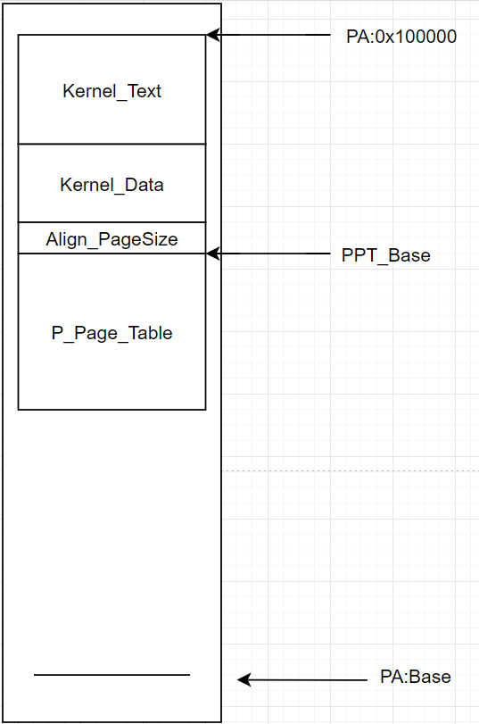


**页帧表中第一项是指向其基址的PPT_BASE**是所有的页表项


### 二级页表建立

在pmm_init(void)函数中：分配第一页作为页目录(最大4K)

```c
	// create boot_pgdir, an initial page directory(Page Directory Table, PDT)
    //创建页目录
    boot_pgdir = boot_alloc_page();
    memset(boot_pgdir, 0, PGSIZE);
    boot_cr3 = PADDR(boot_pgdir);
```

根据线性地址la，找到对应页目录向(**PDX(la)**)看是否存在(**PTE_P**)如果存在就利用PTX(la)获取**二级页表项的指针**，如果不存在就在分配一页将其地址填入页目录项：

```c
//get_pte - get pte and return the kernel virtual address of this pte for la
//        - if the PT contians this pte didn't exist, alloc a page for PT
// parameter:
//  pgdir:  the kernel virtual base address of PDT
//  la:     the linear address need to map
//  create: a logical value to decide if alloc a page for PT
// return vaule: the kernel virtual address of this pte
// 获取二级页表项指针
pte_t *
get_pte(pde_t *pgdir, uintptr_t la, bool create) {
    pde_t *pdep = NULL;
    pde_t *base_addr = pgdir;       //第一个空闲页表

    pdep = &base_addr[PDX(la)];
    if (((*pdep)&PTE_P) == 0){
        struct Page *page = NULL;

        if (create == 0 || (page = alloc_page()) == NULL) return NULL;

        uintptr_t pa_page = page2pa(page);
        memset(KADDR(pa_page), 0, PGSIZE);
        *pdep = pa_page | PTE_P | PTE_U | PTE_W;
        page_ref_inc(page);
    }
    return &((pte_t *)KADDR(PDE_ADDR(*pdep)))[PTX(la)];
}
```


但此时仅仅这样二级页表项中还没有物理地址的数据，需要后面在分配一个页进行插入：

```c
//page_insert - build the map of phy addr of an Page with the linear addr la
// paramemters:
//  pgdir: the kernel virtual base address of PDT
//  page:  the Page which need to map
//  la:    the linear address need to map
//  perm:  the permission of this Page which is setted in related pte
// return value: always 0
//note: PT is changed, so the TLB need to be invalidate 
//插入二级页表
int
page_insert(pde_t *pgdir, struct Page *page, uintptr_t la, uint32_t perm) {
    pte_t *ptep = get_pte(pgdir, la, 1);
    if (ptep == NULL) {
        return -E_NO_MEM;
    }
    page_ref_inc(page);
    if (*ptep & PTE_P) {
        struct Page *p = pte2page(*ptep);
        if (p == page) {
            page_ref_dec(page);
        }
        else {
            page_remove_pte(pgdir, la, ptep);
        }
    }
    *ptep = page2pa(page) | PTE_P | perm;
    tlb_invalidate(pgdir, la);
    return 0;
}
```

+   pgdir：页目录基址
+   page：需要插入的页
+   la：根据线性地址决定插入的位置(二级页表项)
+   perm：设置二级页表项权限

如果在la对应的地方已经有了一个页表项(二级)，那么比对是不是指向同一个页，如果不是同一个就把原来那个释放再填入页的物理地址和权限信息。


### Todo

+   页表自映射建立


# 练习1

>   实现 first-fit 连续物理内存分配算法（需要编程）
>
>   在实现first fit 内存分配算法的回收函数时，要考虑地址连续的空闲块之间的合并操作。提示:在建立空闲页块链表时，需要按照空闲页块起始地址来排序，形成一个有序的链表。可能会修改default_pmm.c中的default_init，default_init_memmap，default_alloc_pages， default_free_pages等相关函数。请仔细查看和理解default_pmm.c中的注释。
>
>   请在实验报告中简要说明你的设计实现过程。请回答如下问题：
>
>   你的first fit算法是否有进一步的改进空间

这里我采用双链表管理空闲块(只含空闲块头部指针)，注意一个空闲块由多个或一个页组成由低地址到高地址排序。通过空闲块的头部进行分割或合并：空闲块头flag：0b10， property：n页数量，空闲页flag：b10， property：0

在default_init_memmap初始化页表

```c
static void
default_init_memmap(struct Page *base, size_t n) {
    assert(n > 0);
    struct Page *p = base;
    for (; p != base + n; p ++) {
        assert(PageReserved(p));
        ClearPageReserved(p);       //flag : PG_reserve to 0 
        SetPageProperty(p);         //flag : PG_property to 1
        p->property = 0;            //property
        set_page_ref(p, 0);         //ref
        memset(&(p->page_link), 0, sizeof(list_entry_t));
    }
    list_add_before(&free_list, &(base->page_link)); //lowAddr-->highAddr page
    base->property = n;
    nr_free += n;
}
```


释放函数思路：先清空块的特殊字段，然后从空闲链表中找到可插入位置。然后注意合并先看低地址是否能合并，再看高地址合并：

```c
static void
default_free_pages(struct Page *base, size_t n) {
	/*debug*/
    cprintf("(struct Page *)%p\n", base);
    cprintf("\t{\n");
    cprintf("  ref = %d,\n", base->ref);
    cprintf("  flags = %d,\n", base->flags);
    cprintf("  property = %d,\n", base->property);
    cprintf("  page_link = {\n");
    cprintf("   prev = %p,\n", base->page_link.prev);
    cprintf("   next = %p\n", base->page_link.next);
    cprintf("  },\n");
    cprintf("}\n");

    assert(n > 0);
    struct Page *p = base;
    for (; p != base + n; p ++) {
        assert(PageReserved(p) && !PageProperty(p));
        SetPageProperty(p);
        ClearPageReserved(p);
        set_page_ref(p, 0);
    }
    base->property = n;
    
    list_entry_t *le = list_next(&free_list);
    struct Page *last = NULL, *next = 0xFFFFFFFF;
    while (le != &free_list) {
        p = le2page(le, page_link);
        le = list_next(le);

        if (p < base && p >= last ) last = p;
        if (p > base && p <= next) next = p;
    }

    if (last < base && last != NULL){
        list_add_after(&(last->page_link), &(base->page_link));
        if ((last + last->property) == base){
            last->property += base->property;
            list_del(&(base->page_link));
            base->property = 0;
            base = last;
        }
    }

    if (base < next && next != 0xFFFFFFFF){
        if (last > base || last == NULL)
            list_add_before(&(next->page_link), &(base->page_link));
        if ((base + base->property) == next){
            base->property += next->property;
            list_del(&(next->page_link));
            next->property = 0;
        }
    }

    if (last == NULL && next == 0xFFFFFFFF){
        list_add_after(&free_list, &(base->page_link));
    }
    
    nr_free += n;
}
```


空闲块分配思路：根据需求n从空闲链表中找到第一个合适的，同样注意是否需要切割块。如果被切割则剩下的块代替原来链表中的位置：

```c
/*first fit*/
static struct Page *
default_alloc_pages(size_t n) {
    assert(n > 0);
    if (n > nr_free) {
        return NULL;
    }
    struct Page *page = NULL;
    list_entry_t *le = &free_list;
    while ((le = list_next(le)) != &free_list) {
        struct Page *p = le2page(le, page_link);
        if (p->property >= n) {
            page = p;
            break;
        }
    }
    if (page != NULL) {
        list_del(&(page->page_link));
       
        if (page->property > n) {
            struct Page *p = page + n;
            p->property = page->property - n;
            list_add_after(page->page_link.prev, &(p->page_link));
            
        }
        
        page->property = n;
        for (int looper = 0; looper < n; looper++){
            SetPageReserved(&(page[looper]));
            ClearPageProperty(&(page[looper]));
            // page_ref_inc(&(page[looper]));
        }
        
        nr_free -= n;
    }
    return page;
}
```


# 练习2

>   练习2：实现寻找虚拟地址对应的页表项（需要编程）
>
>   通过设置页表和对应的页表项，可建立虚拟内存地址和物理内存地址的对应关系。其中的get_pte函数是设置页表项环节中的一个重要步骤。此函数找到一个虚地址对应的二级页表项的内核虚地址，如果此二级页表项不存在，则分配一个包含此项的二级页表。本练习需要补全get_pte函数 in kern/mm/pmm.c，实现其功能。请仔细查看和理解get_pte函数中的注释。get_pte函数的调用关系图如下所示：

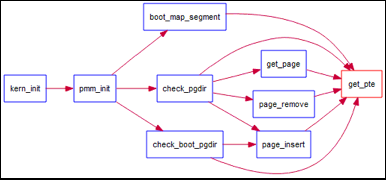

请在实验报告中简要说明你的设计实现过程。请回答如下问题：

+   请描述页目录项（Page Directory Entry）和页表项（Page Table Entry）中每个组成部分的含义以及对ucore而言的潜在用处。	
    +   答：[X86页目录和页表项](#X86页目录和页表项)
+   如果ucore执行过程中访问内存，出现了页访问异常，请问硬件要做哪些事情？
    +   答：中断执行流，启用服务例程分配一个页并插入页表中，然后返回


该函数根据注释get_pte 要做的就是根据PDX(la)获得二级页表项的指针，二级页表项里面有没有东西不管。所以这个函数主要负责二级页表的建立以及定位：

````c
pte_t *
get_pte(pde_t *pgdir, uintptr_t la, bool create) {
	pde_t *pdep = NULL;
    pde_t *base_addr = pgdir;       //第一个空闲页表

    pdep = &base_addr[PDX(la)];
    if (((*pdep)&PTE_P) == 0){
        struct Page *page = NULL;

        if (create == 0 || (page = alloc_page()) == NULL) return NULL;

        uintptr_t pa_page = page2pa(page);
        memset(KADDR(pa_page), 0, PGSIZE);
        *pdep = pa_page | PTE_P | PTE_U | PTE_W;
        page_ref_inc(page);
    }
    return &((pte_t *)KADDR(PDE_ADDR(*pdep)))[PTX(la)];
}
````


# 练习3

>   练习3：释放某虚地址所在的页并取消对应二级页表项的映射（需要编程）
>
>   当释放一个包含某虚地址的物理内存页时，需要让对应此物理内存页的管理数据结构Page做相关的清除处理，使得此物理内存页成为空闲；另外还需把表示虚地址与物理地址对应关系的二级页表项清除。请仔细查看和理解page_remove_pte函数中的注释。为此，需要补全在 kern/mm/pmm.c中的page_remove_pte函数。page_remove_pte函数的调用关系图如下所示：

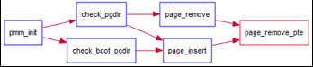

请在实验报告中简要说明你的设计实现过程。请回答如下问题：

+   数据结构Page的全局变量（其实是一个数组）的每一项与页表中的页目录项和页表项有无对应关系？如果有，其对应关系是啥？
    +   答：可以把Page全局变量看做一个二维数组，页目录项就是行idx，页表项就是列idx
+   如果希望虚拟地址与物理地址相等，则需要如何修改lab2，完成此事？ 鼓励通过编程来具体完成这个问题
    +   将kernel.ld的起始地址：0xc0100000===>0x100000
    +   memlayout.h中的KERNELBASE：0xc0000000===>0x0
    +   不启用页机制


page_remove_pte函数根据la移除指定页表项，同时还要把对应页的ref--，如果变为0还需释放该page。最后把页表项设置为不存在状态**!PTE_P**


```c
//page_remove_pte - free an Page sturct which is related linear address la
//                - and clean(invalidate) pte which is related linear address la
//note: PT is changed, so the TLB need to be invalidate 删除一个页
static inline void
page_remove_pte(pde_t *pgdir, uintptr_t la, pte_t *ptep) {
    pde_t *pdep = NULL;
    pde_t *base_addr = pgdir;

    pdep = &base_addr[PDX(la)];
    if (((*pdep)&PTE_P) == 0 || ((*ptep)&PTE_P) == 0){
        return;
    }else{
        struct Page *page = pte2page(*ptep);
        
        assert(page->ref != 0);
        if (page_ref_dec(page) == 0){
            free_page(page);
            *ptep = *ptep & ~PTE_P;
            tlb_invalidate(base_addr, la);
        } 
    }
}    
```

