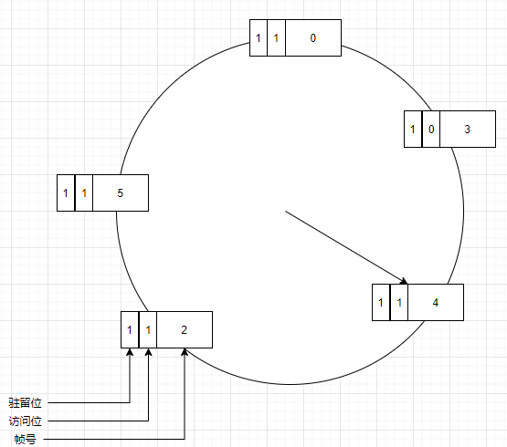
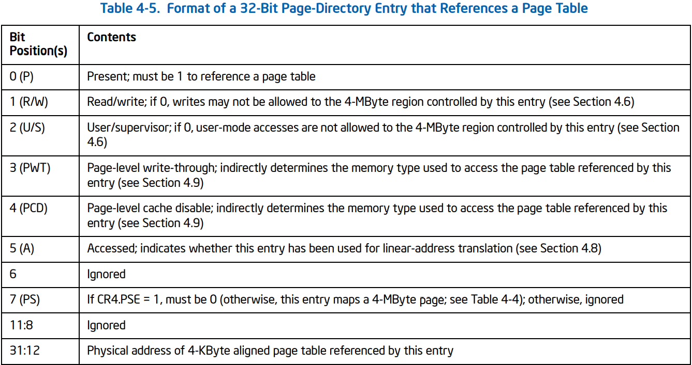
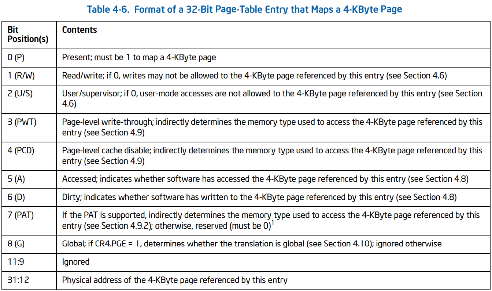

# 知识清单

+   [虚拟存储概念](#虚拟存储概念)
+   [置换算法概述](#置换算法概述)
+   [磁盘读取](#磁盘读取)
+   [ucore虚拟内存管理](#ucore虚拟内存管理)
+   [置换算法概述](#置换算法概述)
+   [Page_fault](#Page_fault)

## 虚拟存储概念

+   需求背景：实际内存无法满足程序运行需求

    +   解决办法：覆盖，交换(swap)，**虚拟存储**技术
+   覆盖技术：依据程序逻辑将程序划分为**功能相对独立**的模块；将不同时执行的模块**共享同一块内存**，在执行时相互覆盖

    +   缺点：程序员划分模块增加编程难度，覆盖时增加执行时间
+   交换技术：增加正在运行或需要运行的程序的内存，不是对于整个内存空间不够的情况。**可将暂时不能运行的程序放到外存**。
    +   换入换出的基本单位是**整个进程地址空间**，换出(swap out)把整个进程的地址空间保存到外存，换入反之
    +   问题：**交换时机**，何时进行交换？只当内存空间不够或有不够时。**交换区大小**。交换后重定位

​    

总目标：使用内存+外存运行程序    == 虚拟内存 

​    

​    

### 局部性原理

程序在执行过程的一个比较段时期，所执行的**指令地址**和**指令操作数**，分别局限于一定区域 。为虚拟存储的理论依据

+   时间局部性：一条指令的一次执行和下次执行，一个数据的一次访问和下次访问都集中在一个**较短时期**内
+   空间局部性：当前指令和临近的几条指令，当前访问的数据和临近的几个数据都集中在一个**较小的区域**中
+   分支局部性：一条跳转指令执行两次，很可能调到相同位置


### 实现思路

将不常用的部分内存块暂存到外存

原理：

+   程序加载时：只将当前指令执行需要的**部分页面或段**载入内存
+   指令执行中需要的**指令或数据不在内存**(缺页)：操作系统加载对应页或段
+   操作系统将内存中暂时不用的页面或段保存到外存：置换算法

实现方式：虚拟段，虚拟页


### 虚拟页式存储管理

在页式存储管理的基础上，增加**请求调页和页面置换**

思路：

+   当用户程序要载入内存时，只载入部分页面就启动程序
+   随后程序发现需要的数据或代码不在内存，**发出缺页异常**
+   操作系统**提供缺页服务例程**，**将外存中相应页面调入内存修改页表项**，再次执行引发缺页的指令
    +   如果此时物理内存没有空闲页，进行置换算法选择被替换页帧以及其逻辑页对其回存，替换等


## 磁盘读取

在置换页时需要将目标页(如果需要)存入磁盘，就得使用磁盘读写。在实时模式下读写IDE硬盘可以使用BIOS中断程序，但在保护模式下就不可以使用BIOS中断程序了，只能通过读写端口来实现硬盘的访问。IDE标准定义了8个端口来操作硬盘。PC体系结构将第一个硬盘控制器映射到端口**0x1F0 ～ 0x1F7**处，而第二个硬盘控制器则被映射到端口**0x170 ～ 0x177**处。这几个寄存器的描述如下：

>   0x1F0：数据寄存器。读写数据都必须通过这个寄存器
>
>   0x1F1：错误寄存器，每一位代表一类错误。全零表示操作成功。
>
>   0x1F2：扇区计数。这里面存放你要操作的扇区数量
>
>   0x1F3：扇区LBA地址的0-7位
>
>   0x1F4：扇区LBA地址的8-15位
>
>   0x1F5：扇区LBA地址的16-23位
>
>   0x1F6（低4位）：扇区LBA地址的24-27位
>
>   0x1F6（第4位）：0表示选择主盘，1表示选择从盘
>
>   0x1F6（5-7位）：必须为1
>
>   0x1F7（写）：命令寄存器
>
>   0x1F7（读）：状态寄存器
>
>   bit 7 = 1 控制器忙
>
>   bit 6 = 1 驱动器就绪
>
>   bit 5 = 1 设备错误
>
>   bit 4 N/A
>
>   bit 3 = 1 扇区缓冲区错误
>
>   bit 2 = 1 磁盘已被读校验
>
>   bit 1 N/A
>
>   bit 0 = 1 上一次命令执行失败

这里是采用LBA对磁盘进行逻辑分区，共28位可以编号0xFFFFFFF个逻辑扇区，每次读写时都是以扇区(512B)为单位。

当我们需要将某一PTE(4K)换出来时，将其保存到连续的8个逻辑分区(LBA占28位)，然后将这28位的位置信息放入PTE高28位，其PTE_P位置为0其他位作为保留位即可。

```bash
/* *
 * swap_entry_t
 * --------------------------------------------
 * |         offset        |   reserved   | 0 |
 * --------------------------------------------
 *           24 bits            7 bits    1 bit
 * */
```


## ucore虚拟内存管理

前面lab1~lab2主要考虑对象是内核代码以及数据对应内核地址空间，而现在是要对于用户应用程序地址空间进行考虑。

ucore使用以下两个结构体管理应用程序的虚拟地址空间：

```c
#define VM_READ                 0x00000001
#define VM_WRITE                0x00000002
#define VM_EXEC                 0x00000004
// the virtual continuous memory area(vma), [vm_start, vm_end), 
// addr belong to a vma means  vma.vm_start<= addr <vma.vm_end 
// 管理一个vma区域由地址范围，属性，所属mm。list_link构成虚拟地址从低到高的顺序
struct vma_struct {
    struct mm_struct *vm_mm; // the set of vma using the same PDT 
    uintptr_t vm_start;      // start addr of vma      
    uintptr_t vm_end;        // end addr of vma, not include the vm_end itself
    uint32_t vm_flags;       // flags of vma
    list_entry_t list_link;  // linear list link which sorted by start addr of vma
};

// the control struct for a set of vma using the same PDT
// 管理使用同一个PDT的vma链表，mmap_list为表头
struct mm_struct {
    list_entry_t mmap_list;        // linear list link which sorted by start addr of vma
    struct vma_struct *mmap_cache; // current accessed vma, used for speed purpose
    pde_t *pgdir;                  // the PDT of these vma
    int map_count;                 // the count of these vma
    void *sm_priv;                   // the private data for swap manager
};
```

+   vma结构体用于描述程序的某一段，如代码段和数据段
    +   虚拟地址空间为：**[vm_start, vm_end)**
    +   vm_flags：该空间(程序段)的权限
    +   vm_mm：属于哪一个mm，依据PDT来分
    +   list_link：双链表将同一类型的(mm)vma从低地址到高地址链接
+   mm结构体用于描述管理使用同一个PDT的vma区域
    +   mmap_list：所管理的vma链表
    +   mmap_cache：当前使用的vma，根据程序局部性原理这样可以更快处理
    +   pgdir：该mm使用的PDT
    +   map_count：vma数量
    +   sm_priv


## 置换算法概述

置换算法功能：当出现缺页异常，需要调入新页面而内存已满时**由置换算法来决定**被置换出的物理页面

设计目标：尽可能减少页面的调入调出次数，把未来不再访问或短期内不访问的页面调出

页面锁定(frame locking)：

+   描述必须常驻内存的逻辑页面
+   操作系统关键部分
+   要求响应速度的代码和数据
+   页表中的锁定标志，lock bit

算法评价：模拟页面置换行为，记录缺页次数，缺页越少性能更好


局部页面置换算法：

+   适用范围仅限于当前进程所占的物理页面
+   最优算法(预测未来使用，作为评测依据无法实现)，FIFO(最差)， 最近最久未使用算法LRU(可行，复杂)
    +   时钟算法，最不常用算法LFU

全局页面置换算法：

+   所有可换出的物理页
+   工作集算法，缺页数算法


工作集算法

问题：

+   进程在**不同阶段**的内存需求是变化的
+   分配给进行的内存也需要在不同阶段有所变化
+   全局置换算法需要确定分配给进程的物理页面数


根据进程的阶段特性引入**工作集**：一个进行当前正在使用的逻辑页面集合，可表示为二元函数**W(t, s)**

+   t是当前执行时刻
+   s称为工作机窗口，一个定长的页面访问时间窗口
+   W(t, s)：是指在当前时刻t，前s时间内所有访问页面的集合


思路：换出不在工作集中的页面

实现：

+   访存链表：维护窗口内的访存页面链表
+   访存时：换出不在工作集的页面；更新访存链表(复杂点)
+   缺页时：换入页面；更新访存链表


### 时钟算法

>   思路：折中FIFO算法和最近最久未使用算法，即仅对页面的访问情况进行**大致统计**
>
>   数据结构：
>
>   +   在页表项增加访问位，描述页面在过去一段时间内访问情况
>   +   各页面组织形成环形链表
>   +   指针指向最先调入的页面(FIFO)
>
>   算法：
>
>   +   访问页面时，在页表项记录页面访问情况
>   +   缺页时，**从指针处开始顺序查找未被访问的页面进行置换**
>
>   实现：
>
>   +   页面载入内存时，访问位初始化位0
>   +   访问页面(读写)时，访问位置1
>   +   缺页时，从指针当前位置顺序检查循环链表
>       +   访问位为0，则置换该页
>       +   访问位为1，则访问位置0，并指向下一个直到找到可置换的页面




页目录：



+   每当访问PDE时idx_5即访问位就被置1


页表：



+   访问PTE时idx_5也被置1
+   如果修改了数据dirty位置1

时钟算法如果找到的那一页是被修改过的将需要把原来的内容写入磁盘，再将磁盘对应页读入，处理时间显然较长因此进行改进


改进的时钟算法：目标减少修改页的缺页处理开销

+   在页面中增加修改为，并在访问是进行相应修改
+   缺页时，修改页标志位，跳过由修改的页面


## Page_fault

这里来跟踪一下ucore中发生页异常的执行流程：page_fault_sign-->


从一个check开始

```c
// check_pgfault - check correctness of pgfault handler
static void
check_pgfault(void) {
    .....
    uintptr_t addr = 0x100;    
    int i, sum = 0;
    for (i = 0; i < 100; i ++) {
        *(char *)(addr + i) = i;
        sum += i;
    }
    .....
}
```

向虚拟地址0x100进行写操作将导致#PG， 跳转到**__alltraps**保存寄存器信息后：

```c
void
trap(struct trapframe *tf) {
    // dispatch based on what type of trap occurred
    trap_dispatch(tf);
}
```

这里trapframe中包含由硬件压入的中断号和**error_code**然后由中断号进入不同服务例程：

```c
static void
trap_dispatch(struct trapframe *tf) {
    char c;

    int ret;

    switch (tf->tf_trapno) {
    case T_PGFLT:  //page fault
        if ((ret = pgfault_handler(tf)) != 0) {
            print_trapframe(tf);
            panic("handle pgfault failed. %e\n", ret);
        }
        break;
            ....
    }
    .....
}
```

最终调用**do_pgfault(check_mm_struct, tf->tf_err, rcr2())**，其中CR2寄存器存放了引发#PG的目标地址这里就是**0x100**。

error_code:

+   idx_0表示缺页或权限冲突导致
+   idx_1表示操作类型 读或写，这次操作是读还是写
+   idx_2表示当前处于内核态还是用户态


如果是没有分配物理页，那么根据la获得对应PTE再分配一个页填入其物理地址和权限即可，权限设置依据所在vma的flags权限，然后iret返回，**注意其压入的eip就是触发#PG的那一条指令**


### 触发swap

该实验页置换历程大致为：

+   每次发生缺页时：服务例程调用**pgdir_alloc_page**

    +   ```c
        struct Page *
        pgdir_alloc_page(pde_t *pgdir, uintptr_t la, uint32_t perm) {
            struct Page *page = alloc_page();
            if (page != NULL) {
                if (page_insert(pgdir, page, la, perm) != 0) {
                    free_page(page);
                    return NULL;
                }
                if (swap_init_ok){
                    swap_map_swappable(check_mm_struct, la, page, 0);
                    page->pra_vaddr=la;
                    assert(page_ref(page) == 1);
                }
            }
            return page;
        }
        
        //alloc_pages - call pmm->alloc_pages to allocate a continuous n*PAGESIZE memory 
        struct Page *
        alloc_pages(size_t n) {
            struct Page *page=NULL;
            bool intr_flag;
            
            while (1)
            {
                 local_intr_save(intr_flag);
                 {
                      page = pmm_manager->alloc_pages(n);
                 }
                 local_intr_restore(intr_flag);
        
                 if (page != NULL || n > 1 || swap_init_ok == 0) break;
                 
                 extern struct mm_struct *check_mm_struct;
                 cprintf("page %x, call swap_out in alloc_pages %d\n",page, n);
                 swap_out(check_mm_struct, n, 0);
            }
            return page;
        }
        ```

    +   如果此时还有空闲页alloc_page将不会调用swap_out来进行置换获取空闲页，将直接插入页表并swap_init_ok之后将此页加入**FIFO_swappable链表**用于之后的置换。同样的在swap_out中如果成功获取一页也会加入swappable链表。**即在初始化swap后每次缺页都会将获取的页插入swappable链表**

+   发送缺页但页位于磁盘：调用**swap_in(mm, addr, &page)**

    +   ````c
        int
        swap_in(struct mm_struct *mm, uintptr_t addr, struct Page **ptr_result)
        {
             struct Page *result = alloc_page();
             assert(result!=NULL);
        
             pte_t *ptep = get_pte(mm->pgdir, addr, 0);
             // cprintf("SWAP: load ptep %x swap entry %d to vaddr 0x%08x, page %x, No %d\n", ptep, (*ptep)>>8, addr, result, (result-pages));
            
             int r;
             if ((r = swapfs_read((*ptep), result)) != 0)
             {
                assert(r!=0);
             }
             cprintf("swap_in: load disk swap entry %d with swap_page in vadr 0x%x\n", (*ptep)>>8, addr);
             *ptr_result=result;
             return 0;
        }
        ````

    +   将从**空闲页或swapable链表**获取一页来存放从磁盘上读进来的数据


# 练习1

>   练习1：给未被映射的地址映射上物理页（需要编程）
>   完成do_pgfault（mm/vmm.c）函数，给未被映射的地址映射上物理页。设置访问权限 的时候需要参考页面所在 VMA 的权限，同时需要注意映射物理页时需要操作内存控制 结构所指定的页表，而不是内核的页表。注意：在LAB3 EXERCISE 1处填写代码。执行
>
>   : make　qemu
>   后，如果通过check_pgfault函数的测试后，会有“check_pgfault() succeeded!”的输出，表示练习1基本正确。

请在实验报告中简要说明你的设计实现过程。请回答如下问题：

+   请描述页目录项（Page Directory Entry）和页表项（Page Table Entry）中组成部分对ucore实现页替换算法的潜在用处。
    +   答：通过线性地址la可以找到对应的PDE和PTE其字段包括了访问权限以及页状态等，借此协助替换算法选择正确何时的页进行替换
+   如果ucore的缺页服务例程在执行过程中访问内存，出现了页访问异常，请问硬件要做哪些事情？
    +   读取中断向量，压入中断号，error_code，触发地址等，找到服务例程并执行。最后处理完后iret重新返回执行触发地址的指令


思路根据la获取PTE然后重新分配一页(from free page or swapbale)并填入

````c
int
do_pgfault(struct mm_struct *mm, uint32_t error_code, uintptr_t addr) {
    int ret = -E_INVAL;
    //try to find a vma which include addr
    struct vma_struct *vma = find_vma(mm, addr);

    pgfault_num++;
    uint32_t perm = PTE_U;
    if (vma->vm_flags & VM_WRITE) {
        perm |= PTE_W;
    }
    addr = ROUNDDOWN(addr, PGSIZE);

    ret = -E_NO_MEM;
	....
    pte_t *ptep=NULL;
   
#if 0
    /*LAB3 EXERCISE 1: YOUR CODE*/
    ptep = ???              //(1) try to find a pte, if pte's PT(Page Table) isn't existed, then create a PT.
    if (*ptep == 0) {
                            //(2) if the phy addr isn't exist, then alloc a page & map the phy addr with logical addr

    }
    ....
#endif
    if ((ptep = get_pte(mm->pgdir, addr, 1)) == NULL){
        cprintf("get_pte in do_pgfualt failed\n");
        goto failed;
    }
    /*没有分配物理页*/
    if(*ptep == 0){
        /*alloc page 这里pgdir_alloc_page会自动将该页加入swapable链*/
        if(pgdir_alloc_page(mm->pgdir, addr, perm | PTE_P) == 0){
            cprintf("pgdir_alloc_page in do_pgfault failed\n");
            goto failed;
        }
        ......
    ret = 0;
failed:
    return ret;
}    
````


# 练习2

>   练习2：补充完成基于FIFO的页面替换算法（需要编程）
>   完成vmm.c中的do_pgfault函数，并且在实现FIFO算法的swap_fifo.c中完成map_swappable和swap_out_victim函数。通过对swap的测试。注意：在LAB3 EXERCISE 2处填写代码。执行
>
>   : make　qemu
>   后，如果通过check_swap函数的测试后，会有“check_swap() succeeded!”的输出，表示练习2基本正确。
>
>   请在实验报告中简要说明你的设计实现过程。
>
>   请在实验报告中回答如下问题：
>
>   +   如果要在ucore上实现"extended clock页替换算法"请给你的设计方案，现有的swap_manager框架是否足以支持在ucore中实现此算法？如果是，请给你的设计方案。如果不是，请给出你的新的扩展和基此扩展的设计方案。并需要回答如下问题
>       +   需要被换出的页的特征是什么？
>           +   答：dirty位和access位都为0
>       +   在ucore中如何判断具有这样特征的页？
>           +   答：利用PTE_A和PTE_D做位运算
>       +   何时进行换入和换出操作？
>           +   发送缺页并且没有空闲物理块

````c
 		/*页在磁盘中*/
        if (swap_init_ok){      //swap初始化完成
            struct Page *page = NULL;
            /*读入一个页中 该物理页可能是尚未分配的物理页，也可能是从别的已分配物理页中取的*/
            if((ret = swap_in(mm, addr, &page)) != 0){
                cprintf("swap_in in do_pgfault failed\n");
                goto failed;
            }
            /*页表，设置虚拟地址和物理地址映射关系*/
            page_insert(mm->pgdir, page, addr, perm);
            /*设置该页为swapable*/
            swap_map_swappable(mm, addr, page, 1);
            page->pra_vaddr = addr;
        }
        else{
            cprintf("swap_init is not ready\n");
            goto failed;
        }
````


# Challenge_1

实现识别dirty bit的 extended clock页替换算法（需要编程）

主要修改原**_fifo_swap_out_victim**，增加对PTE_D和PTE_A的检验和置位：

```c
static list_entry_t *pointer = &pra_list_head;	//作为独立指针
static int 
_exclock_swap_out_victim(struct mm_struct *mm, struct Page ** ptr_page, int in_tick){
    list_entry_t *head = (list_entry_t *)mm->sm_priv;
    assert(head != NULL);
    assert(in_tick == 0);

    while ((pointer = list_next(pointer)) != NULL){
        if(pointer == head && list_next(pointer) != head)
            continue;
        else if(pointer == head)
            break;

        struct Page *p = le2page(pointer, pra_page_link);
        pte_t *ptep = get_pte(mm->pgdir, p->pra_vaddr, 0);
        assert(ptep != NULL);

        if(*ptep & PTE_A){
            *ptep = *ptep & ~PTE_A;
            continue;
        }else if(*ptep & PTE_D){
            *ptep = *ptep & ~PTE_D;
            // swap_out(mm, 1, 0); 
            continue;
        }
        else{
            list_del(pointer);
            pointer = list_next(pointer);

            *ptr_page = p;
            // 遍历了一回，肯定修改了标志位，所以要刷新TLB
            tlb_invalidate(mm->pgdir, pointer);
            return 0;
        }
    }

    *ptr_page = NULL;
}
```

同样使用check_swap(将assert注释)，来检验原来fifo发生11次缺页，用exclock发生7次