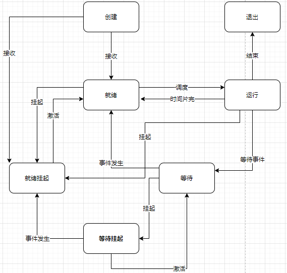
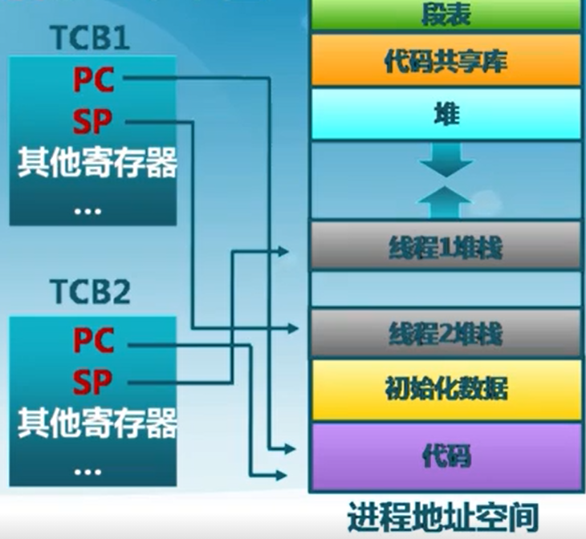

# 知识清单

当前lab进程模型不够完备，针对描述可能不够严谨仔细

+   [进程与线程](#进程与线程)
+   [ucore_进程切换](#ucore_进程切换)

## 进程与线程

**注意此实验对PCB和TCP不做区分**

进程的定义：一个具有独立功能的程序在一个**数据集合**上的一次动态执行过程

进程组成(进程控制块，PCB，Linux中对应TSS struct)：

+   代码，数据
+   状态寄存器：如CPU状态CR0， 指令指针IP
+   通寄存器：AX，BX，CX等
+   进程占用的资源：已打开文件，已分配内存

ucore Lab4使用struct proc_struct表示(当前非常简陋)：了解一下重要的成员

```c
// process's state in his life cycle
enum proc_state {
    PROC_UNINIT = 0,  // uninitialized
    PROC_SLEEPING,    // sleeping
    PROC_RUNNABLE,    // runnable(maybe running)
    PROC_ZOMBIE,      // almost dead, and wait parent proc to reclaim his resource
};
struct proc_struct {
    enum proc_state state;                      // Process state
    int pid;                                    // Process ID
    int runs;                                   // the running times of Proces
    uintptr_t kstack;                           // Process kernel stack
    volatile bool need_resched;                 // bool value: need to be rescheduled to release CPU?
    struct proc_struct *parent;                 // the parent process
    struct mm_struct *mm;                       // Process's memory management field
    struct context context;                     // Switch here to run process
    struct trapframe *tf;                       // Trap frame for current interrupt
    uintptr_t cr3;                              // CR3 register: the base addr of Page Directroy Table(PDT)
    uint32_t flags;                             // Process flag
    char name[PROC_NAME_LEN + 1];               // Process name
    list_entry_t list_link;                     // Process link list 
    list_entry_t hash_link;                     // Process hash list
};
```

+   mm：虚拟内存管理信息，用于用户程序地址空间虚拟化，此lab只涉及内核空间所以被置0并添上**cr3**成员存放PD基址
+   state：进程状态包括**休眠，可执行(可能正在执行)，僵死**
+   parent：父进程
+   context：进程上下文，用于进程切换
+   tf：中断栈帧，存放了调用服务例程前程序的**寄存器，error_code等信息**，用于中断返回
+   cr3：PD物理地址，目的就是进程切换的时候方便直接使用 lcr3实现页表切换，避免每次都根据 mm 来计算 cr3
+   kstack：每个线程/进程？都有一个内核栈。**待定**


为了管理系统中所有的进程控制块，uCore维护了如下全局变量（位于kern/process/proc.c）：

+   static struct proc ***current**：当前占用CPU且处于“运行”状态进程控制块指针。
+    static struct proc ***initproc**：本实验中，指向一个内核线程。本实验以后，此指针将指向第一个用户态进程。
+   static list_entry_t **hash_list**[HASH_LIST_SIZE]：所有进程控制块的哈希表，proc_struct中的成员变量hash_link将基于pid链接入这个哈希表中。
+   list_entry_t **proc_list**：所有进程控制块的双向线性列表，proc_struct中的成员变量list_link将链接入这个链表中。


### 进程状态

进程的状态分为：就绪，运行，等待

进程的生命周期：

+   进程创建：j将进入就绪
    +   **系统**初始化时
    +   **用户**请求创建一个新进程
    +   正在运行的**程序**执行创建进程的系统调用
+   进程执行：将进入运行
    +   内核通过**调度算法**从**就绪队列**中选择一个来占用CPU
+   进程等待：将进入等待(阻塞)，只有进程自身才知道何时需要等待(内部原因导致)
    +   请求并等待系统服务无法马上完成
    +   启动某种操作无法马上完成(I/O)
    +   需要的数据没有到达
+   进程抢占：将**进入就绪**
    +   高优先级程序被调度
    +   当前进程时间片用完
+   进程唤醒：将进入就绪，**只能被别的进程或操作系统唤醒**
    +   被阻塞进程需要的资源已满足
    +   被阻塞进程等待的事件到达
+   进程结束：将退出队列，释放资源
    +   正常退出，错误退出；都是自愿的
    +   致命错误，被其他进程所杀；强制的


进程挂起，目的：将进程转储与外存，减少进程占用内存

在内存时的状态：

+   等待挂起：**进程在外存**并**等待**某时间的出现
    +   等待到等待挂起：没有进程处于就绪态或就绪进程要求更多内存
+   就绪挂起：进程在外存，但只要进入内存即可运行
    +   就绪到就绪挂起：当由**高优先级等待**(系统认为)进程和**低优先级就绪进程**，没有足够空间给高优先级时
    +   运行到就绪挂起：对抢先式分时系统，当有高优先级等待的进程事件出现**进入了就绪态**，而此时没有足够内存

在外存时的状态转换：

+   等待挂起到就绪挂起：当等待挂起进程**等待的事件出现**
+   激活：把一个进程从外存**转到内存**
    +   就绪挂起到就绪：没有就绪进程或**挂起就绪进程**优先级高于就绪进程
    +   等待挂起到等待：当一个进程释放足够内存并有**高优先级等待挂起进程**




### 线程概念

线程是进程的一部分，**描述指令流执行状态**，他是进程中的指令执行流的最小单元。是CPU调度的基本单位，由TCB结构体控制。

+   进程作为资源分配角色：包括地址空间(代码段，数据段)，打开的文件等
+   线程是被调度角色：线程描述在进程资源环境中的指令流执行状态。

针对执行流需要在TCB中保存对应上下文和堆栈




内核线程：进程由内核通过系统调用实现的线程机制，由内核完成线程的创建，终止和管理

+   由内个维护PCB和TCB
+   线程执行系统调用被阻塞不影响其他线程
+   线程的创建，终止和切换开销大：通过系统调用在内核实现
+   以线程为单位进行CPU时间分配


## ucore_进程切换

注意此处实验还未涉及用户空间，因此PCB/TCB的mm成员不需要管。从proc_init函数开始：

调用alloc_proc分配一个简单初始化的PCB然后自主设置pid，state和内核栈等作为当前进程：

```c
    if ((idleproc = alloc_proc()) == NULL) {
        panic("cannot alloc idleproc.\n");
    }

    idleproc->pid = 0;
    idleproc->state = PROC_RUNNABLE;
    idleproc->kstack = (uintptr_t)bootstack;
    idleproc->need_resched = 1;
    set_proc_name(idleproc, "idle");
    nr_process ++;

    current = idleproc;
```

然后调用kernel_thread初始化要创建进程的环境：

```c
// kernel_thread - create a kernel thread using "fn" function
// NOTE: the contents of temp trapframe tf will be copied to 
//       proc->tf in do_fork-->copy_thread function
int
kernel_thread(int (*fn)(void *), void *arg, uint32_t clone_flags) {
    struct trapframe tf;
    memset(&tf, 0, sizeof(struct trapframe));
    tf.tf_cs = KERNEL_CS;
    tf.tf_ds = tf.tf_es = tf.tf_ss = KERNEL_DS;
    tf.tf_regs.reg_ebx = (uint32_t)fn;
    tf.tf_regs.reg_edx = (uint32_t)arg;
    tf.tf_eip = (uint32_t)kernel_thread_entry;
    return do_fork(clone_flags | CLONE_VM, 0, &tf);
}
```

这里使用中断帧 + iret的方式切换函数，do_fork函数真正进程进程的创建大致流程为：

+   alloc_proc：获取初始化PCB
+   设置该PCB的独立栈：setup_kstack
+   拷贝虚拟地址空间(此处未实现)
+   设置该PCB的中断帧，即kernel_thread初始化的那个使其位于独立栈栈顶(esp)，eip指向**forkret**
+   添加其他信息pid，state等

最终proc_init完成后获取一个PCB：

````c
gdb-peda$ p *initproc 
$2 = {
  state = PROC_RUNNABLE, 
  pid = 0x1, 
  runs = 0x0, 
  kstack = 0xc030c000, 
  need_resched = 0x1, 
  parent = 0xc030b008, 
  mm = 0x0, 
  context = {
    eip = 0xc0108ca1, 
    esp = 0xc030dfb4, 
    ebx = 0x0, 
    ecx = 0x0, 
    edx = 0x0, 
    esi = 0x0, 
    edi = 0x0, 
    ebp = 0x0
  }, 
  tf = 0xc030dfb4, 
  cr3 = 0x126000, 
  flags = 0x0, 
  name = "init\000\000\000\000idlepro", 
  list_link = {
    prev = 0xc012b144 <proc_list>, 
    next = 0xc012b144 <proc_list>
  }, 
  hash_link = {
    prev = 0xc012a400 <hash_list+5056>, 
    next = 0xc012a400 <hash_list+5056>
  }
}
````

设置上下文(context)的esp为中断帧，eip为forkret函数**forkrets(current->tf);**

对current的PCB没怎么填充内容：

```c
gdb-peda$ p *current 
$4 = {
  state = PROC_RUNNABLE, 
  pid = 0x0, 
  runs = 0x0, 
  kstack = 0xc0123000, 
  need_resched = 0x1, 
  parent = 0x0, 
  mm = 0x0, 
  context = {
    eip = 0x0, 
    esp = 0x0, 
    ebx = 0x0, 
    ecx = 0x0, 
    edx = 0x0, 
    esi = 0x0, 
    edi = 0x0, 
    ebp = 0x0
  }, 
  tf = 0x0, 
  cr3 = 0x0, 
  flags = 0x0, 
  name = "idle\000Hello worl", 
  list_link = {
    prev = 0x20, 
    next = 0xc030bca0
  }, 
  hash_link = {
    prev = 0xc030b008, 
    next = 0x28
  }
}
```


然后执行shedule：

```c
void
cpu_idle(void) {
    while (1) {
        if (current->need_resched) {
            schedule();
        }
    }
}

void
schedule(void) {
    bool intr_flag;
    list_entry_t *le, *last;
    struct proc_struct *next = NULL;
    local_intr_save(intr_flag);
    {
        current->need_resched = 0;
        last = (current == idleproc) ? &proc_list : &(current->list_link);
        le = last;
        do {
            if ((le = list_next(le)) != &proc_list) {
                next = le2proc(le, list_link);
                if (next->state == PROC_RUNNABLE) {
                    break;
                }
            }
        } while (le != last);
        if (next == NULL || next->state != PROC_RUNNABLE) {
            next = idleproc;
        }
        next->runs ++;
        if (next != current) {
            proc_run(next);
        }
    }
    local_intr_restore(intr_flag);
}
```

+   关中断
+   从proc_list按照FIFO顺序选择进程
+   proc_run：主要进行switch_to函数(**switch_to(&(prev->context), &(next->context));**)
+   开中断

来看看switch_to函数，由汇编完成：

```assembly
.text
.globl switch_to
switch_to:                      # switch_to(from, to)

    # save from's registers
    movl 4(%esp), %eax          # eax points to from
    popl 0(%eax)                # save eip !popl
    movl %esp, 4(%eax)          # save esp::context of from
    movl %ebx, 8(%eax)          # save ebx::context of from
    movl %ecx, 12(%eax)         # save ecx::context of from
    movl %edx, 16(%eax)         # save edx::context of from
    movl %esi, 20(%eax)         # save esi::context of from
    movl %edi, 24(%eax)         # save edi::context of from
    movl %ebp, 28(%eax)         # save ebp::context of from

    # restore to's registers
    movl 4(%esp), %eax          # not 8(%esp): popped return address already
                                # eax now points to to
    movl 28(%eax), %ebp         # restore ebp::context of to
    movl 24(%eax), %edi         # restore edi::context of to
    movl 20(%eax), %esi         # restore esi::context of to
    movl 16(%eax), %edx         # restore edx::context of to
    movl 12(%eax), %ecx         # restore ecx::context of to
    movl 8(%eax), %ebx          # restore ebx::context of to
    movl 4(%eax), %esp          # restore esp::context of to

    pushl 0(%eax)               # push eip

    ret
```

+   将进入switch_to函数前那一刻的上下文保存(prev)
+   加载选中进程(next)的上下文，结合上文也就是说将会调到**forkrets(current->tf)**函数并此时为中断栈帧，**注意此时current已经是init_main函数了**

```bash
=> 0xc0108ca1 <forkret>:	push   ebp
   0xc0108ca2 <forkret+1>:	mov    ebp,esp
   0xc0108ca4 <forkret+3>:	sub    esp,0x18
   0xc0108ca7 <forkret+6>:	mov    eax,ds:0xc0129028
   0xc0108cac <forkret+11>:	mov    eax,DWORD PTR [eax+0x3c]
[------------------------------------stack-------------------------------------]
0000| 0xc030dfb4 --> 0x0 
0004| 0xc030dfb8 --> 0x0 
0008| 0xc030dfbc --> 0x0 
0012| 0xc030dfc0 --> 0x0 
0016| 0xc030dfc4 --> 0xc01090fc --> 0x83e58955 
0020| 0xc030dfc8 --> 0xc010c0c0 ("Hello world!!")
0024| 0xc030dfcc --> 0x0 
0028| 0xc030dfd0 --> 0x0 

```


forkrets也是汇编：

```assembly
.globl __trapret
__trapret:
    # restore registers from stack
    popal

    # restore %ds, %es, %fs and %gs
    popl %gs
    popl %fs
    popl %es
    popl %ds

    # get rid of the trap number and error code
    addl $0x8, %esp
    iret

.globl forkrets
forkrets:
    # set stack to this new process's trapframe
    movl 4(%esp), %esp
    jmp __trapret
```

kernel_thread将中断帧设置为以内核态返回到**kernel_thread_entry**

```assembly
.text
.globl kernel_thread_entry
kernel_thread_entry:        # void kernel_thread(void)

    pushl %edx              # push arg
    call *%ebx              # call fn

    pushl %eax              # save the return value of fn(arg)
    call do_exit            # call do_exit to terminate current thread
EAX: 0x0 
EBX: 0xc01090fc --> 0x83e58955 
ECX: 0x0 
EDX: 0xc010c0c0 ("Hello world!!")
ESI: 0x0 
```

最终执行init_main，kernel_thread_entry最后执行**do_exit**：

```c
int
do_exit(int error_code) {
    panic("process exit!!.\n");
}
```


没有返回到schedule，估计需要引入时间片来切换

总的来说：切换关键

+   进程栈建立和初始化，trapframe关联
+   上下文保存，context关联
+   schedule算法


# 练习1

>   练习1：分配并初始化一个进程控制块（需要编码）
>   alloc_proc函数（位于kern/process/proc.c中）负责分配并返回一个新的struct proc_struct结构，用于存储新建立的内核线程的管理信息。ucore需要对这个结构进行最基本的初始化，你需要完成这个初始化过程。
>
>   【提示】在alloc_proc函数的实现中，需要初始化的proc_struct结构中的成员变量至少包括：state/pid/runs/kstack/need_resched/parent/mm/context/tf/cr3/flags/name。
>
>   请在实验报告中简要说明你的设计实现过程。请回答如下问题：
>
>   +   请说明proc_struct中struct context context和struct trapframe *tf成员变量含义和在本实验中的作用是啥？（提示通过看代码和编程调试可以判断出来）
>       +   答：context 保存进程切换前的上下文，trapframe保存中断帧配合iret切换到另一个进程


alloc_proc：简单建立PCB

```c
// alloc_proc - alloc a proc_struct and init all fields of proc_struct
static struct proc_struct *
alloc_proc(void) {
    struct proc_struct *proc = kmalloc(sizeof(struct proc_struct));
    if (proc != NULL) {
        proc->state = PROC_UNINIT;
        proc->pid = -1;
        proc->runs = 0;
        proc->kstack = 0;
        proc->need_resched = 0;
        proc->parent = current;
        proc->mm = NULL;
        memset(&(proc->context), 0, sizeof(struct context));
        proc->tf = NULL;
        proc->cr3 = boot_cr3;
        proc->flags = 0;
        memset(proc->name, 0, PROC_NAME_LEN + 1);
    }
    return proc;
}
```


# 练习2

>   练习2：为新创建的内核线程分配资源（需要编码）
>   创建一个内核线程需要分配和设置好很多资源。kernel_thread函数通过调用do_fork函数完成具体内核线程的创建工作。do_kernel函数会调用alloc_proc函数来分配并初始化一个进程控制块，但alloc_proc只是找到了一小块内存用以记录进程的必要信息，并没有实际分配这些资源。ucore一般通过do_fork实际创建新的内核线程。do_fork的作用是，创建当前内核线程的一个副本，它们的执行上下文、代码、数据都一样，但是存储位置不同。在这个过程中，需要给新内核线程分配资源，并且复制原进程的状态。你需要完成在kern/process/proc.c中的do_fork函数中的处理过程。它的大致执行步骤包括：
>
>   +   调用alloc_proc，首先获得一块用户信息块。
>
>   +   为进程分配一个内核栈。
>
>   +   复制原进程的内存管理信息到新进程（但内核线程不必做此事）
>
>   +   复制原进程上下文到新进程
>
>   +   将新进程添加到进程列表
>
>   +   唤醒新进程
>
>   +   返回新进程号
>
>       请在实验报告中简要说明你的设计实现过程。请回答如下问题：
>
>   +   请说明ucore是否做到给每个新fork的线程一个唯一的id？请说明你的分析和理由。
>       +   答：能每次建立一个PCB都会加入进程链表proc_list，而使用get_pid函数就是依据当前proc_list链表中的进程个数来获取pid，只要进程不超过即可


do_fork：完善PCB

```c
int
do_fork(uint32_t clone_flags, uintptr_t stack, struct trapframe *tf) {
    int ret = -E_NO_FREE_PROC;
    struct proc_struct *proc;
    if (nr_process >= MAX_PROCESS) {
        goto fork_out;
    }
    ret = -E_NO_MEM;
    
    if ((proc = alloc_proc()) == NULL)
        goto fork_out;
    if (setup_kstack(proc) != 0)
        goto bad_fork_cleanup_proc;
    copy_mm(clone_flags, proc);
    copy_thread(proc, stack, tf);
    proc->pid = get_pid();
    proc->state = PROC_RUNNABLE;
    proc->need_resched = 1;
    proc->cr3 = boot_cr3;
    set_proc_name(proc, "child");
    hash_proc(proc);
    list_add(&(proc_list), &(proc->list_link));
    ret = proc->pid;
fork_out:
    return ret;

bad_fork_cleanup_kstack:
    put_kstack(proc);
bad_fork_cleanup_proc:
    kfree(proc);
    goto fork_out;
}
```


# 练习3

>   练习3：阅读代码，理解 proc_run 函数和它调用的函数如何完成进程切换的。（无编码工作）
>   请在实验报告中简要说明你对proc_run函数的分析。并回答如下问题：
>
>   +   在本实验的执行过程中，创建且运行了几个内核线程？
>       +   答：共两个线程，idle和init_main，运行了一个即init_main
>   +   语句local_intr_save(intr_flag);....local_intr_restore(intr_flag);在这里有何作用?请说明理由
>       完成代码编写后，编译并运行代码：make qemu
>       +   答：分别为关中断和开中断，防止在上下文切换被打断
>
>   如果可以得到如 附录A所示的显示内容（仅供参考，不是标准答案输出），则基本正确。


proc_run: 具体流程见[ucore_进程切换](#ucore_进程切换)

```c
// proc_run - make process "proc" running on cpu
// NOTE: before call switch_to, should load  base addr of "proc"'s new PDT
void
proc_run(struct proc_struct *proc) {
    if (proc != current) {
        bool intr_flag;
        struct proc_struct *prev = current, *next = proc;
        local_intr_save(intr_flag);
        {
            current = proc;
            load_esp0(next->kstack + KSTACKSIZE);
            lcr3(next->cr3);
            switch_to(&(prev->context), &(next->context));
        }
        local_intr_restore(intr_flag);
    }
}
```

+   关中断
+   保存进程的内核栈
    +   结合用户程序，每个用户程序在创建时都会分配一个内核栈彼此独立，因此从另一个进程切换到该进程用户空间要先保存其内核栈
+   使用当前进程的页目录
+   进行上下文切换， 具体执行流切换由trapframe + iret完成